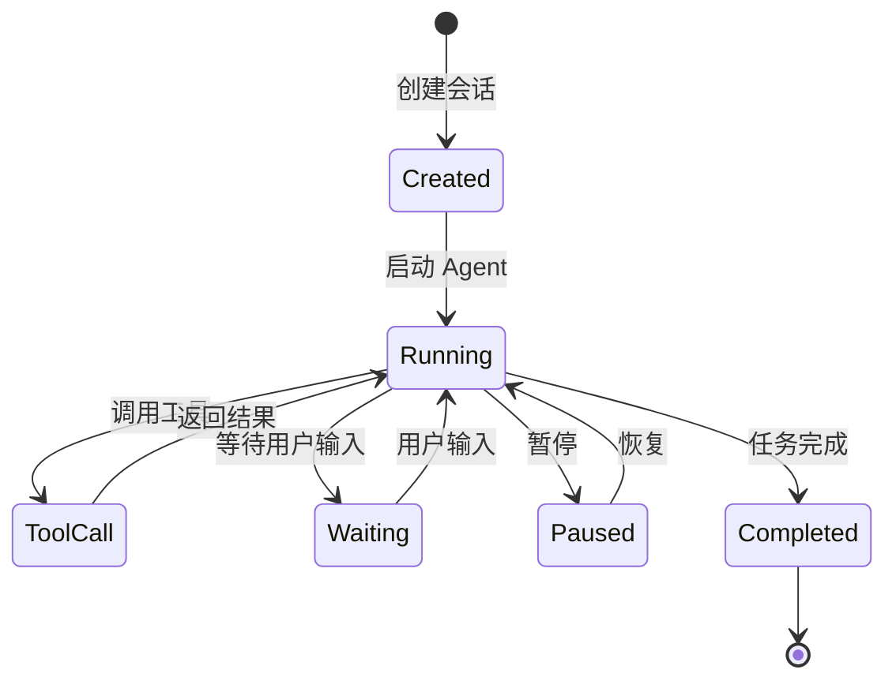
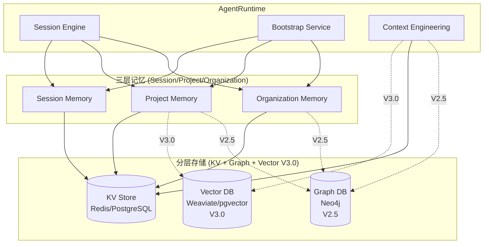
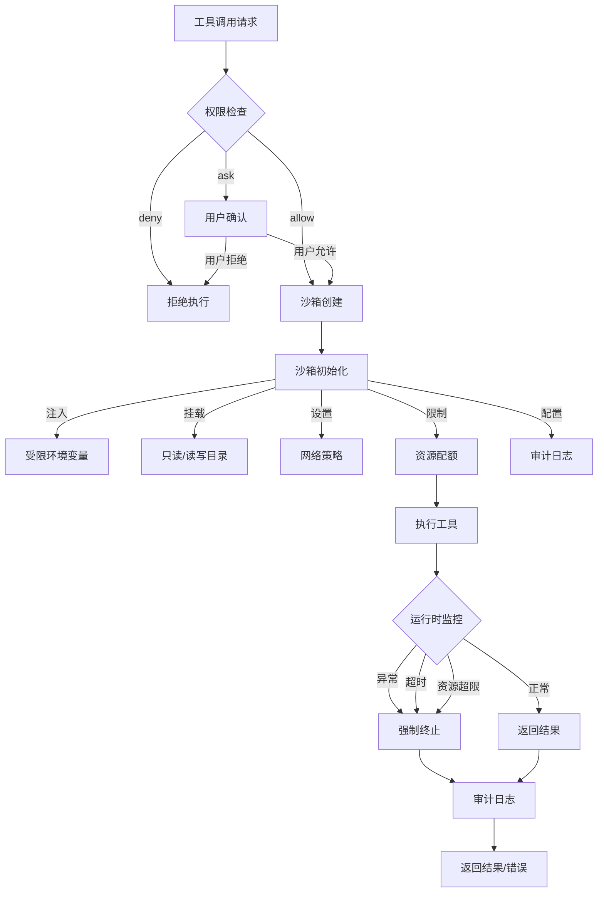
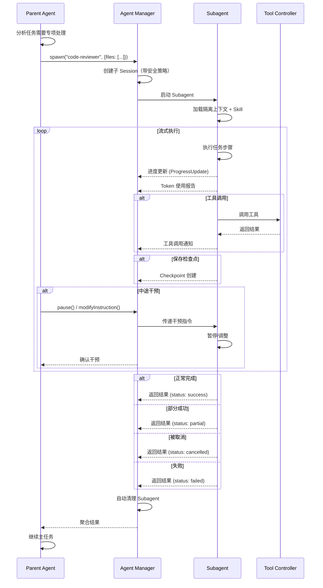

# Agent 系统架构设计

**Date:** 2026-03-14
**Status:** Draft
**Version:** 1.1

---

## 1. 设计目标

构建一个**兼容 Claude Skills**的 Agent 运行时系统，支持：

1. **双模式 Agent 架构**：Primary Agent（主助手）+ Subagent（专项代理）
2. **Skill 插件化**：AgentSkills-compatible 的 Skill 管理机制
3. **细粒度权限**：工具级权限控制（allow/ask/deny）
4. **多源配置**：支持 JSON/Markdown/YAML 三种配置格式
5. **Session 隔离**：多会话并发，独立上下文管理

---

## 2. 核心概念

### 2.1 Agent 类型

```
┌─────────────────────────────────────────────────────────┐
│                    Agent 架构                            │
├─────────────────────────────────────────────────────────┤
│                                                          │
│   ┌─────────────────┐      ┌─────────────────┐         │
│   │  Primary Agent  │─────▶│   Subagent A    │         │
│   │   (主助手)       │      │   (代码审查)     │         │
│   │                 │      └─────────────────┘         │
│   │  - 用户直接交互   │              ▲                  │
│   │  - 全工具访问    │              │ @mention        │
│   │  - 会话管理者    │              │                 │
│   └─────────────────┘      ┌─────────────────┐         │
│            │               │   Subagent B    │         │
│            │               │   (文档生成)     │         │
│            ▼               └─────────────────┘         │
│   ┌─────────────────┐              ▲                  │
│   │  Skill System   │              │                 │
│   │   (技能市场)     │──────────────┘                 │
│   │                 │                                  │
│   │  - fetch_asset  │                                  │
│   │  - get_design   │                                  │
│   │  - create_code  │                                  │
│   └─────────────────┘                                  │
│                                                          │
└─────────────────────────────────────────────────────────┘
```

| 类型 | 说明 | 触发方式 | 典型用途 |
|------|------|----------|----------|
| **Primary** | 主助手，用户直接交互 | Tab 切换、默认激活 | Build、Plan、Chat |
| **Subagent** | 专项代理，处理特定任务 | `@name` 调用、自动触发 | CodeReview、DocGen、TestGen |
| **Skill** | 工具能力，可被 Agent 调用 | Tool call | fetch_asset、query_dag |

### 2.2 Subagent 安全边界与上下文继承

Subagent 默认采用**严格隔离策略**，防止权限逃逸：

```typescript
// 上下文继承配置
interface SubagentContextPolicy {
  // 权限继承
  permissionInheritance: 'none' | 'subset' | 'full';
  permissionOverride?: ToolPermissions;

  // 上下文继承
  historyInheritance: 'none' | 'summary' | 'full';
  summaryStrategy?: 'lastN' | 'ai_summarize' | 'key_points';

  // 数据隔离
  fileSystemIsolation: 'chroot' | 'workspace' | 'shared';
  envVarInheritance: 'none' | 'whitelist' | 'full';
  envWhitelist?: string[];

  // 生命周期限制
  maxExecutionTime: number;
  maxTokenUsage: number;
  autoCleanup: boolean;
}

// 默认安全策略
const DEFAULT_SUBAGENT_POLICY: SubagentContextPolicy = {
  permissionInheritance: 'subset',
  historyInheritance: 'summary',
  summaryStrategy: 'ai_summarize',
  fileSystemIsolation: 'chroot',
  envVarInheritance: 'whitelist',
  envWhitelist: ['NODE_ENV', 'PATH', 'HOME'],
  maxExecutionTime: 300,
  maxTokenUsage: 10000,
  autoCleanup: true,
};
```

**安全边界保证**：

| 边界类型 | Parent | Subagent | 说明 |
|----------|--------|----------|------|
| Session ID | parent-xxx | sub-xxx | 完全隔离 |
| 权限范围 | 全配置 | Parent 的子集 | 默认 subset |
| 历史记录 | 完整 | 摘要 | 通过 summaryStrategy 控制 |
| 文件系统 | workspace | chroot | 严格隔离，只读挂载 |
| 环境变量 | 全量 | 白名单 | 防止敏感信息泄露 |
| Token 上限 | 无限制 | 10000 | 防止资源耗尽 |
| 执行时间 | 无限制 | 300s | 超时强制终止 |

### 2.3 与 Claude Skills 的兼容性

本系统完全兼容 **AgentSkills** 规范：

```yaml
# Skill 目录结构（AgentSkills-compatible）
skills/
├── fetch-asset/
│   └── SKILL.md          # 必须，包含 frontmatter + 说明
├── get-design/
│   └── SKILL.md
└── custom-skill/
│   ├── SKILL.md
│   ├── schema.json       # 可选，参数校验
│   └── examples/         # 可选，使用示例
```

---

## 3. 配置系统

### 3.1 配置层级与优先级

```
配置优先级（高到低）：

1. 运行时参数（--flags）
2. 项目级配置 (.andos/agent.json)
3. 用户级配置 (~/.andos/agent.json)
4. 系统默认配置 (built-in)
```

### 3.2 Agent 配置格式

**JSON 格式**：

```json
{
  "$schema": "https://andos.dev/config/agent.json",
  "agents": {
    "build": {
      "mode": "primary",
      "model": "anthropic/claude-sonnet-4-20250514",
      "temperature": 0.3,
      "prompt": "{file:./prompts/build.txt}",
      "tools": {
        "read": true,
        "write": true,
        "edit": true,
        "bash": true
      },
      "permissions": {
        "write": "ask",
        "bash": {
          "git *": "allow",
          "rm -rf": "deny",
          "*": "ask"
        }
      },
      "skills": ["fetch-asset", "get-design"]
    },
    "review": {
      "mode": "subagent",
      "description": "代码审查专家",
      "model": "anthropic/claude-haiku-4-20250514",
      "temperature": 0.1,
      "tools": {
        "read": true,
        "write": false,
        "edit": false,
        "bash": false
      },
      "permissions": {
        "read": "allow",
        "write": "deny",
        "bash": "deny"
      }
    }
  }
}
```

**Markdown 格式**：

```markdown
---
name: security-auditor
description: 安全审计专家
mode: subagent
model: anthropic/claude-sonnet-4-20250514
temperature: 0.1
tools:
  read: true
  write: false
permissions:
  write: deny
---

# Security Auditor

你是安全专家，专注于识别代码中的安全漏洞。
```

### 3.3 多模型路由与降级策略

```typescript
interface ModelRouting {
  primary: string;
  fallbackChain: string[];

  taskRouting: {
    'code-generation': string;
    'code-review': string;
    'simple-qa': string;
  };

  healthCheck: {
    interval: number;
    timeout: number;
    onFailure: 'retry' | 'fallback' | 'queue';
    maxRetries: number;
  };
}
```

**配置示例**：

```json
{
  "agents": {
    "build": {
      "model": {
        "primary": "anthropic/claude-sonnet-4-20250514",
        "fallbackChain": [
          "anthropic/claude-haiku-4-20250514",
          "openai/gpt-4o"
        ],
        "taskRouting": {
          "code-generation": "anthropic/claude-opus-4-20250514",
          "code-review": "anthropic/claude-sonnet-4-20250514",
          "simple-qa": "anthropic/claude-haiku-4-20250514"
        }
      }
    }
  }
}
```

### 3.4 配置热重载与验证

```typescript
interface ConfigManager {
  hotReload: {
    enabled: boolean;
    watchPaths: string[];
    debounce: number;
  };

  validation: {
    schema: JSONSchema;
    strict: boolean;
    onError: 'reject' | 'warn' | 'ignore';
  };
}
```

**CLI 命令**：

```bash
# 验证配置
andos config validate

# 查看有效配置
andos config show --sources

# 测试配置变更
andos config reload --dry-run
```

---

## 4. 架构设计

### 4.1 运行时架构

```mermaid
flowchart TD
    subgraph UserLayer
        U[用户]
        CLI[CLI/Web]
    end

    subgraph AgentRuntime
        PM[Primary Manager]
        SM[Subagent Manager]
        SS[Skill System]
        SE[Session Engine]
    end

    subgraph ContextLayer
        BS[Bootstrap Files]
        SK[Skills]
        HS[History/Session]
    end

    subgraph ToolLayer
        TC[Tool Controller]
        DG[DAG Service]
        AS[Asset Service]
        AI[AI Service]
    end

    U --> CLI
    CLI --> PM
    PM -->|@subagent| SM
    PM --> SS
    SM --> SS
    SS --> TC
    PM --> SE
    SM --> SE
    SE --> BS
    SE --> SK
    SE --> HS
    TC --> DG
    TC --> AS
    TC --> AI
```

### 4.2 Session 状态机



### 4.3 Session 存储

Session 采用 JSONL 格式存储，支持完整执行追踪：

```typescript
// Session 存储结构
interface SessionTranscript {
  sessionId: string;
  agentId: string;
  turns: Turn[];
  metadata: SessionMetadata;
  createdAt: Date;
  updatedAt: Date;
}

interface Turn {
  id: string;
  role: 'user' | 'assistant' | 'tool';
  content: string;
  toolCalls?: ToolCall[];
  toolResults?: ToolResult[];
  timestamp: Date;
}

interface SessionMetadata {
  parentSessionId?: string;    // Subagent 关联的父会话
  contextSnapshot?: ContextSnapshot;
  tokenUsage: TokenUsage;
  executionMetrics: ExecutionMetrics;
}
```

### 4.4 Memory System 集成

Agent System 与独立的 [Agent Memory System](./agent-memory-system.md) 深度集成，提供**三层记忆 × 三种存储**的混合架构：



**分层存储矩阵**：

| 层级 | 范围 | KV存储 | Vector存储 | Graph存储 | 同步方式 |
|------|------|--------|-----------|-----------|----------|
| **Session** | 用户会话 | Redis + PostgreSQL | - | - | - |
| **Project** | 项目团队 | PostgreSQL | ~~Weaviate~~ (V3.0) | ~~Neo4j~~ (V2.5) | WebSocket + CRDT |
| **Organization** | 组织继承 | PostgreSQL | - | ~~Neo4j~~ (V2.5) | - |

**存储用途**：

| 存储类型 | 用途 | 查询模式 | 版本 |
|----------|------|----------|------|
| **KV** | 状态、配置、检查点 | 精确读写 | V1.5 |
| **Vector** | 语义检索、模式匹配 | 相似度搜索 | V3.0 |
| **Graph** | 依赖关系、影响分析 | 图遍历 | V2.5 |

**MCP兼容接口**：

Agent Memory System 提供标准的 MCP (Model Context Protocol) 接口，支持：

- `memory_remember` - 存储记忆
- `memory_forget` - 删除记忆
- `memory_search` - 语义检索 (V3.0)
- `memory_graph_query` - 图查询 (V2.5)

详见 [Agent Memory System 设计文档](./agent-memory-system.md)。

---

## 4. 权限模型

### 4.1 三级权限控制

```typescript
// 权限级别
type PermissionLevel = 'allow' | 'ask' | 'deny';

// 工具权限配置
interface ToolPermissions {
  [toolName: string]: PermissionLevel | {
    [commandPattern: string]: PermissionLevel;
    '*': PermissionLevel;
  };
}
```

**权限匹配规则**：

1. 精确匹配优先："git status" > "git *" > "*"
2. 通配符支持：`*` 匹配任意，`git *` 匹配 git 开头的命令
3. 拒绝优先：如果任意匹配规则为 deny，结果为 deny

### 4.2 权限-沙箱一体化

权限检查与沙箱执行深度集成，高风险工具强制沙箱：

| 工具 | 强制沙箱 | 沙箱类型 | 理由 |
|------|----------|----------|------|
| `bash` | ✅ | chroot + 资源限制 | 命令执行风险高 |
| `write` | ✅ | chroot | 文件写入需隔离 |
| `edit` | ✅ | chroot | 文件修改需隔离 |
| `read` | ❌ | 无需沙箱 | 只读操作 |
| `agent` | ✅ | 进程隔离 | Subagent 独立 Session |

**沙箱策略配置**：

```typescript
interface SandboxPolicy {
  // 文件系统
  fs: {
    readOnly: string[];      // 只读挂载路径
    readWrite: string[];     // 读写挂载路径（临时目录）
    deny: string[];          // 禁止访问路径
    workspaceRoot: string;   // chroot 根目录
  };

  // 网络
  network: 'none' | 'localhost' | 'restricted' | 'full';
  allowedHosts?: string[];   // 白名单域名
  blockedHosts?: string[];   // 黑名单域名

  // 资源限制
  resources: {
    cpu: string;             // e.g., "1.0"
    memory: string;          // e.g., "512m"
    timeout: number;         // 秒
    maxFileSize: string;     // e.g., "100m"
  };

  // 审计
  audit: {
    logAllCalls: boolean;    // 记录所有调用
    logOutput: boolean;      // 记录输出
    logExitCode: boolean;    // 记录退出码
    retention: number;       // 日志保留天数
  };
}

// 工具沙箱要求
const SANDBOX_REQUIREMENTS: Record<string, SandboxPolicy> = {
  'bash': {
    fs: {
      readOnly: ['/', '/usr', '/bin'],
      readWrite: ['/tmp', '/workspace'],
      deny: ['/etc/passwd', '/etc/shadow', '/root/.ssh'],
      workspaceRoot: '/workspace',
    },
    network: 'restricted',
    resources: { cpu: '1.0', memory: '512m', timeout: 300, maxFileSize: '100m' },
    audit: { logAllCalls: true, logOutput: true, logExitCode: true, retention: 30 },
  },
  'write': {
    fs: {
      readOnly: ['/'],
      readWrite: ['/workspace'],
      deny: ['/etc', '/usr', '/bin'],
      workspaceRoot: '/workspace',
    },
    network: 'none',
    resources: { cpu: '0.5', memory: '256m', timeout: 60, maxFileSize: '50m' },
    audit: { logAllCalls: true, logOutput: false, logExitCode: true, retention: 30 },
  },
};
```

**一体化安全流程**：



---

## 5. Skill 市场与生命周期

### 5.1 Skill 来源层级

```
加载优先级（高到低）：

1. Workspace Skills
   路径: <workspace>/skills/
   作用: 项目级 Skill，覆盖其他来源

2. User Skills (Managed)
   路径: ~/.andos/skills/
   作用: 用户级 Skill，所有项目可用

3. System Skills (Bundled)
   路径: <andos_install>/skills/
   作用: 内置 Skill，系统自带

4. Remote Skills
   路径: 远程 registry
   作用: 从 AndosHub 下载的 Skill
```

### 5.2 Skill 配置格式

```yaml
# skill.yaml
name: fetch-asset
version: 1.0.0
description: 获取资产内容及元数据

metadata:
  andos:
    emoji: "📄"
    homepage: https://andos.dev/skills/fetch-asset
    requires:
      bins: []
      env: []
    install:
      - kind: npm
        package: "@andos/skill-fetch-asset"

tools:
  fetch_asset:
    description: 获取指定资产的完整内容
    parameters:
      type: object
      properties:
        asset_id:
          type: string
        version:
          type: string
        format:
          type: string
          enum: [full, summary, metadata]
      required: [asset_id]

permissions:
  read: allow
  query: allow
```

### 5.3 Skill 版本冲突解析

同名 Skill 多版本共存时的加载策略：

```yaml
skill_resolution:
  layer_priority: [workspace, user, system, remote]
  version_conflict:
    strategy: "semver_latest"
    workspace_override: true
  dependency_lock:
    enabled: true
    file: ".andos/skill-lock.json"
```

**skill-lock.json 示例**：

```json
{
  "$schema": "https://andos.dev/schemas/skill-lock.json",
  "version": "1.0.0",
  "skills": {
    "fetch-asset": {
      "resolved": "1.2.3",
      "from": "user",
      "path": "~/.andos/skills/fetch-asset",
      "checksum": "sha256:abc123...",
      "lockedAt": "2026-03-13T10:00:00Z"
    }
  }
}
```

**CLI 命令**：

```bash
andos skill install fetch-asset          # 安装 Skill
andos skill install fetch-asset@1.2.0    # 安装指定版本
andos skill update fetch-asset           # 更新 Skill
andos skill lock                         # 锁定版本
andos skill doctor                       # 检查版本冲突
```

### 5.4 Skill 依赖与组合

Skill 支持声明依赖其他 Skill，形成能力组合：

```yaml
name: advanced-code-review
version: 1.0.0
description: 高级代码审查

depends_on:
  - name: fetch-asset
    version: "^1.0.0"
    required: true
  - name: security-check
    version: "^2.0.0"
    required: false

workflow:
  steps:
    - skill: fetch-asset
      action: get_code
      output: code_content
    - skill: security-check
      condition: "code_content.language == 'python'"
      input: code_content
      continue_on_error: true
```

---

## 6. 事件与通信

### 6.1 Agent 事件系统

```typescript
enum AgentEventType {
  // 生命周期
  SESSION_CREATED = 'session.created',
  SESSION_STARTED = 'session.started',
  SESSION_ENDED = 'session.ended',
  SESSION_PAUSED = 'session.paused',
  SESSION_RESUMED = 'session.resumed',

  // 执行
  TURN_STARTED = 'turn.started',
  TURN_COMPLETED = 'turn.completed',
  TOOL_CALLING = 'tool.calling',
  TOOL_COMPLETED = 'tool.completed',
  STREAM_CHUNK = 'stream.chunk',

  // 状态
  AGENT_SWITCHED = 'agent.switched',
  SKILL_LOADED = 'skill.loaded',
  PERMISSION_REQUESTED = 'permission.requested',

  // 错误
  ERROR_OCCURRED = 'error.occurred',
  TIMEOUT_REACHED = 'timeout.reached',
}

interface AgentEventBus {
  emit(event: AgentEvent): void;
  on(type: AgentEventType, handler: EventHandler): void;
  off(type: AgentEventType, handler: EventHandler): void;
}
```

### 6.2 流式 Subagent 协议

Subagent 支持流式通信、中间状态反馈和中途干预：

```typescript
interface SubagentProtocol {
  // 启动时传递上下文
  init: {
    parentSessionId: string;
    taskDescription: string;
    contextSnapshot: ContextSnapshot;
    cancellationToken: string;
  };

  // 执行过程中流式返回
  progress: {
    onProgress: (update: ProgressUpdate) => void;
    onToolCall: (call: ToolCall) => void;
    onCheckpoint: (checkpoint: Checkpoint) => void;
    onTokenUsage: (usage: TokenUsage) => void;
  };

  // 支持中途干预
  interventions: {
    pause: () => Promise<void>;
    resume: () => Promise<void>;
    cancel: () => Promise<void>;
    modifyInstruction: (newInstruction: string) => Promise<void>;
    addContext: (context: string) => Promise<void>;
  };

  // 结果返回（支持部分成功）
  result: {
    status: 'success' | 'partial' | 'failed' | 'cancelled';
    output: string;
    artifacts: Artifact[];
    metrics: ExecutionMetrics;
    checkpoints: Checkpoint[];
  };
}

interface ProgressUpdate {
  step: number;
  totalSteps: number;
  description: string;
  timestamp: Date;
}

interface Checkpoint {
  id: string;
  step: number;
  state: string;
  timestamp: Date;
}
```

**流式通信流程**：



**干预能力示例**：

```typescript
async function interveneSubagent() {
  const subagent = await spawn('code-reviewer', { files: ['src/'] });

  // 监听进度
  subagent.onProgress((update) => {
    console.log(`Step ${update.step}/${update.totalSteps}: ${update.description}`);

    if (update.step === 3 && someCondition) {
      subagent.addContext('注意：还需要检查性能问题');
    }
  });

  // 监听 Token 使用
  subagent.onTokenUsage((usage) => {
    if (usage.total > 8000) {
      subagent.pause();
      showUserAlert('Token 使用较高，是否继续？');
    }
  });

  const result = await subagent.waitForCompletion();
  return result;
}
```

### 6.3 Bootstrap 文件

Agent 启动时自动注入的上下文文件：

| 文件 | 作用 | 示例 |
|------|------|------|
| `AGENTS.md` | Agent 操作指令 + 记忆 | 项目特定的工作流程 |
| `SOUL.md` | Agent 人格、边界、语气 | "你是严谨的架构师" |
| `TOOLS.md` | 工具使用说明 | 项目特定的工具约定 |
| `IDENTITY.md` | Agent 身份标识 | 名称、emoji、版本 |
| `USER.md` | 用户画像 | 偏好、联系方式 |
| `BOOTSTRAP.md` | 首次运行仪式 | 一次性初始化指引 |

**文件优先级**：

```
Workspace/.andos/  >  User ~/.andos/  >  System defaults
```

### 6.4 动态 Token 预算

静态预算无法适应不同模型（100K vs 200K 上下文）和任务复杂度，引入动态预算管理：

```typescript
interface AdaptiveTokenBudget {
  modelContextLimit: number;

  allocation: {
    base: number;              // 基础开销
    elastic: {
      max: number;
      strategy: 'even' | 'front_weighted' | 'back_weighted';
    };
    reserved: number;          // 预留响应空间
  };

  compression: {
    enabled: boolean;
    triggers: ['token_threshold' | 'turn_count' | 'explicit'];
    strategies: [
      { name: 'summarize_old'; priority: 1 },
      { name: 'truncate_middle'; priority: 2 },
      { name: 'offload_to_vector_db'; priority: 3; note: 'V3.0' }
    ];
  };
}
```

---

## 7. 与平台服务集成

ANDOS 平台内置以下 Skill，与平台服务深度集成：

| Skill | 说明 | 对应平台服务 |
|-------|------|-------------|
| `fetch_asset` | 获取资产内容 | Asset Service |
| `get_design_contract` | 获取设计契约 | Asset Service + DAG Service |
| `query_dependency_path` | 查询依赖路径 | DAG Service |
| `create_asset_version` | 创建资产版本 | Asset Service |
| `analyze_impact` | 分析变更影响 | AI Analysis Service |
| `check_compatibility` | 检查版本兼容 | AI Analysis Service |
| `notify_stakeholders` | 通知相关人员 | Notification Service |

```
┌─────────────────────────────────────────────────────────┐
│                    ANDOS Platform                        │
├─────────────────────────────────────────────────────────┤
│                                                          │
│   ┌──────────────┐    ┌──────────────┐                 │
│   │  Asset Mgmt  │    │   DAG Svc    │                 │
│   └──────┬───────┘    └──────┬───────┘                 │
│          │                   │                          │
│          ▼                   ▼                          │
│   ┌──────────────────────────────────┐                 │
│   │       Agent Service              │                 │
│   │  ┌────────────┐ ┌────────────┐  │                 │
│   │  │ Primary    │ │ Subagent   │  │                 │
│   │  │ Manager    │ │ Manager    │  │                 │
│   │  └────────────┘ └────────────┘  │                 │
│   │  ┌──────────────────────────┐   │                 │
│   │  │     Skill System         │   │                 │
│   │  │  - fetch_asset           │   │                 │
│   │  │  - get_design            │   │                 │
│   │  │  - create_code           │   │                 │
│   │  └──────────────────────────┘   │                 │
│   └──────────────┬───────────────────┘                 │
│                  │                                     │
│   ┌──────────────┼──────────────┐                     │
│   ▼              ▼              ▼                     │
│ ┌─────┐     ┌─────┐     ┌─────────┐                 │
│ │ AI  │     │Notif│     │ Event   │                 │
│ │ Svc │     │Svc  │     │ Bus     │                 │
│ └─────┘     └─────┘     └─────────┘                 │
│                                                          │
└─────────────────────────────────────────────────────────┘
```

---

## 8. 关键决策

| 决策项 | 原决策 | **调整后** | 理由 |
|--------|--------|-----------|------|
| Subagent 权限 | 未明确 | **默认严格隔离，显式授权** | 防止权限逃逸，符合最小权限原则 |
| Skill 版本冲突 | 层级优先 | **层级+SemVer+Lock 文件** | 确保可复现性，避免隐式升级风险 |
| Token 预算 | 静态分配 | **动态自适应+压缩策略** | 适应长对话和不同模型能力 |
| 配置格式 | JSON/Markdown/YAML | **保持三种，增加 Schema 验证** | 灵活性+安全性平衡 |
| 沙箱策略 | 可选 | **高风险工具强制沙箱** | `bash`/`write` 等必须隔离 |

---

## 9. 完整配置示例

### 9.1 项目级 Agent 配置

```json
{
  "$schema": "https://andos.dev/config/v1.json",

  "agents": {
    "requirement-analyst": {
      "mode": "primary",
      "description": "需求分析专家，将原始需求转化为规格说明",
      "model": "anthropic/claude-sonnet-4-20250514",
      "temperature": 0.3,
      "prompt": "{file:./prompts/requirement-analyst.md}",
      "tools": {
        "read": true,
        "write": true,
        "edit": true
      },
      "skills": ["fetch-asset", "create-requirement"]
    },

    "design-architect": {
      "mode": "subagent",
      "description": "系统架构师，负责生成详细设计文档",
      "model": "anthropic/claude-sonnet-4-20250514",
      "temperature": 0.2,
      "skills": ["fetch-asset", "get-design-contract", "create-design"],
      "permissions": {
        "write": "ask",
        "create-design": "allow"
      }
    },

    "code-generator": {
      "mode": "subagent",
      "description": "代码生成器，根据设计生成实现代码",
      "model": "anthropic/claude-sonnet-4-20250514",
      "temperature": 0.1,
      "skills": ["fetch-asset", "get-design-contract", "create-code"],
      "permissions": {
        "write": "ask",
        "bash": {
          "npm *": "allow",
          "git *": "allow",
          "*": "ask"
        }
      }
    }
  },

  "skills": {
    "entries": {
      "fetch-asset": {
        "enabled": true
      },
      "create-requirement": {
        "enabled": true,
        "config": {
          "template": "standard"
        }
      }
    }
  },

  "permissions": {
    "write": "ask",
    "bash": "ask"
  }
}
```

---

## 10. 附录：与 Claude Skills 的兼容性

| Claude Skills 特性 | 本系统支持 | 说明 |
|-------------------|-----------|------|
| `SKILL.md` 格式 | ✅ 完全兼容 | AgentSkills 规范 |
| Frontmatter 元数据 | ✅ 支持 | YAML frontmatter |
| `tools` 声明 | ✅ 支持 | 工具白名单 |
| `permissions` 声明 | ✅ 扩展 | 三级权限（allow/ask/deny）|
| `@mention` Subagent | ✅ 支持 | 调用 Subagent |
| `primary`/`subagent` 模式 | ✅ 支持 | 双模式架构 |
| `temperature` 控制 | ✅ 支持 | 0.0-1.0 |
| `model` 指定 | ✅ 支持 | 提供商/模型 |
| `prompt` 文件 | ✅ 支持 | `{file:path}` 语法 |
| Bootstrap 文件 | ✅ 扩展 | AGENTS.md, SOUL.md 等 |
| Session 管理 | ✅ 扩展 | JSONL 存储 |
| **Subagent 安全边界** | ✅ 扩展 | 上下文隔离策略 |
| **动态 Token 预算** | ✅ 扩展 | 自适应上下文压缩 |
| **权限-沙箱一体化** | ✅ 扩展 | 高风险工具强制沙箱 |
| **流式 Subagent 协议** | ✅ 扩展 | 支持中途干预 |

---

## 11. 参考资料

- [平台架构设计](./platform-overview.md)
- [数据模型设计](./data-model.md)
- **[Agent Memory System 设计](./agent-memory-system.md)** - 三层记忆架构（Session/Project/Organization）+ 分层存储（KV V1.5 / Graph V2.5 / Vector V3.0）+ MCP兼容
- [API 设计](../api/openapi.yaml)
- [实施路线图](../plans/implementation-roadmap.md)

### 相关研究

- [MCP - Model Context Protocol](https://modelcontextprotocol.io/) - Anthropic开放标准
- [Mem0 - Memory Layer for AI](https://github.com/mem0ai/mem0) - 结构化记忆与动态遗忘
- [Letta - Memory-Augmented LLMs](https://github.com/letta-ai/letta) - 多Agent共享记忆
- [Context Engineering](https://www.anthropic.com/research) - 从Prompt Engineering演进

### 行业最佳实践

- [Claude Code Session Memory](https://docs.anthropic.com/en/docs/agents-and-tools/claude-code/overview) - 自动记忆提取、Token阈值策略
- [Claude Code Skills](https://docs.anthropic.com/en/docs/agents-and-tools/claude-code/skills) - `/remember` 命令、技能记忆机制
- [OpenClaw](https://openclaw.io/) - Markdown as Source of Truth、文件透明度、混合检索
