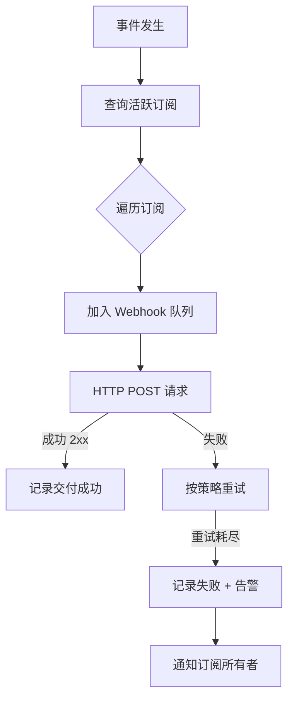
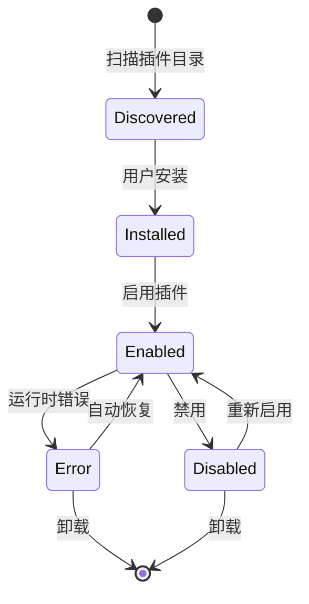

# API 设计规范

**Date:** 2026-03-14
**Status:** Draft
**Version:** 1.1
**Base URL:** `https://api.andos.dev/v1`

---

## 1. 设计原则

1. **RESTful 风格**：使用标准 HTTP 方法（GET/POST/PUT/DELETE）
2. **JSON 格式**：请求/响应统一使用 JSON
3. **版本化**：URL 中包含版本号（`/v1/`）
4. **扁平化**：避免过深嵌套，使用复合 ID

---

## 2. 基础规范

### 2.1 认证

```http
Authorization: Bearer <jwt_token>
```

### 2.2 幂等性

```http
POST /assets
Headers:
  Idempotency-Key: <uuid>

Response (首次):
{
  "data": {"id": "asset-xxx", ...},
  "meta": {
    "idempotency_key": "key-xxx",
    "idempotency_expires_at": "2026-03-13T11:00:00Z"
  }
}

Response (重复):
{
  "data": {"id": "asset-xxx", ...},
  "meta": {
    "idempotency_key": "key-xxx",
    "idempotent": true
  }
}
```

### 2.3 响应格式

**成功响应（2xx）**：

```json
{
  "data": { ... },
  "meta": {
    "page": 1,
    "per_page": 20,
    "total": 100
  }
}
```

**错误响应（4xx/5xx）**：

```json
{
  "error": {
    "code": "ASSET_NOT_FOUND",
    "message": "Asset with id 'xxx' not found",
    "request_id": "req_xxx"
  }
}
```

### 2.4 HTTP 状态码

| 状态码 | 使用场景 |
|--------|----------|
| 200 OK | 成功 |
| 201 Created | 创建成功 |
| 204 No Content | 删除成功 |
| 400 Bad Request | 请求参数错误 |
| 401 Unauthorized | 未认证 |
| 403 Forbidden | 无权限 |
| 404 Not Found | 资源不存在 |
| 409 Conflict | 资源冲突 |
| 422 Unprocessable Entity | 业务逻辑错误 |
| 429 Too Many Requests | 限流 |

### 2.5 限流与配额

**响应头声明限流状态：**

```http
X-RateLimit-Limit: 1000        # 每小时限额
X-RateLimit-Remaining: 999     # 剩余
X-RateLimit-Reset: 1710327600  # 重置时间戳（Unix timestamp）
```

**超过限额响应：**
```http
Status: 429 Too Many Requests
Retry-After: 3600  # 秒
```

```json
{
  "error": {
    "code": "RATE_LIMITED",
    "message": "API rate limit exceeded",
    "details": {
      "limit": 1000,
      "window": "1h",
      "retry_after": 3600
    }
  }
}
```

**分级限流：**

| 用户类型 | 限额 | 突发 |
|----------|------|------|
| 匿名 | 60/h | 10 |
| 普通用户 | 1000/h | 100 |
| 付费用户 | 10000/h | 1000 |
| 内部服务 | 无限制 | - |

### 2.6 错误码定义

```yaml
# 通用错误
COMMON:
  INVALID_REQUEST: "请求格式错误"
  UNAUTHORIZED: "未认证"
  FORBIDDEN: "无权限访问"
  NOT_FOUND: "资源不存在"
  RATE_LIMITED: "请求过于频繁"
  INTERNAL_ERROR: "服务器内部错误"
  IDEMPOTENCY_KEY_CONFLICT: "幂等键与请求不匹配"
  PRECONDITION_FAILED: "资源已被修改"  # 乐观锁失败

# 批量操作错误
BATCH:
  BATCH_TOO_LARGE: "批量操作数量超限"
  PARTIAL_FAILURE: "部分操作失败"

# 资产错误
ASSET:
  ASSET_NOT_FOUND: "资产不存在"
  ASSET_ALREADY_EXISTS: "资产已存在"
  INVALID_ASSET_TYPE: "无效的资产类型"
  INVALID_STATE_TRANSITION: "无效的状态转换"
  CIRCULAR_DEPENDENCY: "检测到循环依赖"
  VERSION_ALREADY_EXISTS: "版本已存在"
  DIRTY_NOT_RESOLVED: "存在未处理的dirty依赖"

# 依赖错误
DEPENDENCY:
  DEPENDENCY_NOT_FOUND: "依赖关系不存在"
  INVALID_DEPENDENCY: "无效的依赖关系"
  CROSS_LAYER_NOT_ALLOWED: "不允许跨层依赖"

# 权限错误
PERMISSION:
  INSUFFICIENT_PERMISSION: "权限不足"
  ASSET_LOCKED: "资产被锁定"
```

## 3. 核心接口

### 3.1 资产接口

| 方法 | 路径 | 说明 |
|------|------|------|
| POST | `/assets` | 创建资产 |
| GET | `/assets/{id}` | 获取资产详情 |
| PUT | `/assets/{id}` | 更新资产 |
| DELETE | `/assets/{id}` | 删除资产（软删除）|
| GET | `/assets` | 列出资产 |

**创建资产请求**：

```json
{
  "name": "用户登录模块需求",
  "slug": "user-login-requirement",
  "description": "实现用户登录功能的需求规格",
  "type": "requirement",
  "tags": ["auth", "login"],
  "project_id": "proj-xxx",
  "owners": ["user-xxx"]
}
```

**字段过滤（稀疏字段集）**：

```http
GET /assets/{id}?fields=name,state,current_version,owners
```

**响应（仅返回指定字段）**：
```json
{
  "data": {
    "name": "用户登录模块",
    "state": "clean",
    "current_version": "v1.0",
    "owners": ["user-xxx"]
  }
}
```

**嵌套资源字段过滤**：
```http
GET /assets/{id}?include=versions&fields[versions]=version,published_at
```

**乐观锁（更新时）**：

```http
PUT /assets/{id}
Headers:
  If-Match: "v1.0-abc123"  # 上次获取的 ETag
```

**乐观锁失败响应（412）**：
```json
{
  "error": {
    "code": "RESOURCE_MODIFIED",
    "message": "Asset has been modified by another user",
    "details": {
      "current_version": "v1.1",
      "conflict_fields": ["description"]
    }
  }
}
```

**批量操作**：

```http
POST /assets/batch
Headers:
  X-Batch-Limit: 100
```

**请求**：
```json
{
  "operations": [
    {
      "id": "op-1",
      "method": "POST",
      "data": {
        "name": "需求1",
        "type": "requirement",
        "project_id": "proj-xxx"
      }
    },
    {
      "id": "op-2",
      "method": "POST",
      "data": {
        "name": "需求2",
        "type": "requirement",
        "project_id": "proj-xxx"
      }
    }
  ]
}
```

**响应（207 Multi-Status）**：
```json
{
  "data": {
    "results": [
      {
        "id": "op-1",
        "status": 201,
        "data": {"id": "asset-1", ...}
      },
      {
        "id": "op-2",
        "status": 400,
        "error": {
          "code": "INVALID_ASSET_TYPE",
          "message": "..."
        }
      }
    ],
    "summary": {
      "succeeded": 1,
      "failed": 1,
      "total": 2
    }
  }
}
```

| 方法 | 路径 | 说明 |
|------|------|------|
| POST | `/assets/{id}/versions` | 发布版本 |
| GET | `/assets/{id}/versions/{version}` | 获取版本详情 |
| GET | `/assets/{id}/versions` | 列出版本 |
| GET | `/contents/{version_ref}` | 获取内容（扁平化接口）|

### 3.3 依赖接口

| 方法 | 路径 | 说明 |
|------|------|------|
| POST | `/assets/{id}/dependencies` | 创建依赖 |
| DELETE | `/assets/{id}/dependencies/{dep_id}` | 删除依赖 |
| GET | `/assets/{id}/dependencies?direction=upstream` | 查询依赖 |
| POST | `/graph-queries` | 提交图谱查询（异步）|
| GET | `/graph-queries/{query_id}` | 获取图谱结果 |

### 3.4 状态接口

| 方法 | 路径 | 说明 |
|------|------|------|
| GET | `/assets/{id}/state` | 获取资产状态 |
| POST | `/assets/{id}/clean` | 手动 Clean |
| GET | `/dirty-queue` | 获取 Dirty 队列 |

### 3.5 Agent 接口

| 方法 | 路径 | 说明 |
|------|------|------|
| GET | `/agents` | 列出可用 Agent |
| POST | `/sessions` | 创建会话 |
| POST | `/sessions/{id}/turns` | 执行对话回合 |
| GET | `/sessions/{id}/stream` | 流式响应（SSE）|

---

## 4. WebSocket 实时接口

### 4.1 连接建立

```http
wss://api.andos.dev/v1/realtime
Headers:
  Authorization: Bearer <jwt_token>
  X-Client-Version: 1.0.0
```

**连接成功响应**：
```json
{
  "type": "connection.established",
  "data": {
    "connection_id": "conn-xxx",
    "heartbeat_interval": 30,
    "server_time": "2026-03-13T10:00:00Z",
    "session_timeout": 300
  }
}
```

### 4.2 心跳机制

**客户端心跳**（每 30 秒）：
```json
{"type": "ping", "timestamp": 1710324000}
```

**服务端响应**：
```json
{"type": "pong", "timestamp": 1710324000}
```

**超时处理**：
- 服务端 60 秒未收到 ping，断开连接
- 客户端 60 秒未收到 pong，触发重连

### 4.3 断线重连

**重连时发送最后收到的消息 ID**：
```json
{
  "type": "subscribe",
  "channels": ["asset:xxx"],
  "resume_from": "msg-xxx"
}
```

**消息确认（QoS）**：
```json
{
  "type": "ack",
  "message_ids": ["msg-1", "msg-2"]
}
```

### 4.4 事件订阅

```json
{
  "type": "subscribe",
  "channels": ["asset:asset-xxx", "project:proj-xxx"]
}
```

**服务端推送消息格式**：
```json
{
  "id": "msg-xxx",
  "channel": "asset:asset-xxx",
  "type": "state.changed",
  "data": {
    "from": "clean",
    "to": "dirty",
    "triggered_by": "upstream:asset-yyy"
  },
  "timestamp": "2026-03-13T10:00:00Z"
}
```

### 4.5 事件类型

| 事件 | 说明 |
|------|------|
| `asset.created` | 资产创建 |
| `asset.updated` | 资产更新 |
| `asset.deleted` | 资产删除 |
| `asset.state.changed` | 资产状态变更 |
| `version.published` | 版本发布 |
| `dependency.created` | 依赖创建 |
| `dirty.created` | dirty来源新增 |
| `dirty.resolved` | dirty已处理 |

### 4.6 连接状态机

```
connecting → connected → subscribed → active
               ↓           ↓            ↓
            disconnected  unsubscribed  idle
               ↓           ↓            ↓
            reconnecting   closed      closed
```

---

## 6. 开发顺序建议

```
Phase 1: 基础框架
  - 数据库迁移脚本
  - 基础中间件（认证、日志、错误处理）
  - 健康检查接口

Phase 2: 核心资产
  - POST /assets
  - GET /assets/{id}
  - PUT /assets/{id}
  - DELETE /assets/{id}

Phase 3: 版本管理
  - POST /assets/{id}/versions
  - GET /assets/{id}/versions/{version}
  - GET /assets/{id}/versions

Phase 4: 依赖关系
  - POST /assets/{id}/dependencies
  - POST /graph-queries
  - GET /graph-queries/{id}

Phase 5: 状态管理
  - GET /assets/{id}/state
  - POST /assets/{id}/clean
  - GET /dirty-queue

Phase 6: 项目与用户
  - GET /projects
  - GET /users/me
```

## 5. Webhook 系统

> **优先级**: P2 (V1.5-V2.0)

支持外部系统订阅平台事件，实现事件驱动的跨系统集成。

### 5.1 Webhook 配置

```yaml
WebhookSubscription:
  id: uuid
  name: string                 # 订阅名称，如"同步到 Jira"
  url: string                  # 接收端点 URL
  events: [string]             # 订阅的事件类型列表
  secret: string               # HMAC-SHA256 签名密钥
  active: boolean              # 是否激活
  retry_policy:
    max_attempts: integer      # 最大重试次数，默认 3
    backoff_multiplier: number # 退避倍数，默认 2
    initial_delay_ms: integer  # 初始延迟，默认 1000
  created_by: user_id
  created_at: timestamp
```

### 5.2 支持的事件类型

| 事件 | 说明 | payload 示例 |
|------|------|-------------|
| `asset.created` | 资产创建 | `{asset_id, type, name, project_id}` |
| `asset.updated` | 资产更新 | `{asset_id, changes: [...], updated_by}` |
| `asset.state.changed` | 状态变更 | `{asset_id, from: "clean", to: "dirty", trigger}` |
| `asset.version.published` | 版本发布 | `{asset_id, version, published_by}` |
| `dependency.created` | 依赖建立 | `{source_id, target_id, created_by}` |
| `analysis.completed` | 分析完成 | `{asset_id, analysis_type, confidence, summary}` |
| `agent.execution.completed` | Agent 执行完成 | `{execution_id, agent_id, status, result}` |

### 5.3 安全机制

```http
# Webhook 请求头
X-Andos-Event: asset.state.changed
X-Andos-Delivery: delv_xxx
X-Andos-Signature: sha256=xxxxxxxx...
X-Andos-Timestamp: 1741861600

# 签名验证（HMAC-SHA256）
signature = HMAC_SHA256(secret, timestamp + "." + body)
```

### 5.4 Webhook 交付流程



---

## 7. GraphQL API

> **优先级**: P2 (V1.5-V2.0)

提供灵活的依赖图谱查询接口，支持复杂关系查询和聚合分析。

### 6.1 功能定位

- 提供灵活的依赖图谱查询接口
- 支持复杂关系查询和聚合分析
- 作为 REST API 的补充，满足前端复杂查询需求

### 6.2 Schema 设计（核心类型）

```graphql
# 资产类型
enum AssetType {
  REQUIREMENT
  DESIGN
  TASK
  CODE
  TEST
  PIPELINE
}

# 资产状态
enum AssetState {
  DRAFT
  CLEAN
  DIRTY
  MODIFIED
  ARCHIVED
}

# 资产对象
type Asset {
  id: ID!
  name: String!
  slug: String!
  type: AssetType!
  state: AssetState!
  currentVersion: String!
  project: Project!
  owners: [User!]!
  dependencies: [Dependency!]!
  dependents: [Dependency!]!
  versions: [AssetVersion!]!
  createdAt: DateTime!
  updatedAt: DateTime!
}

# 依赖关系
type Dependency {
  id: ID!
  source: Asset!
  target: Asset!
  versionConstraint: String
  createdAt: DateTime!
}

# 依赖图谱查询结果
type DependencyGraph {
  nodes: [Asset!]!
  edges: [Dependency!]!
  rootId: ID!
  depth: Int!
}

# 查询定义
type Query {
  # 获取单个资产
  asset(id: ID!): Asset

  # 获取资产的依赖图谱（向上追溯）
  upstreamGraph(
    assetId: ID!
    depth: Int = 5
  ): DependencyGraph

  # 获取资产的影响图谱（向下追溯）
  downstreamGraph(
    assetId: ID!
    depth: Int = 5
  ): DependencyGraph

  # 获取资产的完整依赖图谱
  fullDependencyGraph(
    assetId: ID!
    upstreamDepth: Int = 3
    downstreamDepth: Int = 3
  ): DependencyGraph

  # 搜索资产
  searchAssets(
    query: String!
    types: [AssetType!]
    projectId: ID
  ): [Asset!]!
}

# 变更定义
type Mutation {
  # 创建资产
  createAsset(input: CreateAssetInput!): Asset!

  # 更新资产
  updateAsset(id: ID!, input: UpdateAssetInput!): Asset!

  # 发布版本
  publishVersion(
    assetId: ID!
    version: String!
    changelog: String
  ): AssetVersion!

  # 创建依赖
  createDependency(
    sourceId: ID!
    targetId: ID!
    versionConstraint: String
  ): Dependency!

  # 处理 dirty 状态
  resolveDirty(assetId: ID!): Asset!
}

# 订阅定义（实时更新）
type Subscription {
  # 订阅资产状态变更
  assetStateChanged(assetId: ID!): AssetStateEvent!

  # 订阅项目资产变更
  projectAssetsChanged(projectId: ID!): AssetEvent!
}
```

### 6.3 查询示例

```graphql
# 查询资产的完整依赖图谱（向上追溯 5 层）
query GetAssetDependencyGraph($assetId: ID!) {
  upstreamGraph(assetId: $assetId, depth: 5) {
    nodes {
      id
      name
      type
      state
      currentVersion
    }
    edges {
      id
      source { id name }
      target { id name }
    }
  }
}

# 查询资产详情及下游影响
query GetAssetWithImpact($assetId: ID!) {
  asset(id: $assetId) {
    id
    name
    type
    state
    currentVersion
    downstreamGraph(depth: 3) {
      nodes {
        id
        name
        type
        state
      }
    }
  }
}

# 搜索需求类型的资产
query SearchRequirements($query: String!) {
  searchAssets(query: $query, types: [REQUIREMENT]) {
    id
    name
    slug
    state
    owners {
      id
      name
    }
  }
}
```

### 6.4 GraphQL 端点

```
https://api.andos.dev/v1/graphql

# 认证方式与 REST API 一致
Authorization: Bearer <jwt_token>
```

---

## 8. Plugin SDK

> **优先级**: P2 (V1.5-V2.0)

支持第三方开发插件扩展 ANDOS 平台功能。

### 7.1 插件架构

```
┌─────────────────────────────────────────────────────────┐
│                    ANDOS Platform                        │
│  ┌──────────────────────────────────────────────────┐  │
│  │              Plugin Host (Sandbox)               │  │
│  │  ┌─────────────┐  ┌─────────────┐               │  │
│  │  │   Skill     │  │   Webhook   │               │  │
│  │  │   Plugin    │  │   Plugin    │  ...           │  │
│  │  └─────────────┘  └─────────────┘               │  │
│  │         │                │                      │  │
│  │         └────────┬───────┘                      │  │
│  │                  ▼                              │  │
│  │         Plugin API Bridge                      │  │
│  │         (权限控制 + 审计)                       │  │
│  └──────────────────┬──────────────────────────────┘  │
│                     │                                  │
│         ┌───────────┼───────────┐                     │
│         ▼           ▼           ▼                     │
│    ┌────────┐  ┌────────┐  ┌────────┐                │
│    │ Asset  │  │  AI    │  │ Webhook│                │
│    │Service │  │Service │  │Service │                │
│    └────────┘  └────────┘  └────────┘                │
│                                                          │
└─────────────────────────────────────────────────────────┘
```

### 7.2 插件类型

| 类型 | 说明 | 示例 |
|------|------|------|
| **Skill Plugin** | 扩展 Agent 能力 | 自定义代码分析 Skill |
| **Webhook Plugin** | 事件处理与外部集成 | Jira 同步、Slack 通知 |
| **UI Plugin** | 扩展前端界面 | 自定义资产视图 |
| **Storage Plugin** | 自定义存储后端 | 企业私有 Git 仓库 |

### 7.3 Skill Plugin 开发示例

```typescript
// my-skill/index.ts
import { defineSkill, SkillContext } from '@andos/plugin-sdk';

export default defineSkill({
  name: 'code-quality-analyzer',
  version: '1.0.0',
  description: '分析代码质量并生成报告',

  // 声明需要的权限
  permissions: ['asset:read', 'ai:call'],

  // Skill 参数定义
  parameters: {
    assetId: {
      type: 'string',
      required: true,
      description: '要分析的代码资产 ID'
    },
    rules: {
      type: 'array',
      default: ['complexity', 'coverage', 'security'],
      description: '分析规则列表'
    }
  },

  // Skill 执行逻辑
  async execute(context: SkillContext, params) {
    const { assetId, rules } = params;

    // 获取资产内容
    const asset = await context.assets.get(assetId);
    const content = await context.storage.read(asset.contentRef);

    // 调用 AI 分析
    const analysis = await context.ai.analyze({
      type: 'code_quality',
      content,
      rules
    });

    // 返回结果
    return {
      score: analysis.score,
      issues: analysis.issues,
      report: analysis.report
    };
  }
});
```

### 7.4 插件生命周期



### 7.5 插件市场

```yaml
# AndosHub Plugin 市场
PluginRegistry:
  name: "ANDOS Official Plugin Registry"
  url: "https://hub.andos.dev/registry"

  plugins:
    - id: "jira-integration"
      name: "Jira Integration"
      version: "2.1.0"
      author: "Andos Team"
      description: "Sync assets with Jira issues"
      downloads: 15420
      rating: 4.5

    - id: "slack-notifier"
      name: "Slack Notifications"
      version: "1.5.2"
      author: "Community"
      description: "Send notifications to Slack channels"
      downloads: 3200
      rating: 4.2
```

### 7.6 插件安全模型

```yaml
# 权限声明（manifest.yml）
permissions:
  # 资产权限
  asset:
    read: ["project:*"]        # 可读取所有项目资产
    write: ["project:owned"]   # 只能写入自己拥有的资产

  # AI 服务权限
  ai:
    call: true                  # 允许调用 AI 分析
    models: ["claude-3-5"]      # 限制可用模型

  # 存储权限
  storage:
    read: true
    write: false               # 只读，不能写入

  # 网络权限
  network:
    domains: ["api.jira.com"]  # 允许访问的域名

  # 运行时权限
  runtime:
    commands: ['node', 'python']
    sandbox: required          # 必须在沙箱中运行
```

### 7.7 Plugin CLI

```bash
# 安装插件
andos plugin install jira-integration

# 列出已安装插件
andos plugin list

# 启用/禁用插件
andos plugin enable jira-integration
andos plugin disable jira-integration

# 更新插件
andos plugin update jira-integration

# 卸载插件
andos plugin uninstall jira-integration

# 配置插件
andos plugin config jira-integration --set apiKey=xxx
```

---

## 9. 完整 OpenAPI 定义

完整的 OpenAPI 3.0 定义见：[openapi.yaml](../api/openapi.yaml)

---

## 10. 参考资料

- [平台架构设计](./platform-overview.md)
- [Agent 系统设计](./agent-system.md)
- [数据模型设计](./data-model.md)
- [实施路线图](../plans/implementation-roadmap.md)
