# ANDOS 平台架构设计

**Date:** 2026-03-14
**Status:** Draft
**Version:** 1.1

---

## 1. 概述

ANDOS (AI-Native DevOps System) 是一个 AI-Native 资产管理系统，实现项目全生命周期资产的版本化管理、依赖追踪和智能影响分析。

### 1.1 核心目标

- 资产版本化管理与依赖追踪
- 智能影响分析
- AI-Agent 原生集成
- 人机协作的 DevOps 流程

### 1.2 核心设计原则

| 原则 | 说明 |
|------|------|
| **严格 DAG** | 资产按标签分层，依赖方向固定（需求→设计→代码），防止循环依赖 |
| **显式版本锁定** | 每个版本精确记录依赖资产的版本号 |
| **波浪式状态传播** | dirty 状态只传播给直接依赖者，逐层处理 |
| **人机协作** | AI 分析推荐，用户最终确认，支持自动审批 |
| **Agent 原生** | 平台内置 Agent 能力，所有环节支持人机协作或全自动执行 |

---

## 2. 系统架构

### 2.1 整体架构

```
┌─────────────────────────────────────────────────────────┐
│                      ANDOS Platform                      │
├─────────────────────────────────────────────────────────┤
│  ┌──────────────┐  ┌──────────────┐  ┌──────────────┐  │
│  │   Web UI     │  │    CLI       │  │  Agent API   │  │
│  └──────┬───────┘  └──────┬───────┘  └──────┬───────┘  │
│         └─────────────────┼─────────────────┘           │
│                           ▼                             │
│  ┌──────────────────────────────────────────────────┐  │
│  │              API Gateway (Fastify)               │  │
│  │  - Auth (JWT)  │  - Rate Limit  │  - Validation  │  │
│  └──────────────────────────────────────────────────┘  │
│                           │                             │
│  ┌────────────────────────┼──────────────────────────┐ │
│  ▼                        ▼                        ▼ │
│ ┌──────────┐    ┌──────────────────┐    ┌──────────┐│
│ │  Asset   │    │   Agent Service  │    │  Graph   ││
│ │ Service  │◄──►│  - Primary Agent │    │ Service  ││
│ └──────────┘    │  - Subagent      │    └──────────┘│
│                 │  - Skill System  │                 │
│ ┌──────────┐    └──────────────────┘    ┌──────────┐│
│ │ Version  │                              │  Impact  ││
│ │ Service  │                              │ Analysis ││
│ └──────────┘                              └──────────┘│
│                           │                             │
│  ┌────────────────────────┼──────────────────────────┐ │
│  ▼                        ▼                        ▼ │
│ ┌──────────┐    ┌──────────────────┐    ┌──────────┐│
│ │PostgreSQL│    │   Object Store   │    │  Redis   ││
│ │ (Core)   │    │   (S3/MinIO)     │    │ (Cache)  ││
│ └──────────┘    └──────────────────┘    └──────────┘│
└─────────────────────────────────────────────────────────┘
```

### 2.2 核心模块

| 模块 | 职责 | 技术栈 |
|------|------|--------|
| **Asset Service** | 资产CRUD、版本管理、状态转换 | TypeScript, PostgreSQL |
| **Agent Service** | Primary/Subagent 管理、Skill 系统 | Claude API, Fastify |
| **Graph Service** | 依赖图谱查询、DAG 验证 | PostgreSQL ltree |
| **Impact Analysis** | 变更影响分析、兼容性检查 | Claude API |
| **Webhook Service** | 事件订阅、推送通知 | PostgreSQL |

---

## 3. 资产分层模型

### 3.1 资产类型与分层

资产按 DevOps 生命周期分层，每层只能依赖上层：

```
Layer 1: requirement    (需求层)
Layer 2: design         (设计层)
Layer 3: task           (任务层)
Layer 4: code           (代码层)
Layer 5: test           (测试层)
Layer 6: pipeline       (流水线层)
```

**依赖规则**：
- 下层资产可以依赖上层资产（如 design 依赖 requirement）
- 同层资产可以相互依赖（如 design 之间）
- 禁止反向依赖（如 requirement 依赖 design）

### 3.2 资产定义

**Asset（资产）**：

```yaml
Asset:
  id: uuid                    # 全局唯一标识
  name: string                # 资产名称
  slug: string                # URL友好标识
  description: string         # 描述
  type: enum                  # 类型：requirement, design, task, code, test, pipeline
  state: enum                 # 状态：draft, clean, dirty, archived
  current_version: string     # 当前版本号
  project_id: uuid            # 所属项目
  owners: [user_id]           # 关联人员
  tags: [string]              # 标签
  auto_approval:              # 自动审批配置
    enabled: boolean
    threshold: high | medium | low
  created_at: timestamp
  updated_at: timestamp
```

**AssetVersion（资产版本）**：

```yaml
AssetVersion:
  id: uuid
  asset_id: uuid              # 关联资产
  version: string             # 版本号（语义化版本）
  content: text               # 内容（小内容直接存储）
  content_ref: string         # 内容引用（Git commit / S3 key）
  content_type: enum          # markdown, code, json
  changelog: string           # 变更说明
  dependencies:               # 依赖的上游资产版本快照
    - asset_id: uuid
      version: string
      confirmed_at: timestamp
      confirmed_by: user_id
      auto_confirmed: boolean
  state: enum                 # draft, published, deprecated
  published_at: timestamp
  published_by: user_id
```

### 3.3 资产状态机

```
                    ┌─────────────┐
        ┌──────────►│   draft     │◄──────────┐
        │           └──────┬──────┘           │
        │                  │ publish          │
        │                  ▼                  │
        │           ┌─────────────┐           │
   update │           │    clean    │────┐      │ archive
        │           └──────┬──────┘    │      │
        │                  │            │      │
        │        upstream  │            │      ▼
        │         publish  │            │  ┌─────────────┐
        │                  ▼            └──┤  archived   │
        │           ┌─────────────┐        └─────────────┘
        └───────────│    dirty    │
                    └─────────────┘
                           │
                           │ manual clean
                           ▼
                    ┌─────────────┐
                    │    clean    │
                    └─────────────┘
```

**状态定义**：

| 状态 | 含义 |
|------|------|
| **draft** | 资产创建后的初始状态，尚未首次发布 |
| **clean** | 资产已确认，与上游依赖版本一致 |
| **dirty** | 上游依赖有新版本，待责任人确认处理 |
| **modified** | 资产正在编辑中（可从 clean 或 dirty 进入编辑） |
| **archived** | 资产已废弃，不再参与版本流转 |

**状态流转图**：

```
[draft] ──首次发布──→ [clean] ────────┬───────→ [dirty]
   │                      │            │             │
   │                      │ 编辑内容   │ 上游发布    │ 编辑内容
   │                      │            │             │
   │                      ▼            │             ▼
   │                   [modified] ◄────┘          [modified]
   │                      │                          │
   │                      │ 发布新版本               │ 发布新版本
   │                      │                          │
   │                      └───────────┬──────────────┘
   │                                  │
   │                                  ▼
   │                              [clean]
   │                                  │
   └──资产废弃───────────────────────→ [archived]

modified 来源：
  - clean → modified（主动编辑资产）
  - dirty → modified（处理 dirty 时编辑）
```

**状态转换说明**：

| 转换 | 触发条件 | 说明 |
|------|----------|------|
| draft → clean | 首次发布 | 资产创建后首次发布版本 |
| clean → dirty | 上游发布新版本 | 依赖的上游资产有新版本 |
| clean → clean | 发布新版本 | 主动发布新版本（无上游变更） |
| clean → modified | 编辑内容 | 主动编辑资产内容（非 dirty 触发） |
| clean → archived | 资产废弃 | 资产被标记为废弃 |
| dirty → clean | 处理完成 | 发布新版本或手动 clean |
| dirty → modified | 编辑内容 | 从 dirty 状态进入编辑模式 |
| modified → clean | 发布新版本 | 编辑完成后发布 |
| modified → dirty | 上游又发布 | 编辑过程中上游又有新版本 |
| modified → archived | 资产废弃 | 编辑中的资产被废弃 |

### 3.4 依赖关系规则

**依赖建立规则**：

- **首次发布时确定**：用户手动指定依赖，AI 根据标签和内容辅助推荐
- **版本发布确认**：发布新版本时确认依赖版本，可选择沿用或更新
- **自动确认**：AI 分析无冲突时可自动确认，否则需要人工介入

**依赖限制**：

- 禁止循环依赖（A 依赖 B，B 依赖 C，C 依赖 A）
- 下层资产可依赖上层资产（design → requirement）
- 同层资产可相互依赖（design ↔ design）
- 禁止反向依赖（requirement 不能依赖 design）

**波浪式状态传播**：

```
上游资产发布 → 直接下游变 dirty → 不自动传播给间接下游

Example:
  Req A v1 ──► Design B v1 ──► Code C v1
     ↓
  Req A v2 ──► Design B dirty (不直接传播给 C)
                 ↓
         用户处理 B → 发布 B v2 → Code C dirty
```

---

## 4. 状态传播机制

### 4.1 传播规则

**核心原则**：只有"发布新版本"动作会触发下游 dirty，状态本身的变更不会传播。

1. **发布新版本触发传播**
   - 当资产**发布新版本**时，其**直接依赖者**（下游资产）状态变为 **dirty**
   - 这是唯一会触发 dirty 传播的动作

2. **手动 clean 不传播**
   - 资产**手动 clean**时，仅更新自身依赖版本号为上游最新
   - 自身状态恢复为 **clean**
   - **不触发**下游 dirty 传播

### 4.2 边界场景处理

| 场景 | 处理策略 |
|------|----------|
| **多上游同时dirty** | 队列按 **impact_level > publish_time** 排序，高影响优先 |
| **上游archived** | 下游收到`upstream.archived`事件，强制进入dirty并提示"需更换依赖" |
| **dirty处理中上游又发布** | dirty来源合并，保留最新版本，累计impact_level |
| **批量发布** | 支持事务性多资产发布，中间状态为`publishing`，全部成功后才触发下游dirty |

### 4.3 Dirty队列优先级算法

```yaml
Priority Score =
  (impact_level_weight: high=100, medium=50, low=10) +
  (time_factor: hours_waiting * -1) +
  (asset_type_weight: requirement=50, design=30, code=10)

Sort: DESC by Priority Score
```

### 4.4 特殊状态说明

| 状态 | 传播行为 |
|------|----------|
| **draft** | 不参与 dirty 传播。首次发布前不接收上游 dirty 通知 |
| **archived** | 不参与任何传播。资产废弃后从 DAG 中隐式移除（或标记为不可达） |
| **modified** | 同 clean/dirty，参与传播规则 |

### 4.5 传播示例

```
初始状态：
  A v1.0(clean) → B v1.0(clean) → C v1.0(clean)

场景1：B 主动发布 v1.1
  A v1.0(clean) → B v1.1(clean) → C v1.0(dirty)
  （B 发布新版本，C 变 dirty）

场景2：然后 A 发布 v1.1
  A v1.1(clean) → B v1.1(dirty) → C v1.0(dirty)
  （A 发布新版本，B 变 dirty；C 保持 dirty，是之前 B 导致的）

场景3：B 处理 dirty（不修改内容，手动 clean）
  A v1.1(clean) → B v1.1(clean，依赖A v1.1) → C v1.0(dirty)
  （B 状态变为 clean，但 C 状态不变，因为不是"发布新版本"）

场景4：C 处理 dirty（发布 v1.1）
  A v1.1(clean) → B v1.1(clean，依赖A v1.1) → C v1.1(clean，依赖B v1.1)
```

---

## 5. 发布流程

### 5.1 正常发布流程

```
1. 用户发起发布
   ↓
2. 填写变更说明（必填）
   ↓
3. 确认/调整依赖关系
   ↓
4. AI 检查新版本与依赖资产的兼容性
   - 分析内容一致性
   - 检查是否遗漏依赖
   ↓
5. 发布
   - 创建新版本
   - 状态设为 clean
   - 触发下游 dirty 状态传播
   ↓
6. AI 分析对下游资产的影响
   - 按置信度分级：高/中/低/无影响
   - 生成影响报告和建议修改方案
   ↓
7. 通知下游资产责任人
```

### 5.2 AI 影响分析与确认

**置信度校准机制**：

```yaml
AI Analysis Service - Confidence Calibration:
  initial_thresholds:
    high: 0.8    # 自动dirty
    medium: 0.5  # 通知人工确认
    low: 0.2     # 仅记录日志

  feedback_loop:
    enabled: true
    collection: "责任人标记'实际影响是否与预测一致'"
    adjustment: "每周根据反馈数据微调阈值"
    decay: "90天前的反馈权重降低50%"

  quality_metrics:
    precision: "高置信度预测中实际受影响的比例"
    recall: "实际受影响资产中被预测到的比例"
    target: "precision > 0.9, recall > 0.8"

  fallback:
    on_uncertain: "置信度在0.4-0.6区间时，强制人工确认"
```

**影响分析流程**：

```
上游资产发布新版本
        ↓
┌─────────────────────────┐
│    AI 分析影响范围       │
│  ┌─────────────────┐    │
│  │ 高置信度受影响   │ → 自动设为 dirty（如开启 auto-approval）│
│  │ 中/低置信度     │ → 通知责任人，等待确认                   │
│  │ 不受影响        │ → 无操作                               │
│  └─────────────────┘    │
└─────────────────────────┘
        ↓
┌─────────────────────────┐
│    责任人处理 dirty      │
│  ┌─────────────────┐    │
│  │ 1. 查看 AI 分析  │    │
│  │ 2. 对比版本差异  │    │
│  │ 3. 标记反馈     │    │
│  │ 4. 选择操作：    │    │
│  │    - 修改并发布  │    │
│  │    - 手动 clean │    │
│  └─────────────────┘    │
└─────────────────────────┘
```

### 5.3 Auto-Approval 配置

| 阈值 | 行为 |
|------|------|
| OFF | 所有影响都通知责任人，人工确认 |
| high | 仅高置信度受影响自动 dirty，其他人工确认 |
| medium | 高/中置信度自动 dirty，低/无影响忽略 |
| low | 高/中/低置信度都自动 dirty，仅无影响忽略 |

---

## 6. 环节转换与 Agent 委托

### 6.1 环节定义

每个资产标签对应一个工作环节，环节间存在预定义的流转顺序：

```
原始需求 → 需求规格 → 系统设计 → 工作项 → 代码实现 → 测试 → 部署
(requirement) (spec)      (design)    (task)    (code)      (test) (pipeline)
```

### 6.2 环节转换模式

当当前环节资产发布新版本后，进入下一环节时有三种处理模式：

| 模式 | 说明 | 适用场景 |
|------|------|----------|
| **Manual** | 人工创建下一环节资产 | 关键决策点，需要人工深度参与 |
| **Agent** | 委托给 Agent 自动完成 | 标准化流程，Agent 能力成熟 |
| **Hybrid** | Agent 生成 + 人工审批 | 默认模式，人机协作 |

### 6.3 环节配置

每个项目可配置各环节的处理模式：

```yaml
StageConfig:
  requirement:
    next_stage: spec
    delegation_mode: agent  # 需求→规格自动由 Agent 处理
    default_agent: RequirementAgent
    auto_execute: true      # 无需审批

  spec:
    next_stage: design
    delegation_mode: hybrid # 混合模式
    default_agent: DesignAgent
    auto_execute: false     # 需要人工审批
    approval_chain: [tech_lead]

  design:
    next_stage: task
    delegation_mode: manual # 人工处理
```

### 6.4 环节转换流程

```
当前环节资产发布 v1.0（如需求规格）
        ↓
查询下一环节配置（design）
        ↓
根据配置模式处理：

┌─────────────────────────────────────────────────────────────┐
│ Manual 模式                                                  │
│ 1. 创建下一环节 Asset（状态为 pending）                      │
│ 2. 建立依赖关系：spec v1.0 → design（pending）               │
│ 3. 通知责任人人工处理                                        │
└─────────────────────────────────────────────────────────────┘

┌─────────────────────────────────────────────────────────────┐
│ Agent 模式                                                   │
│ 1. 触发 AgentExecution                                       │
│ 2. Agent 读取上游资产内容                                    │
│ 3. Agent 生成下游资产内容                                    │
│ 4. 自动创建 AssetVersion                                     │
│ 5. 建立依赖关系                                              │
│ 6. 自动发布（auto_execute=true）                            │
└─────────────────────────────────────────────────────────────┘

┌─────────────────────────────────────────────────────────────┐
│ Hybrid 模式                                                  │
│ 1-4 同 Agent 模式                                            │
│ 5. Agent 提交结果，状态为 pending_approval                   │
│ 6. 通知审批人                                                │
│ 7. 审批通过 → 正式发布                                       │
│ 8. 审批拒绝 → 返回 Agent 重新生成或转人工                    │
└─────────────────────────────────────────────────────────────┘
```

### 6.5 内置 Agent 类型

| Agent 类型 | 职责 | 触发时机 |
|------------|------|----------|
| **RequirementAgent** | 将原始需求转换为结构化需求规格 | requirement → spec |
| **DesignAgent** | 根据需求生成系统设计文档 | spec → design |
| **TaskAgent** | 将设计拆解为可执行工作项 | design → task |
| **CodeAgent** | 根据设计/任务生成代码实现 | task → code |
| **TestAgent** | 生成测试用例并执行测试 | code → test |
| **ImpactAgent** | 分析变更对下游资产的影响 | 资产发布后 |
| **CompatibilityAgent** | 检查新版本与依赖资产的兼容性 | 发布前检查 |

### 6.6 Agent 执行上下文

Agent 执行时可访问的上下文信息。核心原则：**基于 DAG 依赖图谱构建完整上下文**，确保 Agent 理解任务的全景背景。

#### 上下文组成

| 上下文项 | 来源 | 说明 |
|----------|------|------|
| `trigger_event` | Event Bus | 触发本次执行的事件详情 |
| `upstream_assets` | **DAG Service 查询** | 递归获取所有上游依赖资产（直到根节点），含完整内容和元数据 |
| `downstream_assets` | **DAG Service 查询** | 直接依赖者列表（用于影响评估） |
| `dependency_graph` | **DAG Service 构建** | 当前资产在完整 DAG 中的子图位置 |
| `project_config` | Project Service | 项目配置信息 |
| `stage_config` | Stage Service | 当前环节配置（委托模式、审批链等） |
| `historical_versions` | Asset Service | 当前资产历史版本（用于学习风格） |
| `similar_assets` | AI Analysis | 项目中语义相似的资产参考 |
| `user_preferences` | User Service | 用户/项目偏好设置 |

#### DAG 驱动的上下文构建流程

```
Agent 被触发
    ↓
[Agent Service] 接收执行请求
    ↓
[DAG Service] 构建上下文图谱
    ├─ 查询当前资产直接依赖（上游）
    ├─ 递归查询间接依赖（直到 requirement 根节点）
    ├─ 构建依赖路径（如：req→design→task→code）
    └─ 标注各节点当前版本状态（clean/dirty）
    ↓
[Asset Service] 批量获取资产内容
    ├─ 按类型路由到对应存储
    └─ 组装完整内容上下文
    ↓
组装 AgentExecutionContext
    ↓
调用 Agent 执行
```

#### 渐进式上下文披露（Skill 机制）

为解决 DAG 依赖过多导致的上下文溢出问题，平台提供 **Skill 机制** —— Agent 按需获取信息，而非一次性加载全部依赖内容。

**Skill 类型**：

| Skill | 用途 | 适用场景 |
|-------|------|----------|
| `fetch_asset_summary` | 获取资产摘要（而非完整内容） | 快速了解依赖关系 |
| `fetch_asset_content` | 获取资产完整内容 | 需要详细参考时 |
| `get_design_contract` | 提取设计的结构化信息（API、模型、时序图） | CodeAgent 编码时 |
| `query_dependency_path` | 查询两资产间的依赖路径 | 追溯影响来源 |
| `get_version_diff` | 获取版本间差异 | 处理 dirty 状态时 |
| `search_similar_assets` | 搜索相似资产 | 寻找参考实现 |

**与 DAG 的结合**：

```
DAG 提供结构信息（轻量）
    ↓
Agent 接收初始上下文：依赖图谱 + 资产摘要
    ↓
Agent 通过 Skill 按需获取内容（完整内容按需加载）
    ↓
既保证上下文完整，又避免窗口溢出
```

---

## 7. 关键交互场景

### 7.1 场景：提交时查看依赖变更

```
用户提交资产 B 的新版本
        ↓
系统显示：
  当前依赖：
    - 资产 A: v1.0 → v1.2 (有更新)
      变更说明：
        v1.1: 增加用户管理模块
        v1.2: 修复权限描述
      Diff:
        [文本差异高亮]

  建议操作：
    [ ] 保持依赖 A v1.0
    [x] 更新依赖到 A v1.2
    [ ] 稍后手动处理
```

### 7.2 场景：AI 生成工作项

```
用户使用 AI 将需求 R 拆解为工作项
        ↓
AI 生成工作项 T1, T2, T3
        ↓
系统自动创建依赖：
  R v1.0 → T1 v1.0
        → T2 v1.0
        → T3 v1.0
        ↓
后续 R 变更时，T1/T2/T3 自动收到影响分析通知
```

### 7.3 场景：需求发布后的 Agent 自动设计

```
用户发布需求规格说明 Spec v1.0
        ↓
系统检查环节配置：spec.next_stage = design
                spec.delegation_mode = agent
                spec.auto_execute = true
        ↓
触发 DesignAgent
        ↓
DesignAgent 读取 Spec v1.0 内容
        ↓
DesignAgent 生成设计文档
  - 系统架构图
  - 数据库设计
  - API 接口定义
        ↓
自动创建 Design Asset
  name: "XX系统设计"
  version: v1.0
  dependencies: [{asset: Spec, version: v1.0}]
  state: clean
        ↓
自动发布 Design v1.0
        ↓
触发下游 TaskAgent（根据配置继续自动流转）
        ↓
通知用户："设计文档已自动生成并发布"
```

### 7.4 场景：Agent 生成结果的人工审批

```
用户发布需求规格说明 Spec v1.0
        ↓
系统检查环节配置：spec.delegation_mode = hybrid
                spec.auto_execute = false
        ↓
触发 DesignAgent
        ↓
DesignAgent 生成设计文档
        ↓
提交审批请求
  status: pending_approval
  assigned_to: [tech_lead]
        ↓
通知 Tech Lead："Spec v1.0 的设计文档待审批"
        ↓
Tech Lead 审查：
  ├─ 查看设计内容
  ├─ 对比需求规格
  ├─ 查看 Agent 思考过程 (reasoning)
  └─ 查看置信度评分
        ↓
Tech Lead 决策：
  ├─ [批准] → 创建 Design Asset 并发布
  │           触发下游环节
  │           通知相关人员
  │
  ├─ [拒绝 + 反馈] → 返回 DesignAgent 重试
  │                   Agent 根据反馈修正
  │                   重新提交审批
  │
  └─ [转人工] → 取消 Agent 任务
                创建 Design Asset（pending）
                通知责任人手工编写
```

### 7.5 场景：发布前 Agent 兼容性检查

```
用户发起 Code v1.1 发布请求
        ↓
触发事件：asset.version.pre_publish
        ↓
Event Bus 通知订阅者：CompatibilityAgent
        ↓
CompatibilityAgent 执行：
  1. 获取 Code v1.1 内容
  2. 获取上游依赖（Design v1.0, Task v1.2）
  3. 检查接口兼容性
  4. 检查数据库 schema 变更
  5. 生成兼容性报告
        ↓
结果判断：
  ├─ 兼容 → 允许发布流程继续
  │         记录检查结果
  │
  └─ 不兼容 → 中断发布流程
              显示冲突详情：
                "Design v1.1 修改了用户接口定义
                 Code v1.1 仍使用旧接口
                 建议：更新代码或等待 Design 更新"
              提供快捷操作：
                [ ] 查看差异
                [ ] 委托 CodeAgent 修复
                [ ] 手动修改
```

### 7.6 场景：发布后 Agent 影响分析

```
Code v1.1 发布成功
        ↓
触发事件：asset.version.published
        ↓
Event Bus 通知订阅者：ImpactAgent
        ↓
ImpactAgent 执行影响分析：
  1. 获取 Code v1.1 变更内容（diff）
  2. 获取直接依赖者：[Test, Pipeline]
  3. 分析对 Test 的影响：
     - 接口变更 → 测试用例需更新
     - 置信度: 高
  4. 分析对 Pipeline 的影响：
     - 构建脚本可能受影响
     - 置信度: 中
        ↓
生成影响报告：
  ┌─────────────────────────────────────┐
  │ Code v1.1 影响分析报告              │
  ├─────────────────────────────────────┤
  │ 变更摘要:                           │
  │   - 用户认证接口增加 token 刷新     │
  │   - 数据库 user 表增加字段          │
  ├─────────────────────────────────────┤
  │ 高置信度影响（2项）:                │
  │   Test: 需要新增 token 刷新测试     │
  │   Test: 数据库测试数据需更新        │
  ├─────────────────────────────────────┤
  │ 中置信度影响（1项）:                │
  │   Pipeline: 检查是否需要新环境变量  │
  └─────────────────────────────────────┘
        ↓
根据 Auto-Approval 配置处理：
  ├─ high 阈值 + 开启 auto_approval
  │   → Test 自动标记 dirty
  │   → 通知责任人"已自动确认"
  │
  └─ medium 阈值
      → Test 和 Pipeline 都标记 dirty
      → 发送影响分析报告给责任人
      → 责任人决定是否委托 Agent 处理
```

### 7.7 场景：Agent 处理 Dirty 状态

```
资产 Test 收到 dirty 通知（上游 Code 更新）
        ↓
用户查看影响分析报告
        ↓
用户决策：
  ├─ [手动处理] → 进入正常编辑流程
  │
  └─ [委托 TestAgent] → 触发 TestAgent
                        ↓
  TestAgent 执行：
    1. 读取 Code 变更内容
    2. 分析测试用例影响
    3. 生成新的测试用例
    4. 更新受影响测试代码
    5. 执行测试验证
                        ↓
  结果判断：
    ├─ 测试通过 → 自动提交 Test v1.1
    │             更新依赖到 Code v1.1
    │             状态恢复 clean
    │
    └─ 测试失败 → 生成失败报告
                  建议人工介入
                  保留 dirty 状态
```

---

## 8. 核心服务

### 8.1 Asset Management Service

职责：
- 资产的 CRUD 操作
- 版本管理
- 依赖关系维护

### 8.2 DAG Service

职责：
- 依赖方向验证
- **循环依赖检测（DFS + 三色标记法）**
- 依赖图谱查询
- 影响范围计算

**循环检测算法：**

```yaml
Cycle Detection:
  algorithm: DFS with color marking
  complexity: O(V + E)  # V=节点数, E=边数

  process:
    1. 创建依赖时触发检测
    2. 使用三色标记：WHITE(未访问), GRAY(访问中), BLACK(已完成)
    3. 若遇到 GRAY 节点 → 发现循环
    4. 拒绝创建并返回循环路径

  optimization:
    - 依赖图缓存（Redis）
    - 增量检测（只检测新增边涉及的子图）
    - 每1000次检测后全图压缩
```

**实时检测触发点：**
- 创建依赖关系时
- 修改依赖版本时
- 批量导入依赖时

### 8.3 State Management Service

职责：
- 状态转换控制
- 状态传播触发
- 状态变更日志记录

### 8.4 AI Analysis Service

职责：
- 发布前兼容性检查
- 发布后影响分析
- 依赖关系推荐
- 变更摘要生成
- 版本差异分析（含 diff）

### 8.5 Notification Service

职责：
- 状态变更通知
- 影响分析报告推送
- 待办提醒

### 8.6 Agent Service

职责：
- Agent 生命周期管理（注册、配置、调度、监控）
- 事件订阅与触发
- **Agent 执行上下文构建**：调用 DAG Service 查询依赖图谱，组装完整上下文
- Agent 执行结果审核流转

### 8.7 Event Bus Service

职责：
- 平台事件总线，统一事件发布与订阅
- 事件持久化与重放
- 事件过滤与路由
- 支持异步与同步事件处理

### 8.8 Skill Service

职责：
- 提供 Agent 可调用的 Skill 集合
- 管理 Skill 注册、版本和权限
- 处理 Agent Skill 调用请求
- 优化内容获取（摘要 vs 完整内容）
- 上下文窗口管理（分块、压缩、摘要）

核心 Skills：
- `fetch_asset_summary` - 获取资产元信息和摘要
- `fetch_asset_content` - 按需获取完整内容
- `get_design_contract` - 提取设计的结构化信息
- `query_dependency_path` - 查询依赖路径
- `get_version_diff` - 获取版本差异
- `search_similar_assets` - 相似资产搜索

---

## 9. 安全与合规

### 9.1 数据脱敏

| 场景 | 脱敏策略 |
|------|----------|
| CodeAgent上传代码到外部AI | 移除敏感注释、配置文件中的密钥 |
| 日志记录 | 用户输入脱敏，Token使用量记录 |
| 事件总线 | payload中的敏感字段加密 |

### 9.2 Agent权限隔离

```yaml
Agent权限模型:
  principle: "Agent权限 ≤ 触发用户权限"

  rules:
    - Agent只能访问用户有权限的资产
    - Agent执行写操作需用户显式确认
    - Agent不能访问用户未授权的私有Skill

  audit:
    log_all_actions: true
    retention: "90天"
    immutability: "写入WORM存储"
```

### 9.3 审计日志

| 事件 | 记录内容 | 保留期 |
|------|----------|--------|
| 资产创建/修改/删除 | 操作人、时间、变更diff | 1年 |
| 版本发布 | 发布人、依赖变更、changelog | 永久 |
| Agent执行 | 输入输出、工具调用、审批记录 | 90天 |
| 权限变更 | 授权人、被授权人、权限范围 | 永久 |

---

## 10. 扩展设计决策

以下决策基于 MVP 优先、简化原则制定，可在后续版本中根据实际需求调整。

| 决策项 | 决策结果 | 决策依据 |
|--------|----------|----------|
| **同层级依赖** | **禁止** | 简化依赖规则，避免复杂循环依赖检测；同层级资产通过上游资产间接关联 |
| **版本号规范** | **SemVer** | 行业标准，工具生态完善（npm、pip、Maven 均支持），用户学习成本低 |
| **dirty 队列处理** | **FIFO** | 先实现简单队列，按接收顺序处理；后续根据用户反馈考虑优先级队列 |
| **AI 模型选择** | **外部 API** | 快速验证产品价值，降低初期基础设施投入；达到规模后评估本地部署成本 |
| **Agent 执行模式** | **Hybrid 默认** | 默认人机协作，Agent 生成+人工审批；简单场景可配置 Auto 全自动 |
| **Agent 事件处理** | **异步+持久化** | 事件入队后异步处理，保证可靠性；支持重试和失败恢复 |

### 10.1 决策详细说明

**同层级依赖禁止**
- **实现方式**：DAG Service 在创建依赖时校验，若源和目标标签相同则拒绝
- **例外情况**：暂不考虑例外，保持规则一致性
- **未来扩展**：若业务需要，可在 V1.5+ 版本中通过配置白名单方式开放特定同层级依赖

**SemVer 版本规范**
- **格式**：`MAJOR.MINOR.PATCH`（如 1.2.3）
- **预发布版本**：支持 `1.0.0-alpha.1` 格式用于测试版本
- **版本比较**：使用语义化版本标准比较规则

**FIFO dirty 队列**
- **队列设计**：每个资产维护自己的 dirty 来源队列
- **处理顺序**：按上游资产发布时间先后处理
- **批量处理**：V1.0 版本暂不支持，后续考虑增加"一键处理所有 dirty"功能

**外部 AI API**
- **首选供应商**：Claude API（根据效果和成本评估）
- **降级策略**：API 不可用时跳过 AI 分析，标记为"待人工确认"
- **数据安全**：敏感代码片段脱敏处理，仅发送必要的元数据

**Agent 执行模式**
- **默认模式**：Hybrid（Agent 生成 + 人工审批）
- **可选模式**：
  - Manual：纯人工，不启用 Agent
  - Agent：全自动，适用于标准化、低风险场景
- **配置粒度**：可按项目、按环节、按资产类型分别配置
- **安全策略**：高风险环节（如部署）强制审批，不可配置为全自动

**Agent 事件处理**
- **架构**：事件总线（Event Bus）统一接收和分发
- **持久化**：事件持久化到消息队列，保证不丢失
- **异步处理**：Agent 执行异步进行，不阻塞主流程
- **重试机制**：失败自动重试3次，仍失败则人工介入
- **超时处理**：Agent 执行设置超时（如 5 分钟），超时自动降级

---

### 10.2 决策记录

| 决策 | 选择 | 理由 |
|------|------|------|
| **DAG vs 图** | 严格 DAG | 防止循环依赖，确保 Agent 能正确确定上下文顺序 |
| **版本存储** | 内容引用 + 外部存储 | Git commit / S3 key，支持大内容 |
| **依赖确认** | 显式确认 | 用户/AI 确认依赖版本，自动记录 |
| **状态传播** | 波浪式（一层） | 只通知直接下游，避免级联 dirty |
| **Agent 模式** | Primary + Subagent | 主助手处理复杂任务，专项代理处理特定工作 |
| **存储后端** | PostgreSQL 单实例 | MVP 优先，预留扩展路径 |

### 10.3 技术栈

| 层级 | 技术 | 版本 |
|------|------|------|
| **Runtime** | Node.js | 18+ |
| **Language** | TypeScript | 5.3+ |
| **Framework** | Fastify | 4.26+ |
| **Database** | PostgreSQL | 14+ |
| **Cache** | Redis | 7+ |
| **Storage** | S3/MinIO | - |
| **AI** | Claude API | - |

---

## 11. 与 Agent 系统的集成

ANDOS 平台内置 Agent Service，支持：

- **Primary Agent**：主助手，用户直接交互，全工具访问
- **Subagent**：专项代理，@mention 调用，严格权限隔离
- **Skill System**：工具能力插件化，兼容 Claude Skills 规范

详见 [Agent System 设计文档](./agent-system.md)

---

## 12. 附录：数据流图 (Mermaid)

### 12.1 资产创建数据流

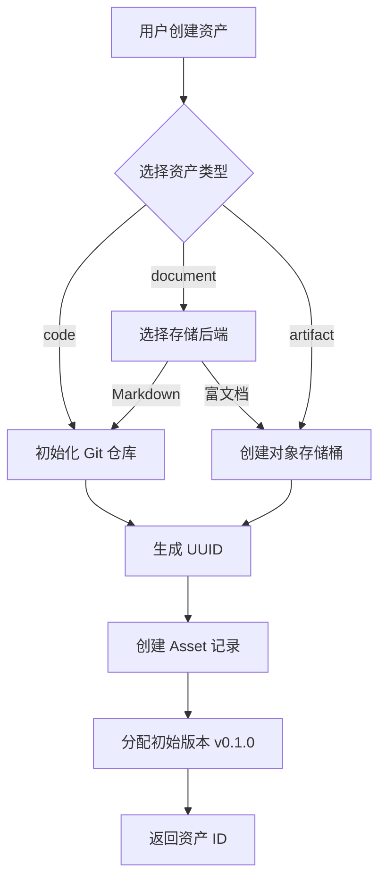
```mermaid
flowchart TD
    A[用户创建资产] --> B{选择资产类型}
    B -->|code| C[初始化 Git 仓库]
    B -->|document| D[选择存储后端]
    B -->|artifact| E[创建对象存储桶]
    D -->|Markdown| C
    D -->|富文档| E
    C --> F[生成 UUID]
    E --> F
    F --> G[创建 Asset 记录]
    G --> H[分配初始版本 v0.1.0]
    H --> I[返回资产 ID]
```

### 12.2 发布流程时序图

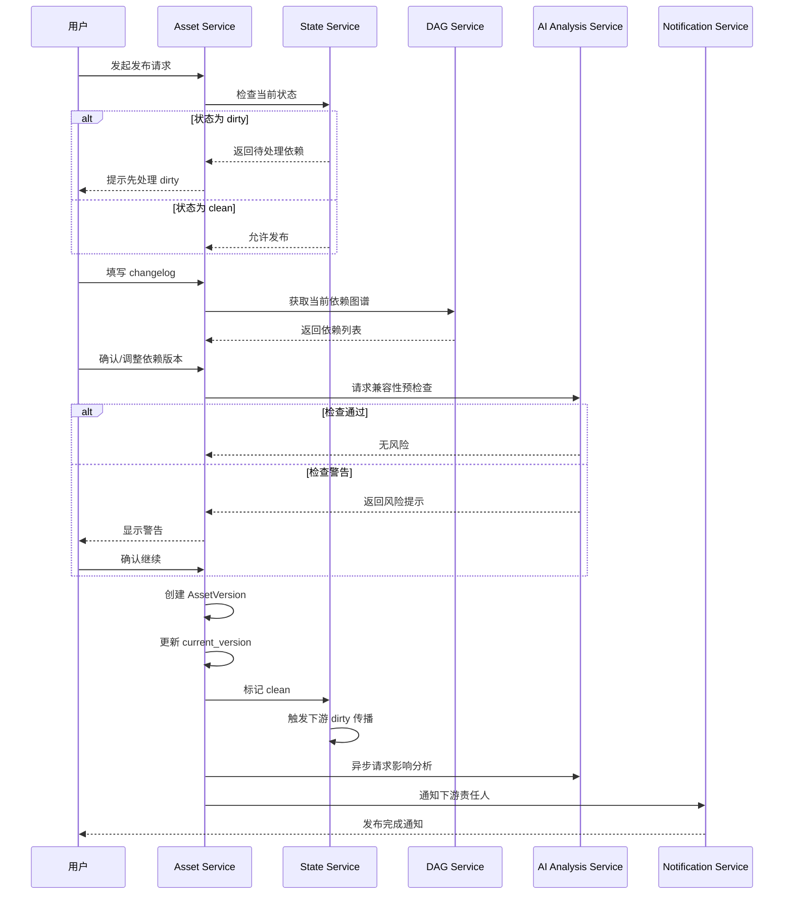
```mermaid
sequenceDiagram
    participant U as 用户
    participant A as Asset Service
    participant S as State Service
    participant D as DAG Service
    participant AI as AI Analysis Service
    participant N as Notification Service

    U->>A: 发起发布请求
    A->>S: 检查当前状态
    alt 状态为 dirty
        S-->>A: 返回待处理依赖
        A-->>U: 提示先处理 dirty
    else 状态为 clean
        S-->>A: 允许发布
    end
    U->>A: 填写 changelog
    A->>D: 获取当前依赖图谱
    D-->>A: 返回依赖列表
    U->>A: 确认/调整依赖版本
    A->>AI: 请求兼容性预检查
    alt 检查通过
        AI-->>A: 无风险
    else 检查警告
        AI-->>A: 返回风险提示
        A-->>U: 显示警告
        U->>A: 确认继续
    end
    A->>A: 创建 AssetVersion
    A->>A: 更新 current_version
    A->>S: 标记 clean
    S->>S: 触发下游 dirty 传播
    A->>AI: 异步请求影响分析
    A->>N: 通知下游责任人
    N-->>U: 发布完成通知
```

### 12.3 状态传播数据流

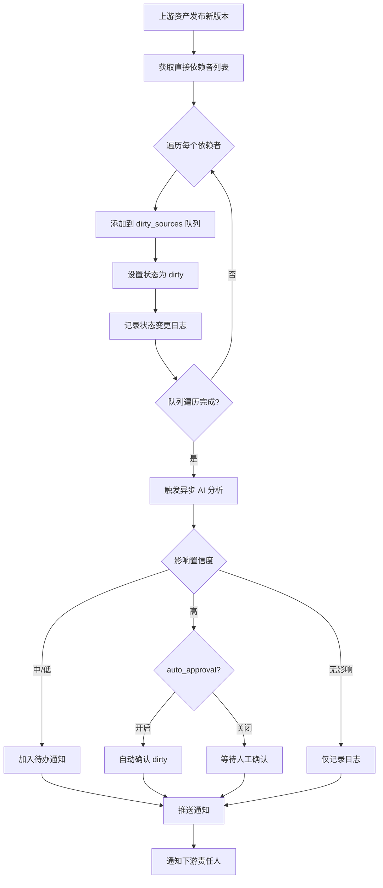
```mermaid
flowchart TD
    A[上游资产发布新版本] --> B[获取直接依赖者列表]
    B --> C{遍历每个依赖者}
    C --> D[添加到 dirty_sources 队列]
    D --> E[设置状态为 dirty]
    E --> F[记录状态变更日志]
    F --> G{队列遍历完成?}
    G -->|否| C
    G -->|是| H[触发异步 AI 分析]
    H --> I{影响置信度}
    I -->|高| J{auto_approval?}
    I -->|中/低| K[加入待办通知]
    I -->|无影响| L[仅记录日志]
    J -->|开启| M[自动确认 dirty]
    J -->|关闭| N[等待人工确认]
    K --> O[推送通知]
    M --> O
    N --> O
    L --> O
    O --> P[通知下游责任人]
```

### 12.4 Dirty 处理时序图

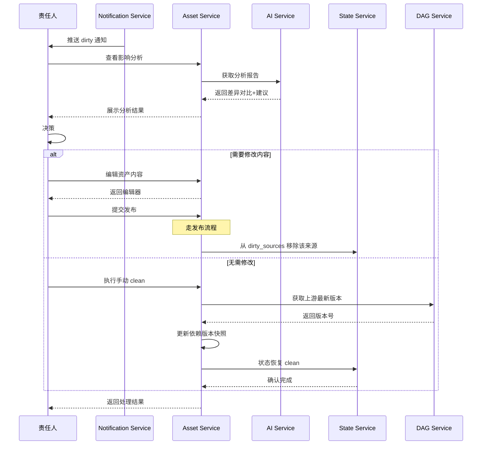
```mermaid
sequenceDiagram
    participant U as 责任人
    participant N as Notification Service
    participant A as Asset Service
    participant AI as AI Service
    participant S as State Service
    participant D as DAG Service

    N->>U: 推送 dirty 通知
    U->>A: 查看影响分析
    A->>AI: 获取分析报告
    AI-->>A: 返回差异对比+建议
    A-->>U: 展示分析结果
    U->>U: 决策
    alt 需要修改内容
        U->>A: 编辑资产内容
        A-->>U: 返回编辑器
        U->>A: 提交发布
        Note over A: 走发布流程
        A->>S: 从 dirty_sources 移除该来源
    else 无需修改
        U->>A: 执行手动 clean
        A->>D: 获取上游最新版本
        D-->>A: 返回版本号
        A->>A: 更新依赖版本快照
        A->>S: 状态恢复 clean
        S-->>A: 确认完成
    end
    A-->>U: 返回处理结果
```

### 12.5 AI 生成资产数据流

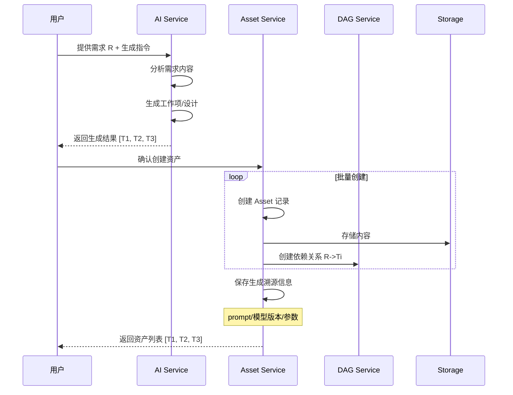
```mermaid
sequenceDiagram
    participant U as 用户
    participant AI as AI Service
    participant A as Asset Service
    participant D as DAG Service
    participant S as Storage

    U->>AI: 提供需求 R + 生成指令
    AI->>AI: 分析需求内容
    AI->>AI: 生成工作项/设计
    AI-->>U: 返回生成结果 [T1, T2, T3]
    U->>A: 确认创建资产
    loop 批量创建
        A->>A: 创建 Asset 记录
        A->>S: 存储内容
        A->>D: 创建依赖关系 R->Ti
    end
    A->>A: 保存生成溯源信息
    Note over A: prompt/模型版本/参数
    A-->>U: 返回资产列表 [T1, T2, T3]
```

### 12.6 依赖图谱查询数据流

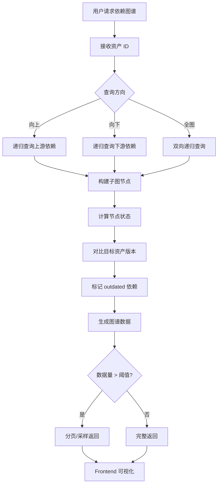
```mermaid
flowchart TD
    A[用户请求依赖图谱] --> B[接收资产 ID]
    B --> C{查询方向}
    C -->|向上| D[递归查询上游依赖]
    C -->|向下| E[递归查询下游依赖]
    C -->|全图| F[双向递归查询]
    D --> G[构建子图节点]
    E --> G
    F --> G
    G --> H[计算节点状态]
    H --> I[对比目标资产版本]
    I --> J[标记 outdated 依赖]
    J --> K[生成图谱数据]
    K --> L{数据量 > 阈值?}
    L -->|是| M[分页/采样返回]
    L -->|否| N[完整返回]
    M --> O[Frontend 可视化]
    N --> O
```

### 12.7 Agent DAG 上下文构建

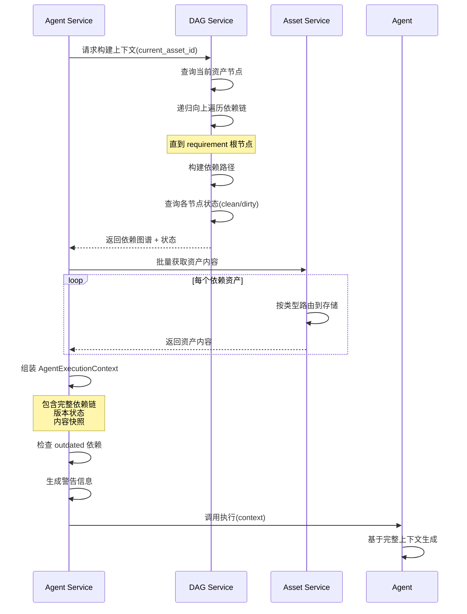
```mermaid
sequenceDiagram
    participant AG as Agent Service
    participant DG as DAG Service
    participant AS as Asset Service
    participant AI as Agent

    AG->>DG: 请求构建上下文(current_asset_id)
    DG->>DG: 查询当前资产节点
    DG->>DG: 递归向上遍历依赖链
    Note over DG: 直到 requirement 根节点
    DG->>DG: 构建依赖路径
    DG->>DG: 查询各节点状态(clean/dirty)
    DG-->>AG: 返回依赖图谱 + 状态
    AG->>AS: 批量获取资产内容
    loop 每个依赖资产
        AS->>AS: 按类型路由到存储
        AS-->>AG: 返回资产内容
    end
    AG->>AG: 组装 AgentExecutionContext
    Note over AG: 包含完整依赖链<br>版本状态<br>内容快照
    AG->>AG: 检查 outdated 依赖
    AG->>AG: 生成警告信息
    AG->>AI: 调用执行(context)
    AI->>AI: 基于完整上下文生成
```

### 12.8 存储层数据流

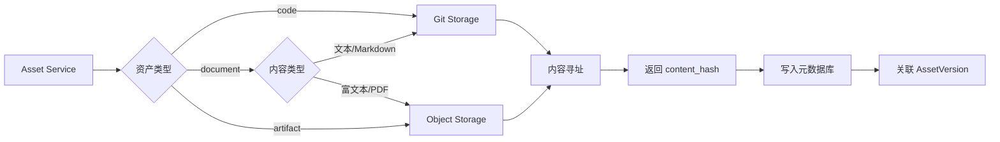
```mermaid
flowchart LR
    A[Asset Service] --> B{资产类型}
    B -->|code| C[Git Storage]
    B -->|document| D{内容类型}
    B -->|artifact| E[Object Storage]
    D -->|文本/Markdown| C
    D -->|富文本/PDF| E
    C --> F[内容寻址]
    E --> F
    F --> G[返回 content_hash]
    G --> H[写入元数据库]
    H --> I[关联 AssetVersion]
```

### 12.9 AI 分析服务内部数据流

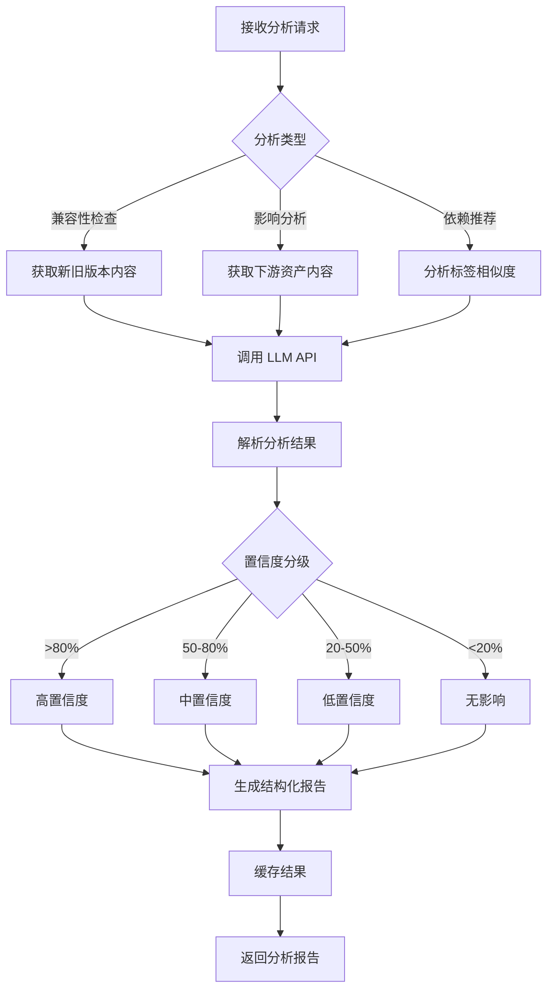
```mermaid
flowchart TD
    A[接收分析请求] --> B{分析类型}
    B -->|兼容性检查| C[获取新旧版本内容]
    B -->|影响分析| D[获取下游资产内容]
    B -->|依赖推荐| E[分析标签相似度]
    C --> F[调用 LLM API]
    D --> F
    E --> F
    F --> G[解析分析结果]
    G --> H{置信度分级}
    H -->|>80%| I[高置信度]
    H -->|50-80%| J[中置信度]
    H -->|20-50%| K[低置信度]
    H -->|<20%| L[无影响]
    I --> M[生成结构化报告]
    J --> M
    K --> M
    L --> M
    M --> N[缓存结果]
    N --> O[返回分析报告]
```

### 12.10 通知服务数据流

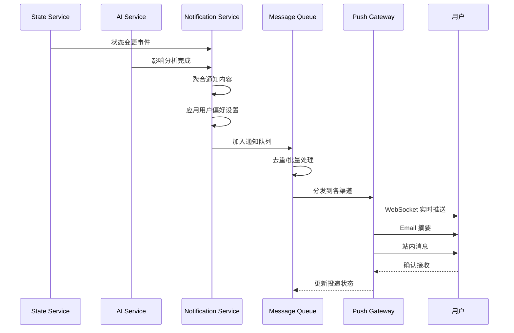
```mermaid
sequenceDiagram
    participant S as State Service
    participant AI as AI Service
    participant N as Notification Service
    participant Q as Message Queue
    participant P as Push Gateway
    participant U as 用户

    S->>N: 状态变更事件
    AI->>N: 影响分析完成
    N->>N: 聚合通知内容
    N->>N: 应用用户偏好设置
    N->>Q: 加入通知队列
    Q->>Q: 去重/批量处理
    Q->>P: 分发到各渠道
    P->>U: WebSocket 实时推送
    P->>U: Email 摘要
    P->>U: 站内消息
    U-->>P: 确认接收
    P-->>Q: 更新投递状态
```

### 12.11 完整资产生命周期状态机

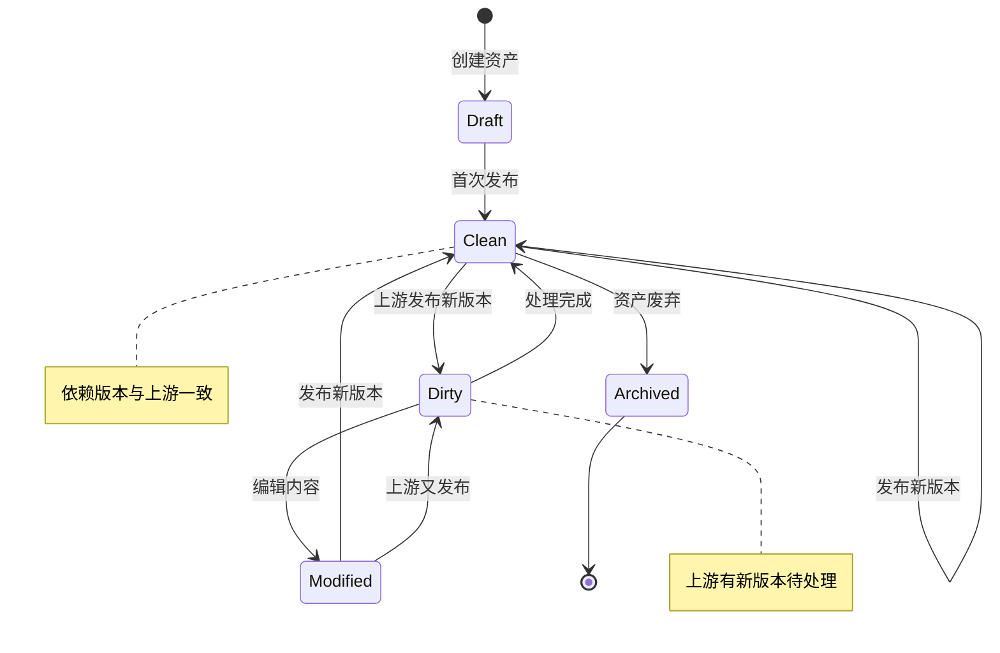
```mermaid
stateDiagram-v2
    [*] --> Draft: 创建资产
    Draft --> Clean: 首次发布

    Clean --> Dirty: 上游发布新版本
    Clean --> Clean: 发布新版本
    Clean --> Archived: 资产废弃

    Dirty --> Clean: 处理完成
    Dirty --> Modified: 编辑内容

    Modified --> Clean: 发布新版本
    Modified --> Dirty: 上游又发布

    Archived --> [*]

    note right of Clean
        依赖版本与上游一致
    end note

    note right of Dirty
        上游有新版本待处理
    end note
```

### 12.12 Agent 执行流程

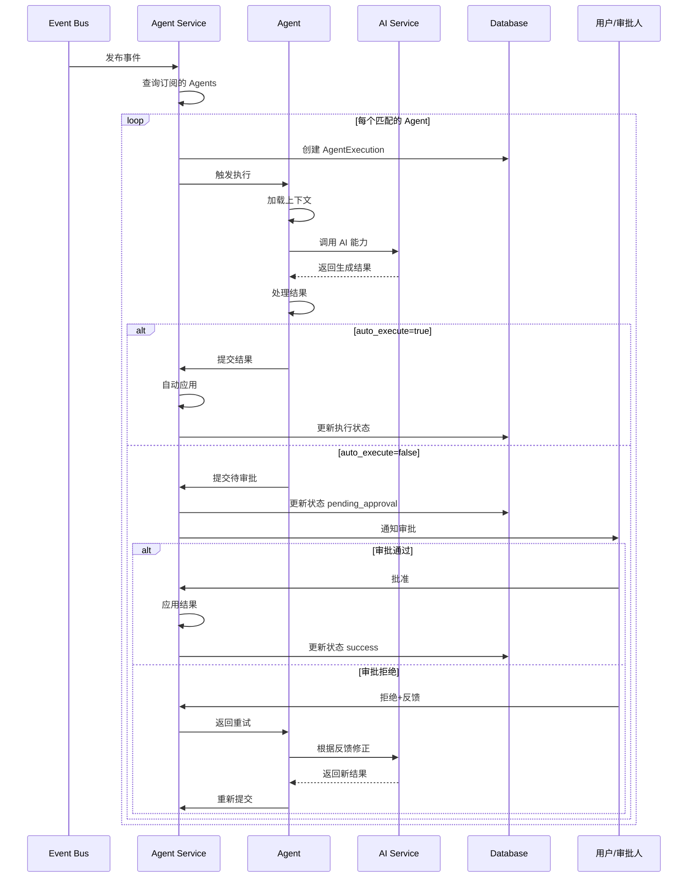
```mermaid
sequenceDiagram
    participant E as Event Bus
    participant AS as Agent Service
    participant A as Agent
    participant AI as AI Service
    participant DB as Database
    participant U as 用户/审批人

    E->>AS: 发布事件
    AS->>AS: 查询订阅的 Agents
    loop 每个匹配的 Agent
        AS->>DB: 创建 AgentExecution
        AS->>A: 触发执行
        A->>A: 加载上下文
        A->>AI: 调用 AI 能力
        AI-->>A: 返回生成结果
        A->>A: 处理结果
        alt auto_execute=true
            A->>AS: 提交结果
            AS->>AS: 自动应用
            AS->>DB: 更新执行状态
        else auto_execute=false
            A->>AS: 提交待审批
            AS->>DB: 更新状态 pending_approval
            AS->>U: 通知审批
            alt 审批通过
                U->>AS: 批准
                AS->>AS: 应用结果
                AS->>DB: 更新状态 success
            else 审批拒绝
                U->>AS: 拒绝+反馈
                AS->>A: 返回重试
                A->>AI: 根据反馈修正
                AI-->>A: 返回新结果
                A->>AS: 重新提交
            end
        end
    end
```

### 12.13 环节委托与流转

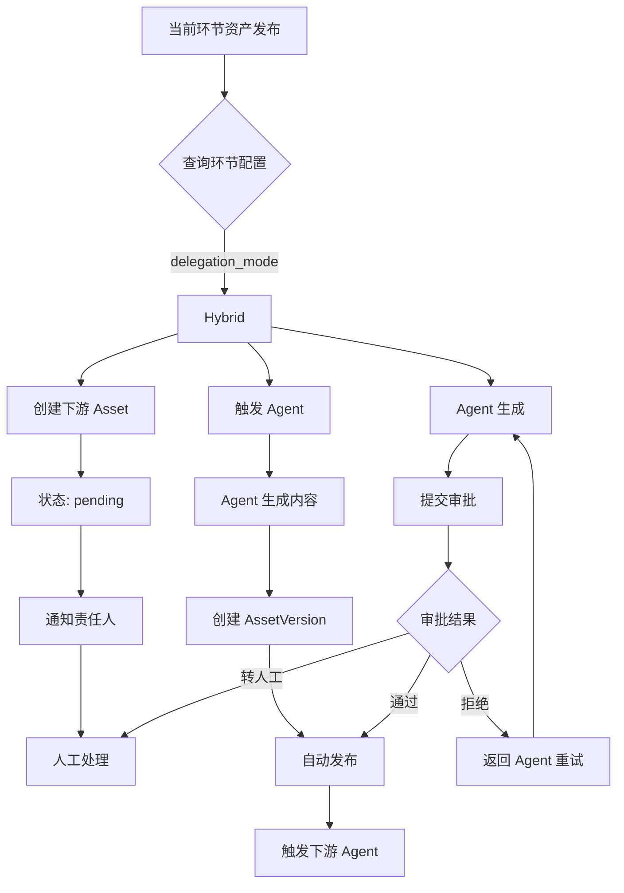
```mermaid
flowchart TD
    A[当前环节资产发布] --> B{查询环节配置}
    B -->|delegation_mode| C

    C[Manual] --> D[创建下游 Asset]
    D --> E[状态: pending]
    E --> F[通知责任人]
    F --> G[人工处理]

    C[Agent] --> H[触发 Agent]
    H --> I[Agent 生成内容]
    I --> J[创建 AssetVersion]
    J --> K[自动发布]
    K --> L[触发下游 Agent]

    C[Hybrid] --> M[Agent 生成]
    M --> N[提交审批]
    N --> O{审批结果}
    O -->|通过| K
    O -->|拒绝| P[返回 Agent 重试]
    P --> M
    O -->|转人工| G
```

### 12.14 事件总线架构

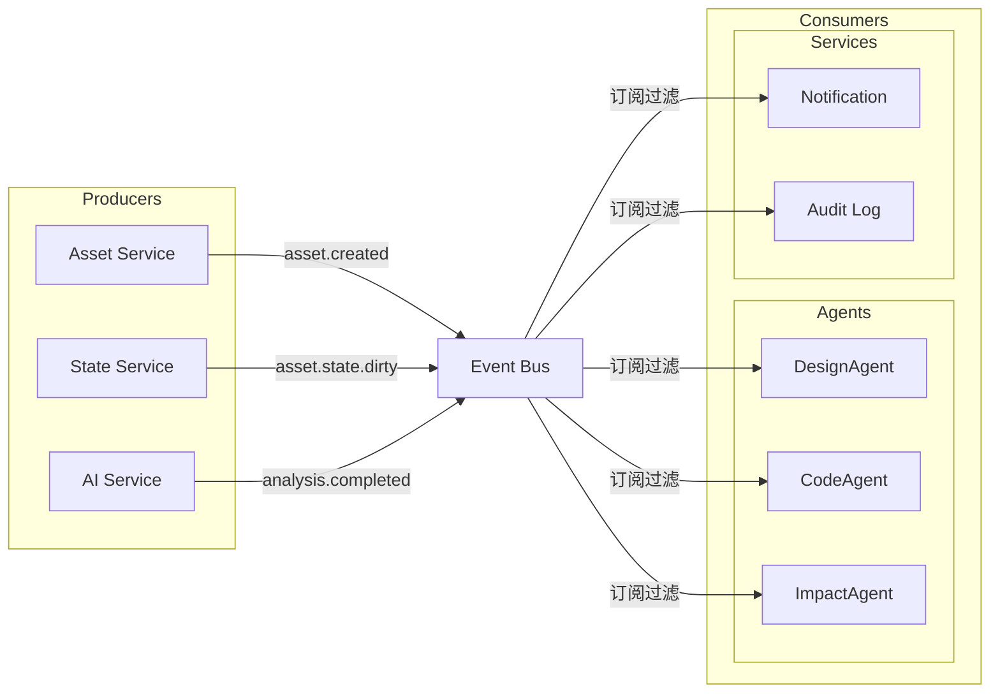
```mermaid
flowchart LR
    subgraph Producers
        P1[Asset Service]
        P2[State Service]
        P3[AI Service]
    end

    EB[Event Bus]

    subgraph Consumers
        subgraph Agents
            A1[DesignAgent]
            A2[CodeAgent]
            A3[ImpactAgent]
        end
        subgraph Services
            S1[Notification]
            S2[Audit Log]
        end
    end

    P1 -->|asset.created| EB
    P2 -->|asset.state.dirty| EB
    P3 -->|analysis.completed| EB

    EB -->|订阅过滤| A1
    EB -->|订阅过滤| A2
    EB -->|订阅过滤| A3
    EB -->|订阅过滤| S1
    EB -->|订阅过滤| S2
```

### 12.15 Agent 审批流程

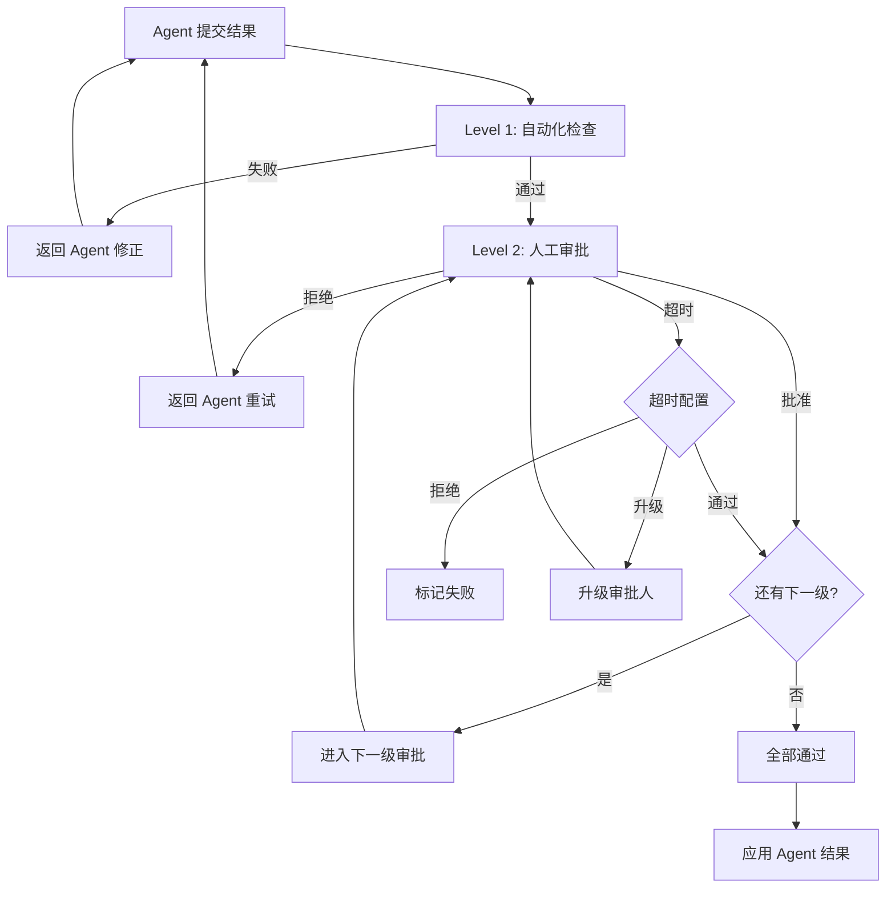
```mermaid
flowchart TD
    A[Agent 提交结果] --> B[Level 1: 自动化检查]
    B -->|失败| C[返回 Agent 修正]
    C --> A
    B -->|通过| D[Level 2: 人工审批]
    D -->|批准| E{还有下一级?}
    D -->|拒绝| F[返回 Agent 重试]
    F --> A
    D -->|超时| G{超时配置}
    G -->|通过| E
    G -->|拒绝| H[标记失败]
    G -->|升级| I[升级审批人]
    I --> D
    E -->|是| J[进入下一级审批]
    J --> D
    E -->|否| K[全部通过]
    K --> L[应用 Agent 结果]
```

### 12.16 发布前后 Agent 触发

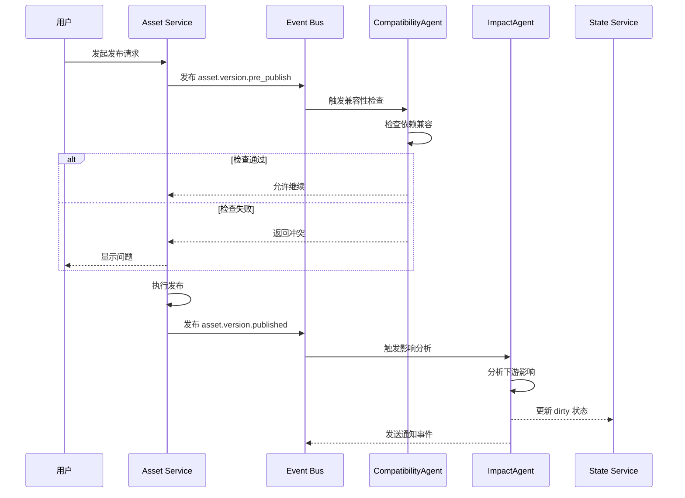
```mermaid
sequenceDiagram
    participant U as 用户
    participant A as Asset Service
    participant E as Event Bus
    participant C as CompatibilityAgent
    participant I as ImpactAgent
    participant S as State Service

    U->>A: 发起发布请求
    A->>E: 发布 asset.version.pre_publish
    E->>C: 触发兼容性检查
    C->>C: 检查依赖兼容
    alt 检查通过
        C-->>A: 允许继续
    else 检查失败
        C-->>A: 返回冲突
        A-->>U: 显示问题
    end
    A->>A: 执行发布
    A->>E: 发布 asset.version.published
    E->>I: 触发影响分析
    I->>I: 分析下游影响
    I-->>S: 更新 dirty 状态
    I-->>E: 发送通知事件
```

### 12.17 Agent Skill 机制（渐进式上下文披露）

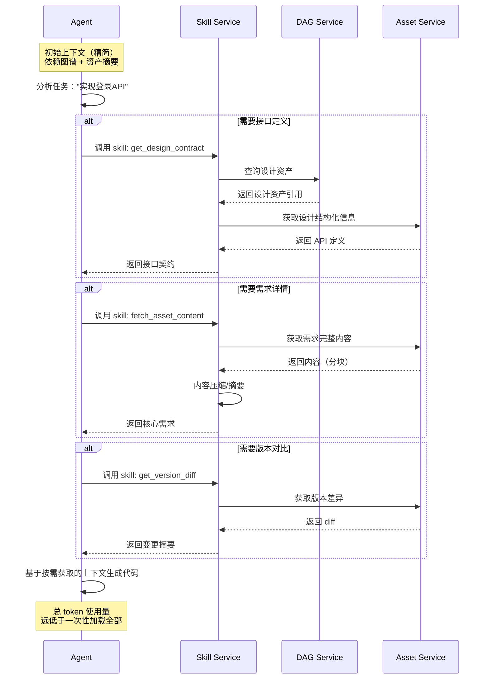
```mermaid
sequenceDiagram
    participant AG as Agent
    participant SK as Skill Service
    participant DG as DAG Service
    participant AS as Asset Service

    Note over AG: 初始上下文（精简）<br>依赖图谱 + 资产摘要

    AG->>AG: 分析任务："实现登录API"

    alt 需要接口定义
        AG->>SK: 调用 skill: get_design_contract
        SK->>DG: 查询设计资产
        DG-->>SK: 返回设计资产引用
        SK->>AS: 获取设计结构化信息
        AS-->>SK: 返回 API 定义
        SK-->>AG: 返回接口契约
    end

    alt 需要需求详情
        AG->>SK: 调用 skill: fetch_asset_content
        SK->>AS: 获取需求完整内容
        AS-->>SK: 返回内容（分块）
        SK->>SK: 内容压缩/摘要
        SK-->>AG: 返回核心需求
    end

    alt 需要版本对比
        AG->>SK: 调用 skill: get_version_diff
        SK->>AS: 获取版本差异
        AS-->>SK: 返回 diff
        SK-->>AG: 返回变更摘要
    end

    AG->>AG: 基于按需获取的上下文生成代码

    Note over AG: 总 token 使用量 <br>远低于一次性加载全部
```

### 12.18 Skill Service 架构

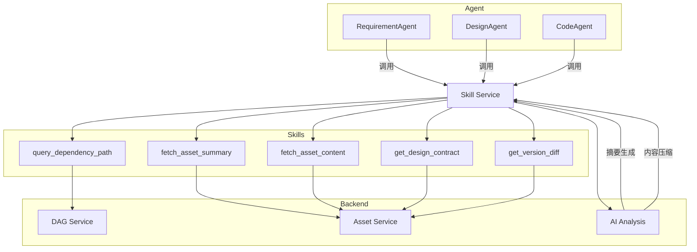
```mermaid
flowchart TD
    subgraph Agent
        A1[RequirementAgent]
        A2[DesignAgent]
        A3[CodeAgent]
    end

    SK[Skill Service]

    subgraph Skills
        S1[fetch_asset_summary]
        S2[fetch_asset_content]
        S3[get_design_contract]
        S4[query_dependency_path]
        S5[get_version_diff]
    end

    subgraph Backend
        DG[DAG Service]
        AS[Asset Service]
        AI[AI Analysis]
    end

    A1 -->|调用| SK
    A2 -->|调用| SK
    A3 -->|调用| SK

    SK --> S1
    SK --> S2
    SK --> S3
    SK --> S4
    SK --> S5

    S1 --> AS
    S2 --> AS
    S3 --> AS
    S4 --> DG
    S5 --> AS

    SK --> AI

    AI -->|摘要生成| SK
    AI -->|内容压缩| SK
```

---

## 13. 参考资料

- [Agent System 设计](./agent-system.md)
- [数据模型设计](./data-model.md)
- [API 设计](../api/openapi.yaml)
- [实施路线图](../plans/implementation-roadmap.md)
