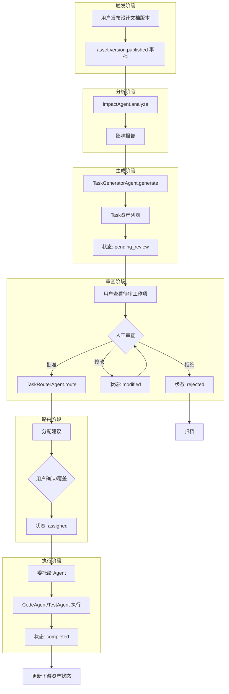
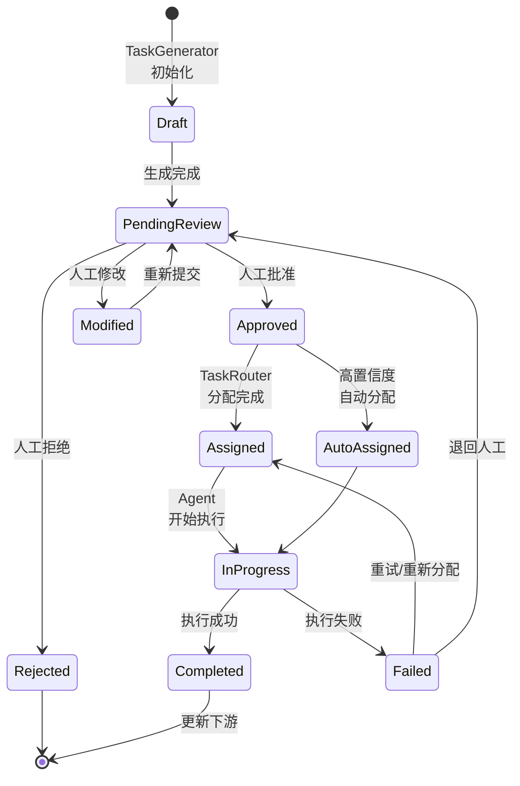

# TaskGeneratorAgent & TaskRouterAgent 设计文档

**Date:** 2026-03-25
**Status:** Approved
**Version:** 1.0

---

## 1. 设计目标

实现设计文档变更后的自动化工作流编排：

1. **自动生成工作项** - 基于 ImpactAgent 影响分析结果创建 Task 资产
2. **智能任务路由** - 将任务分配给最合适的 Agent 执行
3. **人在回路审查** - 人工审批机制确保可控性
4. **委托执行流程** - 用户可将任务委托给 CodeAgent/TestAgent 等执行

---

## 2. 架构概览

### 2.1 完整工作流



### 2.2 Agent 职责划分

| Agent | 职责 | 输入 | 输出 |
|-------|------|------|------|
| **TaskGeneratorAgent** | 生成工作项 | ImpactReport | Task[] |
| **TaskRouterAgent** | 分配路由 | Task + 策略 | AgentAssignment |
| **CodeAgent** | 代码生成 | Task | Code + Tests |
| **TestAgent** | 测试生成 | Task | Test Suite |

---

## 3. TaskGeneratorAgent 设计

### 3.1 核心职责

- 解析 ImpactAgent 的影响分析报告
- 根据变更类型（breaking/additive/behavioral）生成对应任务
- 设置任务优先级、估计工时
- 创建 Task 资产（复用 assets 表，type='task'）

### 3.2 任务生成规则

```yaml
breaking_change:
  tasks:
    - type: code_update
      priority: high
      template: "更新 {asset_name} 以适配 {breaking_changes} 变更"
    - type: test_update
      priority: high
      depends_on: code_update
    - type: compatibility_check
      priority: medium

additive_change:
  tasks:
    - type: code_implementation
      priority: medium
    - type: test_generation
      priority: medium
      depends_on: code_implementation

behavioral_change:
  tasks:
    - type: regression_test
      priority: high
    - type: behavior_validation
      priority: medium
```

### 3.3 配置

```typescript
interface TaskGeneratorConfig {
  rules: {
    [changeType: string]: {
      tasks: TaskTemplate[];
      defaultPriority: 'high' | 'medium' | 'low';
      autoApproveThreshold: 'high_confidence' | 'medium' | 'none';
    };
  };

  // 是否允许 TaskGenerator 给出分配建议
  enableRoutingSuggestion: boolean;
}

const TASK_GENERATOR_CONFIG: AgentConfig = {
  slug: 'task-generator',
  name: 'TaskGeneratorAgent',
  mode: 'subagent',
  subscribed_events: ['impact.analysis.completed'],
  config: {
    enableRoutingSuggestion: true,
  },
};
```

---

## 4. TaskRouterAgent 设计

### 4.1 核心职责

- 接收已批准的 Task
- 根据策略选择最优 Agent
- 支持人工覆盖建议
- 处理重试和重新分配

### 4.2 路由策略（按优先级）

```typescript
interface RoutingStrategy {
  // 策略 1: 任务类型映射（默认）
  typeBased: {
    code_generation: 'code-agent';
    code_update: 'code-agent';
    test_generation: 'test-agent';
    test_update: 'test-agent';
    compatibility_check: 'compatibility-agent';
    review: 'user'; // 人工审查
  };

  // 策略 2: Agent 负载感知（未来扩展）
  loadAware: {
    enabled: boolean;
    maxConcurrentPerAgent: number;
  };

  // 策略 3: 历史成功率（未来扩展）
  successRate: {
    enabled: boolean;
    minSuccessRate: 0.8;
  };


  // 策略 4: 用户偏好（未来扩展）
  userPreference: {
    enabled: boolean;
    allowOverride: true;
  };
}
```

### 4.3 配置

```typescript
const TASK_ROUTER_CONFIG: AgentConfig = {
  slug: 'task-router',
  name: 'TaskRouterAgent',
  mode: 'subagent',
  config: {
    strategies: ['typeBased'], // 当前仅启用类型映射
    defaultAgent: 'user', // 无法路由时默认人工处理
  },
};
```

---

## 5. 数据模型

### 5.1 Task 资产扩展

```typescript
// 复用 assets 表，type='task'
interface TaskAsset {
  // ===== 基础字段（继承 Asset） =====
  id: string;
  type: 'task'; // 固定值
  name: string;
  slug: string;
  description: string;
  state: 'draft' | 'pending_review' | 'approved' | 'rejected' |
         'modified' | 'assigned' | 'in_progress' | 'completed' | 'failed';

  // ===== 生成阶段 =====
  generated_by: 'task-generator-agent';
  impact_report_id: string;           // 来源影响报告
  source_asset_id: string;           // 触发变更的资产
  source_version: string;
  change_type: 'breaking' | 'additive' | 'behavioral';

  // ===== 任务内容 =====
  task_type: 'code_generation' | 'code_update' | 'test_generation' |
             'test_update' | 'compatibility_check' | 'review';
  acceptance_criteria: string[];     // 验收标准
  estimated_effort: number;          // 估计工时（小时）
  priority: 'high' | 'medium' | 'low';

  // ===== 路由阶段 =====
  suggested_agent: string;             // TaskGeneratorAgent 建议
  router_recommendation: {            // TaskRouterAgent 建议
    agent_id: string;
    confidence: number;
    reason: string;
  };
  assigned_agent: string;            // 最终分配（人工可覆盖）

  // ===== 审查阶段 =====
  reviewed_by?: string;
  reviewed_at?: Date;
  review_notes?: string;
  review_decision: 'approved' | 'rejected' | 'modified';

  // ===== 执行阶段 =====
  execution_session_id?: string;     // AgentExecution 会话
  execution_started_at?: Date;
  execution_completed_at?: Date;
  execution_result?: {
    status: 'success' | 'failure' | 'partial';
    output: string;
    artifacts: string[];             // 生成的文件/资产ID
  };

  // ===== 自动审批配置 =====
  auto_approve_policy: {
    enabled: boolean;
    confidence_threshold: number;
    change_type_whitelist: string[];
  };
}

// dirty_sources 表关联
interface DirtySource {
  id: string;
  asset_id: string;                  // 受影响的下游资产
  upstream_asset_id: string;         // 上游变更资产
  upstream_version: string;

  // 关联生成的工作项
  generated_tasks: string[];         // Task IDs
  resolution_strategy: 'auto' | 'manual';

  status: 'pending' | 'acknowledged' | 'processing' | 'resolved';
}
```

### 5.2 新表：task_routing_history

```typescript
interface TaskRoutingHistory {
  id: string;
  task_id: string;

  // 路由决策
  router_agent_id: string;
  strategy_used: string;
  recommended_agent: string;
  confidence: number;

  // 人工覆盖
  user_overridden: boolean;
  override_reason?: string;
  final_agent: string;

  // 执行结果（用于学习）
  execution_success: boolean;
  execution_duration: number;

  created_at: Date;
}
```

---

## 6. API 设计

### 6.1 TaskGeneratorAgent API

```typescript
// POST /v1/agents/task-generator/execute
// 由 ImpactAgent 触发或手动调用
interface GenerateTasksRequest {
  impact_report_id: string;
  policy?: 'all' | 'high_confidence_only' | 'breaking_only';
}

interface GenerateTasksResponse {
  tasks: TaskAsset[];
  summary: {
    total: number;
    high_priority: number;
    medium_priority: number;
    low_priority: number;
    auto_approved: number;
    pending_review: number;
  };
}
```

### 6.2 TaskRouterAgent API

```typescript
// POST /v1/agents/task-router/route
// 由系统调用（批准后）
interface RouteTaskRequest {
  task_id: string;
  context?: {
    user_preference?: string;
    urgency?: 'high' | 'normal' | 'low';
  };
}

interface RouteTaskResponse {
  recommendation: {
    agent_id: string;
    confidence: number;
    reason: string;
    alternatives: string[];
  };
  requires_confirmation: boolean; // 高置信度可自动分配
}

// POST /v1/tasks/:id/assign
// 用户确认/覆盖分配
interface AssignTaskRequest {
  agent_id: string;        // 用户选择的 Agent
  override_reason?: string; // 覆盖建议的原因
  auto_execute: boolean;   // 是否立即执行
}
```

### 6.3 审查工作流 API

```typescript
// GET /v1/tasks?status=pending_review&assigned_to_me=true
// 列出待审查工作项

// POST /v1/tasks/:id/review
interface ReviewTaskRequest {
  decision: 'approve' | 'reject' | 'modify';
  notes?: string;
  modifications?: {
    title?: string;
    description?: string;
    priority?: 'high' | 'medium' | 'low';
    assigned_agent?: string; // 审查时可直接指定 Agent
  };
}

// POST /v1/tasks/batch-review
// 批量审查
interface BatchReviewRequest {
  task_ids: string[];
  decision: 'approve' | 'reject';
  notes?: string;
}
```

### 6.4 委托执行 API

```typescript
// POST /v1/tasks/:id/delegate
// 委托给 Agent 执行
interface DelegateTaskRequest {
  agent_id: string;
  context?: {
    session_id?: string;      // 复用现有会话
    parent_execution_id?: string;
  };
}

// GET /v1/tasks/:id/execution-status
// 查询执行状态
```

---

## 7. 状态机



---

## 8. 事件流

```typescript
// EventBus 订阅关系
eventBus.subscribe('asset.version.published', ImpactAgent.analyze);
eventBus.subscribe('impact.analysis.completed', TaskGeneratorAgent.generate);
eventBus.subscribe('tasks.generated', NotificationService.notifyUser);
eventBus.subscribe('task.approved', TaskRouterAgent.route);
eventBus.subscribe('task.assigned', AgentExecutionEngine.execute);
eventBus.subscribe('task.completed', DirtySourceService.resolve);
```

---

## 9. 关键决策记录

### ADR 1: 两个 Agent vs 一个 Agent
**决策**: TaskGenerator + TaskRouter 分离
**原因**:
- 职责分离：生成 vs 路由是不同的领域
- 独立演进：路由策略会更频繁调整
- 可测试性：可独立测试路由逻辑
- 复用性：TaskRouter 可被其他场景复用

### ADR 2: 人在回路机制
**决策**: 人工审查所有 Task，不支持全自动
**原因**:
- 安全：防止 AI 生成不恰当任务
- 控制：用户保留最终决策权
- 质量：人工可修正 AI 理解偏差
- 例外：支持配置高置信度自动批准（默认关闭）

### ADR 3: Task 存储
**决策**: 复用 assets 表而非新建 tasks 表
**原因**:
- 一致性：Task 也是一种资产
- 复用：自动获得版本、依赖、权限机制
- 简化：无需维护两套相似模型

---

## 10. 实施计划

### Phase 1: 基础设施 (3天)
- [ ] EventBus 服务实现
- [ ] AssetService.publishVersion() 触发事件
- [ ] ImpactAgent 改为事件驱动
- [ ] dirty_sources 表扩展（关联 Task）

### Phase 2: TaskGeneratorAgent (3天)
- [ ] TaskGeneratorAgent.ts 实现
- [ ] 任务生成规则引擎
- [ ] POST /v1/agents/task-generator/execute
- [ ] Task 创建 API 集成

### Phase 3: TaskRouterAgent (3天)
- [ ] TaskRouterAgent.ts 实现
- [ ] 路由策略框架
- [ ] POST /v1/agents/task-router/route
- [ ] 路由历史记录

### Phase 4: 审查工作流 (4天)
- [ ] GET /v1/tasks?status=pending_review
- [ ] POST /v1/tasks/:id/review
- [ ] POST /v1/tasks/batch-review
- [ ] 通知机制（有新工作项时通知用户）

### Phase 5: 委托执行 (3天)
- [ ] CodeAgent/TestAgent Subagent 改造
- [ ] POST /v1/tasks/:id/assign
- [ ] POST /v1/tasks/:id/delegate
- [ ] 执行状态追踪

### Phase 6: Web UI (4天)
- [ ] 工作项列表页面
- [ ] 工作项详情/审查页面
- [ ] 分配选择器（显示 TaskRouter 建议）
- [ ] 执行进度查看

### Phase 7: 集成测试 (3天)
- [ ] E2E 工作流测试
- [ ] 批量审查场景
- [ ] 重试/失败处理
- [ ] 性能测试

**总计：23 个工作日**

---

## 11. 风险评估

| 风险 | 概率 | 影响 | 缓解措施 |
|------|------|------|----------|
| TaskGenerator 生成过多任务 | 中 | 高 | 配置生成上限，用户可批量拒绝 |
| TaskRouter 分配不当 | 中 | 中 | 支持人工覆盖，收集反馈优化 |
| 用户审查负担重 | 中 | 高 | 支持批量操作，高置信度自动批准可选 |
| Agent 执行失败 | 低 | 中 | 重试机制，失败后退回人工 |

---

## 12. 附录

### A. 与现有系统的集成

```typescript
// 与 AgentExecutionEngine 集成
class TaskExecutionAdapter {
  async executeTask(task: TaskAsset): Promise<void> {
    const agent = await agentService.getBySlug(task.assigned_agent);

    const execution = await agentExecutionEngine.execute({
      agent_id: agent.id,
      task_context: {
        task_id: task.id,
        description: task.description,
        acceptance_criteria: task.acceptance_criteria,
        source_asset: task.source_asset_id,
      },
    });

    // 更新 Task 状态
    await assetService.update(task.id, {
      state: 'in_progress',
      execution_session_id: execution.session_id,
    });
  }
}
```

### B. 配置示例

```json
{
  "task_generator": {
    "rules": {
      "breaking_change": {
        "max_tasks_per_impact": 5,
        "default_priority": "high"
      }
    },
    "enable_routing_suggestion": true
  },
  "task_router": {
    "strategies": ["type_based"],
    "load_aware": {
      "enabled": false
    },
    "auto_assign_threshold": 0.9
  }
}
```

---

**Next Steps:**
1. 创建 Phase 1 实施计划
2. 开始 EventBus 服务开发
3. 更新数据库迁移（dirty_sources 扩展）
