# AI-Native DevOps Platform - Design Document

**Date:** 2026-03-12
**Status:** Draft
**Version:** 1.0

---

## 1. 概述

### 1.1 核心目标

构建一个 AI-Native DevOps 平台，实现项目全生命周期资产的版本化管理、依赖追踪和智能影响分析。

### 1.2 核心原则

- **严格 DAG**：资产按标签分层，依赖方向固定（如需求 → 设计 → 代码），防止循环依赖；同时为 Agent 提供准确的上下文依赖图谱
- **显式版本锁定**：每个版本精确记录依赖资产的版本号
- **波浪式状态传播**：dirty 状态只传播给直接依赖者，逐层处理
- **人机协作**：AI 分析推荐，用户最终确认，支持自动审批
- **Agent 原生**：平台内置 Agent 能力，所有环节支持人机协作或全自动执行

---

## 2. 资产模型

### 2.1 资产定义

```yaml
Asset:
  id: uuid                    # 全局唯一标识
  name: string                # 资产名称
  tags: [string]              # 标签：requirement, design, task, code, test, pipeline, etc.
  owners: [user_id]           # 关联人员
  current_version: string     # 当前版本号
  state: clean | dirty        # 当前状态
  auto_approval:              # 自动审批配置
    enabled: boolean
    threshold: high | medium | low
  created_at: timestamp
  updated_at: timestamp
```

### 2.2 版本定义

```yaml
AssetVersion:
  asset_id: uuid
  version: string             # 版本号，遵循语义化版本规范
  content_ref: string         # 内容存储引用（Git commit hash / 对象存储 key）
  changelog: string           # 变更说明（发布时必填）
  dependencies:               # 依赖的上游资产版本快照
    - asset_id: uuid
      version: string
      confirmed_at: timestamp   # 确认时间
      confirmed_by: user_id     # 确认人
      auto_confirmed: boolean   # 是否自动确认
  state: clean | dirty        # 该版本发布时的状态
  published_at: timestamp
  published_by: user_id
```

---

## 3. 依赖关系规则

### 3.1 依赖建立

- **首次发布时确定**：用户手动指定依赖，AI 根据标签和内容辅助推荐
- **AI 生成资产自动关联**：AI 根据生成依据自动创建依赖关系

### 3.2 依赖方向约束

> **图例说明**：`A → B` 表示 **B 依赖 A**（A 是上游，B 是下游）。上游发布新版本会导致下游状态变为 dirty。
>
> ```
> 上游 A ──→ 下游 B
> （被依赖）  （依赖 A）
>
> A 发布新版本 → B 变 dirty
> ```

**层级约束：**

| 层级 | 可依赖目标 | 同层级策略 |
|------|-----------|-----------|
| requirement | 无 | - |
| design | requirement, **design*** | 有条件开放* |
| task | requirement, design | 禁止 |
| code | design, task, **code*** | 有条件开放* |
| test | requirement, design, code | 禁止 |
| pipeline | code, test | 禁止 |

> **同层级依赖规则***：
> - design → design：允许，但目标版本必须 **>=** 源版本（防止循环）
> - code → code：允许，通过 package 管理，平台仅记录引用关系
> - 同层级依赖需通过 DAG Service **实时 acyclic 检测**

**依赖关系示例：**

```
requirement-v1.0 ──┬──→ design-v1.0 ──→ code-v1.0 ──→ pipeline-v1.0
                   │      │              │
                   │      ↓              ↓
                   │   design-v2.0    code-lib-v1.0
                   │
                   └──→ test-v1.0 ──────┘

design 依赖 requirement
design-v2.0 依赖 design-v1.0（同层级，版本升级）
code 依赖 design 和 code-lib（代码库依赖）
test 依赖 requirement 和 code
pipeline 依赖 code（和 test）

当 requirement 发布 v1.1：
  - design 变 dirty
  - test 变 dirty（因为直接依赖 requirement）
  - code 保持 clean（直到 design 发布后才变 dirty）
  - pipeline 保持 clean（直到 code/test 发布后才变 dirty）
```

> 注：同层级依赖通过版本约束和实时 acyclic 检测控制风险。

---

## 4. 状态管理

### 4.1 状态定义

| 状态 | 含义 |
|------|------|
| **draft** | 资产创建后的初始状态，尚未首次发布 |
| **clean** | 资产已确认，与上游依赖版本一致 |
| **dirty** | 上游依赖有新版本，待责任人确认处理 |
| **modified** | 资产正在编辑中（可从 clean 或 dirty 进入编辑） |
| **archived** | 资产已废弃，不再参与版本流转 |

**状态说明：**

```
[draft] ──首次发布──→ [clean] ────────┬───────→ [dirty]
   │                      │            │             │
   │                      │ 编辑内容   │ 上游发布    │ 编辑内容
   │                      │            │             │
   │                      ▼            │             ▼
   │                   [modified] ◄────┘          [modified]
   │                      │                          │
   │                      │ 发布新版本               │ 发布新版本
   │                      │                          │
   │                      └───────────┬──────────────┘
   │                                  │
   │                                  ▼
   │                              [clean]
   │                                  │
   └──资产废弃───────────────────────→ [archived]

modified 来源：
  - clean → modified（主动编辑资产）
  - dirty → modified（处理 dirty 时编辑）
```

### 4.2 状态转换规则

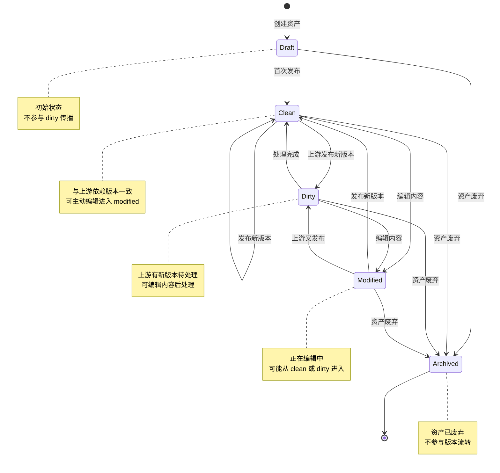
```mermaid
stateDiagram-v2
    [*] --> Draft: 创建资产

    Draft --> Clean: 首次发布
    Draft --> Archived: 资产废弃

    Clean --> Dirty: 上游发布新版本
    Clean --> Clean: 发布新版本
    Clean --> Modified: 编辑内容
    Clean --> Archived: 资产废弃

    Dirty --> Clean: 处理完成
    Dirty --> Modified: 编辑内容
    Dirty --> Archived: 资产废弃

    Modified --> Clean: 发布新版本
    Modified --> Dirty: 上游又发布
    Modified --> Archived: 资产废弃

    Archived --> [*]

    note right of Draft
        初始状态
        不参与 dirty 传播
    end note

    note right of Clean
        与上游依赖版本一致
        可主动编辑进入 modified
    end note

    note right of Dirty
        上游有新版本待处理
        可编辑内容后处理
    end note

    note right of Modified
        正在编辑中
        可能从 clean 或 dirty 进入
    end note

    note right of Archived
        资产已废弃
        不参与版本流转
    end note
```

**状态转换说明：**

| 转换 | 触发条件 | 说明 |
|------|----------|------|
| draft → clean | 首次发布 | 资产创建后首次发布版本 |
| clean → dirty | 上游发布新版本 | 依赖的上游资产有新版本 |
| clean → clean | 发布新版本 | 主动发布新版本（无上游变更） |
| clean → modified | 编辑内容 | 主动编辑资产内容（非 dirty 触发） |
| clean → archived | 资产废弃 | 资产被标记为废弃 |
| dirty → clean | 处理完成 | 发布新版本或手动 clean |
| dirty → modified | 编辑内容 | 从 dirty 状态进入编辑模式 |
| modified → clean | 发布新版本 | 编辑完成后发布 |
| modified → dirty | 上游又发布 | 编辑过程中上游又有新版本 |
| modified → archived | 资产废弃 | 编辑中的资产被废弃 |

### 4.3 状态传播机制

**规则：**

1. **发布新版本触发传播**
   - 当资产**发布新版本**时，其**直接依赖者**（下游资产）状态变为 **dirty**
   - 这是唯一会触发 dirty 传播的动作

2. **手动 clean 不传播**
   - 资产**手动 clean**时，仅更新自身依赖版本号为上游最新
   - 自身状态恢复为 **clean**
   - **不触发**下游 dirty 传播

> **关键原则**：只有"发布新版本"动作会触发下游 dirty，状态本身的变更不会传播。

**边界场景处理：**

| 场景 | 处理策略 |
|------|----------|
| **多上游同时dirty** | 队列按 **impact_level > publish_time** 排序，高影响优先 |
| **上游archived** | 下游收到`upstream.archived`事件，强制进入dirty并提示"需更换依赖" |
| **dirty处理中上游又发布** | dirty来源合并，保留最新版本，累计impact_level |
| **批量发布** | 支持事务性多资产发布，中间状态为`publishing`，全部成功后才触发下游dirty |

**Dirty队列优先级算法：**

```yaml
Priority Score =
  (impact_level_weight: high=100, medium=50, low=10) +
  (time_factor: hours_waiting * -1) +
  (asset_type_weight: requirement=50, design=30, code=10)

Sort: DESC by Priority Score
```

**特殊状态说明：**

| 状态 | 传播行为 |
|------|----------|
| **draft** | 不参与 dirty 传播。首次发布前不接收上游 dirty 通知 |
| **archived** | 不参与任何传播。资产废弃后从 DAG 中隐式移除（或标记为不可达） |
| **modified** | 同 clean/dirty，参与传播规则 |

**示例：**

```
初始状态：
  A v1.0(clean) → B v1.0(clean) → C v1.0(clean)

场景1：B 主动发布 v1.1
  A v1.0(clean) → B v1.1(clean) → C v1.0(dirty)
  （B 发布新版本，C 变 dirty）

场景2：然后 A 发布 v1.1
  A v1.1(clean) → B v1.1(dirty) → C v1.0(dirty)
  （A 发布新版本，B 变 dirty；C 保持 dirty，是之前 B 导致的）

场景3：B 处理 dirty（不修改内容，手动 clean）
  A v1.1(clean) → B v1.1(clean，依赖A v1.1) → C v1.0(dirty)
  （B 状态变为 clean，但 C 状态不变，因为不是"发布新版本"）

场景4：C 处理 dirty（发布 v1.1）
  A v1.1(clean) → B v1.1(clean，依赖A v1.1) → C v1.1(clean，依赖B v1.1)
```

---

## 5. 发布流程

### 5.1 正常发布流程

```
1. 用户发起发布
   ↓
2. 填写变更说明（必填）
   ↓
3. 确认/调整依赖关系
   ↓
4. AI 检查新版本与依赖资产的兼容性
   - 分析内容一致性
   - 检查是否遗漏依赖
   ↓
5. 发布
   - 创建新版本
   - 状态设为 clean
   - 触发下游 dirty 状态传播
   ↓
6. AI 分析对下游资产的影响
   - 按置信度分级：高/中/低/无影响
   - 生成影响报告和建议修改方案
   ↓
7. 通知下游资产责任人
```

### 5.2 AI 影响分析与确认

**置信度校准机制：**

```yaml
AI Analysis Service - Confidence Calibration:
  initial_thresholds:
    high: 0.8    # 自动dirty
    medium: 0.5  # 通知人工确认
    low: 0.2     # 仅记录日志

  feedback_loop:
    enabled: true
    collection: "责任人标记'实际影响是否与预测一致'"
    adjustment: "每周根据反馈数据微调阈值"
    decay: "90天前的反馈权重降低50%"

  quality_metrics:
    precision: "高置信度预测中实际受影响的比例"
    recall: "实际受影响资产中被预测到的比例"
    target: "precision > 0.9, recall > 0.8"

  fallback:
    on_uncertain: "置信度在0.4-0.6区间时，强制人工确认"
```

**影响分析流程：**

```
上游资产发布新版本
        ↓
┌─────────────────────────┐
│    AI 分析影响范围       │
│  ┌─────────────────┐    │
│  │ 高置信度受影响   │ → 自动设为 dirty（如开启 auto-approval）│
│  │ 中/低置信度     │ → 通知责任人，等待确认                   │
│  │ 不受影响        │ → 无操作                               │
│  └─────────────────┘    │
└─────────────────────────┘
        ↓
┌─────────────────────────┐
│    责任人处理 dirty      │
│  ┌─────────────────┐    │
│  │ 1. 查看 AI 分析  │    │
│  │ 2. 对比版本差异  │    │
│  │ 3. 标记反馈     │    │
│  │ 4. 选择操作：    │    │
│  │    - 修改并发布  │    │
│  │    - 手动 clean │    │
│  └─────────────────┘    │
└─────────────────────────┘
```

### 5.3 Auto-Approval 配置

| 阈值 | 行为 |
|------|------|
| OFF | 所有影响都通知责任人，人工确认 |
| high | 仅高置信度受影响自动 dirty，其他人工确认 |
| medium | 高/中置信度自动 dirty，低/无影响忽略 |
| low | 高/中/低置信度都自动 dirty，仅无影响忽略 |

---

## 6. 存储架构

### 6.1 元数据存储

统一存储在平台数据库：
- Asset 基本信息
- AssetVersion 版本历史
- 依赖关系图谱
- 状态变更日志

### 6.2 内容存储

**自动选择策略：**

| 条件 | 存储方式 | 理由 |
|------|----------|------|
| 大小 < 1MB && 文本率 > 90% | Git | 小文本文件，Git高效 |
| 大小 > 10MB \| 二进制 | 对象存储 | 大文件/二进制，不适合Git |
| 其他 | 可配置，默认Git | 团队偏好 |

按资产类型使用不同存储后端：

| 资产类型 | 存储方式 | 说明 |
|---------|---------|------|
| code | Git | 原生 Git 版本管理 |
| document | Git / 对象存储 | Markdown等文本→Git，富文档→对象存储（自动选择） |
| artifact | 对象存储 | 二进制制品 |
| pipeline | Git | 流水线配置即代码 |

**垃圾回收策略：**

```yaml
Content GC:
  orphaned_content: "版本被删除但content未被引用"
  detection_frequency: "每周扫描"
  retention_policy: "orphaned内容保留30天后删除"
  dry_run: "先模拟，确认后再实际删除"
```

### 6.3 内容寻址

所有内容通过 content hash 唯一标识，支持：
- 版本可重现
- 去重存储
- 跨存储后端引用

---

## 7. 核心服务

### 7.1 Asset Management Service

职责：
- 资产的 CRUD 操作
- 版本管理
- 依赖关系维护

### 7.2 DAG Service

职责：
- 依赖方向验证
- **循环依赖检测（DFS + 三色标记法）**
- 依赖图谱查询
- 影响范围计算

**循环检测算法：**

```yaml
Cycle Detection:
  algorithm: DFS with color marking
  complexity: O(V + E)  # V=节点数, E=边数

  process:
    1. 创建依赖时触发检测
    2. 使用三色标记：WHITE(未访问), GRAY(访问中), BLACK(已完成)
    3. 若遇到 GAY 节点 → 发现循环
    4. 拒绝创建并返回循环路径

  optimization:
    - 依赖图缓存（Redis）
    - 增量检测（只检测新增边涉及的子图）
    - 每1000次检测后全图压缩
```

**实时检测触发点：**
- 创建依赖关系时
- 修改依赖版本时
- 批量导入依赖时

### 7.3 State Management Service

职责：
- 状态转换控制
- 状态传播触发
- 状态变更日志记录

### 7.4 AI Analysis Service

职责：
- 发布前兼容性检查
- 发布后影响分析
- 依赖关系推荐
- 变更摘要生成
- 版本差异分析（含 diff）

### 7.5 Notification Service

职责：
- 状态变更通知
- 影响分析报告推送
- 待办提醒

### 7.6 Agent Service

职责：
- Agent 生命周期管理（注册、配置、调度、监控）
- 事件订阅与触发
- **Agent 执行上下文构建**：调用 DAG Service 查询依赖图谱，组装完整上下文
- Agent 执行结果审核流转

### 7.7 Event Bus Service

职责：
- 平台事件总线，统一事件发布与订阅
- 事件持久化与重放
- 事件过滤与路由
- 支持异步与同步事件处理

### 7.8 Skill Service

职责：
- 提供 Agent 可调用的 Skill 集合
- 管理 Skill 注册、版本和权限
- 处理 Agent Skill 调用请求
- 优化内容获取（摘要 vs 完整内容）
- 上下文窗口管理（分块、压缩、摘要）

核心 Skills：
- `fetch_asset_summary` - 获取资产元信息和摘要
- `fetch_asset_content` - 按需获取完整内容
- `get_design_contract` - 提取设计的结构化信息
- `query_dependency_path` - 查询依赖路径
- `get_version_diff` - 获取版本差异
- `search_similar_assets` - 相似资产搜索

---

## 8. Agent 能力架构

### 8.1 Agent 角色定义

Agent 是平台中的一类特殊用户，具有自动化执行任务的能力。

| 属性 | 说明 |
|------|------|
| agent_id | Agent 唯一标识 |
| name | Agent 名称 |
| description | Agent 功能描述 |
| capabilities | 能力列表（如 generate_spec, review_design, create_code） |
| trigger_mode | 触发方式：event / schedule / manual |
| subscribed_events | 订阅的事件类型 |
| config | Agent 配置参数（模型选择、温度参数等） |
| status | enabled / disabled |

> **注意**：是否自动执行（`auto_execute`）是在**环节配置**中设置，不是 Agent 属性。同一个 Agent 在不同环节可以有不同的执行模式。

### 8.2 内置 Agent 类型

| Agent | 职责 | 典型场景 |
|-------|------|----------|
| **RequirementAgent** | 将原始需求转换为规范的需求规格说明 | 需求分析阶段 |
| **DesignAgent** | 根据需求规格生成系统设计文档 | 系统设计阶段 |
| **TaskAgent** | 将设计拆解为具体工作项 | 任务规划阶段 |
| **CodeAgent** | 生成代码实现 | 编码阶段 |
| **TestAgent** | 生成测试用例和测试代码 | 测试阶段 |
| **ReviewAgent** | 代码/设计审查 | 各阶段的审查环节 |
| **ImpactAgent** | 分析版本变更影响范围 | 发布前后 |
| **CompatibilityAgent** | 检查版本兼容性 | 发布前 |

### 8.3 事件驱动的 Agent 触发机制

#### 8.3.1 平台事件类型

| 事件类型 | 触发时机 | 典型订阅者 |
|----------|----------|-----------|
| `asset.created` | 资产创建后 | TaskAgent（自动创建任务） |
| `asset.version.pre_publish` | 版本发布前 | CompatibilityAgent（兼容性检查） |
| `asset.version.published` | 版本发布后 | ImpactAgent（影响分析） |
| `asset.state.dirty` | 资产变为 dirty | ReviewAgent（评估变更） |
| `asset.state.clean` | 资产恢复 clean | - |
| `dependency.updated` | 依赖关系变更 | - |
| `stage.transition.requested` | 环节转换请求 | 对应阶段的 Agent |
| `stage.transition.completed` | 环节转换完成 | 下游 Agent |

#### 8.3.2 事件处理流程

```yaml
Agent执行流程:
  trigger: 事件触发

  retry_policy:
    max_attempts: 3
    backoff_strategy: exponential  # 1s, 2s, 4s
    timeout: 300s  # 5分钟超时

  failure_handling:
    level_1_retry: "失败后自动重试，共3次"
    level_2_escalation: "仍失败转人工处理"
    level_3_circuit_breaker: "连续失败5次暂停Agent，通知管理员"

  recovery:
    on_resume: "从上次checkpoint恢复"
    checkpoint_interval: 30s
    state_persistence: "执行状态写入Redis"

  fallback:
    strategy: "降级到保守模式或转人工"
    notification: "通知责任人Agent执行失败"
```

**流程图：**

```
事件发生
    ↓
Event Bus 接收事件
    ↓
查询订阅该事件的 Agents
    ↓
对每个 Agent：
    ├─ 检查 Agent 状态（enabled?）
    ├─ 检查触发条件匹配
    └─ 检查 Agent 权限
    ↓
创建 AgentExecution 记录
    ↓
{ Agent 执行 }
    ↓
执行成功?
    ├─ 是 → 返回结果 → 处理结果
    └─ 否 → 重试(最多3次) → 仍失败?
                            ├─ 是 → 转人工/暂停Agent
                            └─ 否 → 返回结果
    ↓
结果处理：
    ├─ auto_execute=true → 自动应用结果
    └─ auto_execute=false → 进入审批流
```

### 8.4 环节转换与 Agent 委托

#### 8.4.1 环节定义

每个资产标签对应一个工作环节，环节间存在预定义的流转顺序：

```
原始需求 → 需求规格 → 系统设计 → 工作项 → 代码实现 → 测试 → 部署
(requirement) (spec)      (design)    (task)    (code)      (test) (pipeline)
```

#### 8.4.2 环节转换模式

当当前环节资产发布新版本后，进入下一环节时有三种处理模式：

| 模式 | 说明 | 适用场景 |
|------|------|----------|
| **Manual** | 人工创建下一环节资产 | 关键决策点，需要人工深度参与 |
| **Agent** | 委托给 Agent 自动完成 | 标准化流程，Agent 能力成熟 |
| **Hybrid** | Agent 生成 + 人工审批 | 默认模式，人机协作 |

#### 8.4.3 环节配置

每个项目可配置各环节的处理模式：

```yaml
StageConfig:
  requirement:
    next_stage: spec
    delegation_mode: agent  # 需求→规格自动由 Agent 处理
    default_agent: RequirementAgent
    auto_execute: true      # 无需审批

  spec:
    next_stage: design
    delegation_mode: hybrid # 混合模式
    default_agent: DesignAgent
    auto_execute: false     # 需要人工审批
    approval_chain: [tech_lead]

  design:
    next_stage: task
    delegation_mode: manual # 人工处理
```

#### 8.4.4 环节转换流程

```
当前环节资产发布 v1.0（如需求规格）
        ↓
查询下一环节配置（design）
        ↓
根据配置模式处理：

┌─────────────────────────────────────────────────────────────┐
│ Manual 模式                                                  │
│ 1. 创建下一环节 Asset（状态为 pending）                      │
│ 2. 建立依赖关系：spec v1.0 → design（pending）               │
│ 3. 通知责任人人工处理                                        │
└─────────────────────────────────────────────────────────────┘

┌─────────────────────────────────────────────────────────────┐
│ Agent 模式                                                   │
│ 1. 触发 AgentExecution                                       │
│ 2. Agent 读取上游资产内容                                    │
│ 3. Agent 生成下游资产内容                                    │
│ 4. 自动创建 AssetVersion                                     │
│ 5. 建立依赖关系                                              │
│ 6. 自动发布（auto_execute=true）                            │
└─────────────────────────────────────────────────────────────┘

┌─────────────────────────────────────────────────────────────┐
│ Hybrid 模式                                                  │
│ 1-4 同 Agent 模式                                            │
│ 5. Agent 提交结果，状态为 pending_approval                   │
│ 6. 通知审批人                                                │
│ 7. 审批通过 → 正式发布                                       │
│ 8. 审批拒绝 → 返回 Agent 重新生成或转人工                    │
└─────────────────────────────────────────────────────────────┘
```

### 8.5 Agent 执行上下文

Agent 执行时可访问的上下文信息。核心原则：**基于 DAG 依赖图谱构建完整上下文**，确保 Agent 理解任务的全景背景。

#### 8.5.1 上下文组成

| 上下文项 | 来源 | 说明 |
|----------|------|------|
| `trigger_event` | Event Bus | 触发本次执行的事件详情 |
| `upstream_assets` | **DAG Service 查询** | 递归获取所有上游依赖资产（直到根节点），含完整内容和元数据 |
| `downstream_assets` | **DAG Service 查询** | 直接依赖者列表（用于影响评估） |
| `dependency_graph` | **DAG Service 构建** | 当前资产在完整 DAG 中的子图位置 |
| `project_config` | Project Service | 项目配置信息 |
| `stage_config` | Stage Service | 当前环节配置（委托模式、审批链等） |
| `historical_versions` | Asset Service | 当前资产历史版本（用于学习风格） |
| `similar_assets` | AI Analysis | 项目中语义相似的资产参考 |
| `user_preferences` | User Service | 用户/项目偏好设置 |

#### 8.5.2 DAG 驱动的上下文构建流程

```
Agent 被触发
    ↓
[Agent Service] 接收执行请求
    ↓
[DAG Service] 构建上下文图谱
    ├─ 查询当前资产直接依赖（上游）
    ├─ 递归查询间接依赖（直到 requirement 根节点）
    ├─ 构建依赖路径（如：req→design→task→code）
    └─ 标注各节点当前版本状态（clean/dirty）
    ↓
[Asset Service] 批量获取资产内容
    ├─ 按类型路由到对应存储
    └─ 组装完整内容上下文
    ↓
组装 AgentExecutionContext
    ↓
调用 Agent 执行
```

#### 8.5.3 上下文使用示例

**场景：CodeAgent 根据工作项生成代码**

```yaml
AgentExecutionContext:
  trigger_event:
    type: "stage.transition.requested"
    source_asset: { id: "task-123", name: "实现用户登录API", version: "v1.0" }

  # DAG Service 递归查询构建
  upstream_assets:
    - asset: { id: "task-123", name: "实现用户登录API", version: "v1.0" }
      content: "[工作项详细描述：开发JWT认证接口...]"
      state: clean

    - asset: { id: "design-456", name: "认证模块设计", version: "v2.1" }
      content: "[设计文档：API定义、数据模型、时序图...]"
      state: clean
      relation: "task-123 依赖 design-456"

    - asset: { id: "req-789", name: "用户认证需求", version: "v1.5" }
      content: "[需求规格：支持邮箱+密码登录、Token刷新...]"
      state: dirty  # 注意：上游有更新未处理
      relation: "design-456 依赖 req-789"

  dependency_graph:
    path: "req-789 → design-456 → task-123"
    root: "req-789"
    current: "task-123"
    outdated_dependencies: ["req-789"]  # 标记过期依赖

  # 用于提示 Agent 注意风险
  warnings:
    - "上游需求 req-789 有更新（v1.5 → v1.6），当前工作项基于 v1.5"
```

**Agent 如何利用 DAG 上下文：**

1. **理解任务背景**：通过完整依赖链，CodeAgent 不仅知道"要实现登录API"，还知道设计约束和业务需求

2. **识别依赖风险**：Agent 发现上游需求是 dirty 状态，可以在生成代码时添加注释：
   ```python
   # TODO: 需求 v1.6 已更新，可能需要调整以下逻辑
   def login():
       # 基于需求 v1.5 实现
       ...
   ```

3. **保持一致性**：Agent 参考设计文档中的接口定义，确保代码实现与设计一致

4. **生成建议**：如果发现设计文档与需求有冲突，可以在结果中标记：
   ```yaml
   AgentExecutionResult:
     outputs:
       content: "[生成的代码]"
     warnings:
       - "设计文档中的 Token 有效期（7天）与需求规格（30天）不一致"
     suggestions:
       - "建议先更新 design-456 或确认需求变更"
   ```

#### 8.5.4 渐进式上下文披露（Skill 机制）

为解决 DAG 依赖过多导致的上下文溢出问题，平台提供 **Skill 机制** —— Agent 按需获取信息，而非一次性加载全部依赖内容。

**问题场景：**
```
工作项 Task-123 的依赖链：
  Req-001 (需求) → Design-A (设计) → Design-B (详细设计) → Task-123
  Req-002 (需求) ──→ Design-C (设计) ───────┘

如果一次性加载所有内容：
  - Req-001: 5000 tokens
  - Req-002: 3000 tokens
  - Design-A: 8000 tokens
  - Design-B: 6000 tokens
  - Design-C: 7000 tokens
  总计: 29,000 tokens（超出典型 8K/16K 上下文窗口）
```

**Skill 机制解决方案：**

```yaml
AgentExecutionContext:
  # 精简版初始上下文（必须信息）
  summary:
    dependency_count: 5
    dependency_graph: "Req-001 → Design-A → Design-B → Task-123\nReq-002 → Design-C → Task-123"
    root_requirements:
      - { id: "Req-001", name: "用户认证需求", version: "v1.2", summary: "实现JWT认证..." }
      - { id: "Req-002", name: "权限管理需求", version: "v1.0", summary: "RBAC权限模型..." }

  # 当前任务资产
  current_asset:
    id: "Task-123"
    name: "实现登录API"
    content: "[完整内容]"

  # Skill 工具（Agent 可调用）
  skills:
    - name: "fetch_asset_content"
      description: "获取指定资产的完整内容"
      params: [asset_id, version]

    - name: "query_dependency_path"
      description: "查询两个资产间的依赖路径"
      params: [from_asset, to_asset]

    - name: "get_design_contract"
      description: "获取指定设计的接口定义/数据模型"
      params: [design_asset_id]

    - name: "check_version_compatibility"
      description: "检查依赖版本兼容性"
      params: [asset_id, expected_version]
```

**Agent 使用 Skill 的示例：**

```
Step 1: Agent 分析当前任务
  "实现登录API... 需要先了解接口定义"
  → 调用 skill: get_design_contract(design_asset_id="Design-B")

Step 2: 获取 Design-B 的接口定义
  "接口定义：POST /api/auth/login，参数：{email, password}..."
  → 需要了解认证流程

Step 3: 按需获取上游内容
  → 调用 skill: fetch_asset_content(asset_id="Req-001", version="v1.2")

Step 4: 完成代码生成
  "基于接口定义和需求，生成代码..."
```

**Skill 类型：**

| Skill | 用途 | 适用场景 |
|-------|------|----------|
| `fetch_asset_summary` | 获取资产摘要（而非完整内容） | 快速了解依赖关系 |
| `fetch_asset_content` | 获取资产完整内容 | 需要详细参考时 |
| `get_design_contract` | 提取设计的结构化信息（API、模型、时序图） | CodeAgent 编码时 |
| `query_dependency_path` | 查询两资产间的依赖路径 | 追溯影响来源 |
| `get_version_diff` | 获取版本间差异 | 处理 dirty 状态时 |
| `search_similar_assets` | 搜索相似资产 | 寻找参考实现 |

**与 DAG 的结合：**

```
DAG 提供结构信息（轻量）
    ↓
Agent 接收初始上下文：依赖图谱 + 资产摘要
    ↓
Agent 通过 Skill 按需获取内容（完整内容按需加载）
    ↓
既保证上下文完整，又避免窗口溢出
```

### 8.6 Agent 执行结果结构

```yaml
AgentExecutionResult:
  execution_id: uuid
  agent_id: string
  status: success | failed | pending_approval
  outputs:
    content: string          # 生成的内容
    content_type: markdown | code | json
    attachments: [file_ref]  # 附件列表
  actions:                   # Agent 请求的操作
    - type: create_asset
      asset_type: design
      name: string
      content: string
    - type: update_dependency
      target_asset: uuid
      new_version: string
    - type: create_task
      title: string
      assignee: user_id
  confidence: float          # 置信度 0-1
  reasoning: string          # Agent 的思考过程说明
  requires_approval: boolean
  approved_by: user_id
  approved_at: timestamp
```

### 8.7 Agent 审批机制

#### 8.7.1 审批配置

每个 Agent 可配置审批链：

```yaml
ApprovalChain:
  levels:
    - name: auto_review
      type: automated    # 自动化规则检查
      rules: [check_format, check_completeness]
    - name: peer_review
      type: manual       # 人工审核
      approvers: [role:tech_lead]
      timeout: 24h       # 超时自动通过
    - name: final_approval
      type: manual
      approvers: [role:architect]
      required_count: 1  # 需要1人批准
```

#### 8.7.2 审批流程

```
Agent 提交结果
    ↓
Level 1: 自动化检查
    ├─ 通过 → 进入 Level 2
    └─ 失败 → 返回 Agent 修正
    ↓
Level 2: 人工审批
    ├─ 批准 → 进入 Level 3 或完成
    ├─ 拒绝 → 返回 Agent 重试 / 转人工
    └─ 超时 → 根据配置处理（通过/拒绝/升级）
    ↓
Level N: ...
    ↓
全部通过 → 应用 Agent 结果
```

---

## 9. 关键交互场景

### 9.1 场景：提交时查看依赖变更

```
用户提交资产 B 的新版本
        ↓
系统显示：
  当前依赖：
    - 资产 A: v1.0 → v1.2 (有更新)
      变更说明：
        v1.1: 增加用户管理模块
        v1.2: 修复权限描述
      Diff:
        [文本差异高亮]

  建议操作：
    [ ] 保持依赖 A v1.0
    [x] 更新依赖到 A v1.2
    [ ] 稍后手动处理
```

### 9.2 场景：AI 生成工作项

```
用户使用 AI 将需求 R 拆解为工作项
        ↓
AI 生成工作项 T1, T2, T3
        ↓
系统自动创建依赖：
  R v1.0 → T1 v1.0
        → T2 v1.0
        → T3 v1.0
        ↓
后续 R 变更时，T1/T2/T3 自动收到影响分析通知
```

### 9.3 场景：需求发布后的 Agent 自动设计

```
用户发布需求规格说明 Spec v1.0
        ↓
系统检查环节配置：spec.next_stage = design
                spec.delegation_mode = agent
                spec.auto_execute = true
        ↓
触发 DesignAgent
        ↓
DesignAgent 读取 Spec v1.0 内容
        ↓
DesignAgent 生成设计文档
  - 系统架构图
  - 数据库设计
  - API 接口定义
        ↓
自动创建 Design Asset
  name: "XX系统设计"
  version: v1.0
  dependencies: [{asset: Spec, version: v1.0}]
  state: clean
        ↓
自动发布 Design v1.0
        ↓
触发下游 TaskAgent（根据配置继续自动流转）
        ↓
通知用户："设计文档已自动生成并发布"
```

### 9.4 场景：Agent 生成结果的人工审批

```
用户发布需求规格说明 Spec v1.0
        ↓
系统检查环节配置：spec.delegation_mode = hybrid
                spec.auto_execute = false
        ↓
触发 DesignAgent
        ↓
DesignAgent 生成设计文档
        ↓
提交审批请求
  status: pending_approval
  assigned_to: [tech_lead]
        ↓
通知 Tech Lead："Spec v1.0 的设计文档待审批"
        ↓
Tech Lead 审查：
  ├─ 查看设计内容
  ├─ 对比需求规格
  ├─ 查看 Agent 思考过程 (reasoning)
  └─ 查看置信度评分
        ↓
Tech Lead 决策：
  ├─ [批准] → 创建 Design Asset 并发布
  │           触发下游环节
  │           通知相关人员
  │
  ├─ [拒绝 + 反馈] → 返回 DesignAgent 重试
  │                   Agent 根据反馈修正
  │                   重新提交审批
  │
  └─ [转人工] → 取消 Agent 任务
                创建 Design Asset（pending）
                通知责任人手工编写
```

### 9.5 场景：发布前 Agent 兼容性检查

```
用户发起 Code v1.1 发布请求
        ↓
触发事件：asset.version.pre_publish
        ↓
Event Bus 通知订阅者：CompatibilityAgent
        ↓
CompatibilityAgent 执行：
  1. 获取 Code v1.1 内容
  2. 获取上游依赖（Design v1.0, Task v1.2）
  3. 检查接口兼容性
  4. 检查数据库 schema 变更
  5. 生成兼容性报告
        ↓
结果判断：
  ├─ 兼容 → 允许发布流程继续
  │         记录检查结果
  │
  └─ 不兼容 → 中断发布流程
              显示冲突详情：
                "Design v1.1 修改了用户接口定义
                 Code v1.1 仍使用旧接口
                 建议：更新代码或等待 Design 更新"
              提供快捷操作：
                [ ] 查看差异
                [ ] 委托 CodeAgent 修复
                [ ] 手动修改
```

### 9.6 场景：发布后 Agent 影响分析

```
Code v1.1 发布成功
        ↓
触发事件：asset.version.published
        ↓
Event Bus 通知订阅者：ImpactAgent
        ↓
ImpactAgent 执行影响分析：
  1. 获取 Code v1.1 变更内容（diff）
  2. 获取直接依赖者：[Test, Pipeline]
  3. 分析对 Test 的影响：
     - 接口变更 → 测试用例需更新
     - 置信度: 高
  4. 分析对 Pipeline 的影响：
     - 构建脚本可能受影响
     - 置信度: 中
        ↓
生成影响报告：
  ┌─────────────────────────────────────┐
  │ Code v1.1 影响分析报告              │
  ├─────────────────────────────────────┤
  │ 变更摘要:                           │
  │   - 用户认证接口增加 token 刷新     │
  │   - 数据库 user 表增加字段          │
  ├─────────────────────────────────────┤
  │ 高置信度影响（2项）:                │
  │   Test: 需要新增 token 刷新测试     │
  │   Test: 数据库测试数据需更新        │
  ├─────────────────────────────────────┤
  │ 中置信度影响（1项）:                │
  │   Pipeline: 检查是否需要新环境变量  │
  └─────────────────────────────────────┘
        ↓
根据 Auto-Approval 配置处理：
  ├─ high 阈值 + 开启 auto_approval
  │   → Test 自动标记 dirty
  │   → 通知责任人"已自动确认"
  │
  └─ medium 阈值
      → Test 和 Pipeline 都标记 dirty
      → 发送影响分析报告给责任人
      → 责任人决定是否委托 Agent 处理
```

### 9.7 场景：Agent 处理 Dirty 状态

```
资产 Test 收到 dirty 通知（上游 Code 更新）
        ↓
用户查看影响分析报告
        ↓
用户决策：
  ├─ [手动处理] → 进入正常编辑流程
  │
  └─ [委托 TestAgent] → 触发 TestAgent
                        ↓
  TestAgent 执行：
    1. 读取 Code 变更内容
    2. 分析测试用例影响
    3. 生成新的测试用例
    4. 更新受影响测试代码
    5. 执行测试验证
                        ↓
  结果判断：
    ├─ 测试通过 → 自动提交 Test v1.1
    │             更新依赖到 Code v1.1
    │             状态恢复 clean
    │
    └─ 测试失败 → 生成失败报告
                  建议人工介入
                  保留 dirty 状态
```

---

## 10. 关键决策

以下决策基于 MVP 优先、简化原则制定，可在后续版本中根据实际需求调整。

| 决策项 | 决策结果 | 决策依据 |
|--------|----------|----------|
| **同层级依赖** | **禁止** | 简化依赖规则，避免复杂循环依赖检测；同层级资产通过上游资产间接关联 |
| **版本号规范** | **SemVer** | 行业标准，工具生态完善（npm、pip、Maven 均支持），用户学习成本低 |
| **dirty 队列处理** | **FIFO** | 先实现简单队列，按接收顺序处理；后续根据用户反馈考虑优先级队列 |
| **AI 模型选择** | **外部 API** | 快速验证产品价值，降低初期基础设施投入；达到规模后评估本地部署成本 |
| **Agent 执行模式** | **Hybrid 默认** | 默认人机协作，Agent 生成+人工审批；简单场景可配置 Auto 全自动 |
| **Agent 事件处理** | **异步+持久化** | 事件入队后异步处理，保证可靠性；支持重试和失败恢复 |

### 10.1 决策详细说明

#### 同层级依赖禁止
- **实现方式**：DAG Service 在创建依赖时校验，若源和目标标签相同则拒绝
- **例外情况**：暂不考虑例外，保持规则一致性
- **未来扩展**：若业务需要，可在 V1.5+ 版本中通过配置白名单方式开放特定同层级依赖

#### SemVer 版本规范
- **格式**：`MAJOR.MINOR.PATCH`（如 1.2.3）
- **预发布版本**：支持 `1.0.0-alpha.1` 格式用于测试版本
- **版本比较**：使用语义化版本标准比较规则

#### FIFO dirty 队列
- **队列设计**：每个资产维护自己的 dirty 来源队列
- **处理顺序**：按上游资产发布时间先后处理
- **批量处理**：V1.0 版本暂不支持，后续考虑增加"一键处理所有 dirty"功能

#### 外部 AI API
- **首选供应商**：OpenAI / Claude API（根据效果和成本评估）
- **降级策略**：API 不可用时跳过 AI 分析，标记为"待人工确认"
- **数据安全**：敏感代码片段脱敏处理，仅发送必要的元数据

#### Agent 执行模式
- **默认模式**：Hybrid（Agent 生成 + 人工审批）
- **可选模式**：
  - Manual：纯人工，不启用 Agent
  - Agent：全自动，适用于标准化、低风险场景
- **配置粒度**：可按项目、按环节、按资产类型分别配置
- **安全策略**：高风险环节（如部署）强制审批，不可配置为全自动

#### Agent 事件处理
- **架构**：事件总线（Event Bus）统一接收和分发
- **持久化**：事件持久化到消息队列，保证不丢失
- **异步处理**：Agent 执行异步进行，不阻塞主流程
- **重试机制**：失败自动重试3次，仍失败则人工介入
- **超时处理**：Agent 执行设置超时（如 5 分钟），超时自动降级

---

## 11. 里程碑规划

| 阶段 | 目标 | 周期 | 关键交付物 |
|------|------|------|-----------|
| **MVP** | 资产版本管理 + 依赖关系 + 状态机 + **1个核心Agent** | **8-10周** | 可用状态流转、DAG查询、ImpactAgent |
| **V1.0** | 完整AI分析 + 审批流 + **Agent框架** + **3个Agent** | **12-14周** | RequirementAgent、DesignAgent、TaskAgent |
| **V1.5** | **可视化依赖图谱** + 高级查询 + **环节委托配置** | **14-16周** | 交互式图谱、Hybrid模式完整支持 |
| **V2.0** | Agent生态 + 自定义Agent + **Plugin SDK** | **18-24周** | 第三方Skill、多Agent协作 |

> **调整说明**：原规划过于乐观，调整后确保基础架构（DAG、状态机、Event Bus）扎实，Agent能力渐进式验证。

### 11.1 各阶段 Agent 能力规划

| 阶段 | Agent能力 | 说明 |
|------|-----------|------|
| **MVP** | - Event Bus基础<br>- **ImpactAgent**（影响分析）<br>- 基础审批机制 | 先验证Agent核心流程 |
| **V1.0** | - Agent Service框架<br>- **RequirementAgent**<br>- **DesignAgent**<br>- **TaskAgent** | 覆盖需求→设计→任务 |
| **V1.5** | - 环节委托配置UI<br>- **CodeAgent**<br>- **TestAgent**<br>- 审批流引擎 | 编码测试环节 |
| **V2.0** | - Agent SDK<br>- Skill市场<br>- 多Agent协作 | 生态建设 |

---

## 12. 安全与合规

### 12.1 数据脱敏

| 场景 | 脱敏策略 |
|------|----------|
| CodeAgent上传代码到外部AI | 移除敏感注释、配置文件中的密钥 |
| 日志记录 | 用户输入脱敏，Token使用量记录 |
| 事件总线 | payload中的敏感字段加密 |

### 12.2 Agent权限隔离

```yaml
Agent权限模型:
  principle: "Agent权限 ≤ 触发用户权限"

  rules:
    - Agent只能访问用户有权限的资产
    - Agent执行写操作需用户显式确认
    - Agent不能访问用户未授权的私有Skill

  audit:
    log_all_actions: true
    retention: "90天"
    immutability: "写入WORM存储"
```

### 12.3 审计日志

| 事件 | 记录内容 | 保留期 |
|------|----------|--------|
| 资产创建/修改/删除 | 操作人、时间、变更diff | 1年 |
| 版本发布 | 发布人、依赖变更、changelog | 永久 |
| Agent执行 | 输入输出、工具调用、审批记录 | 90天 |
| 权限变更 | 授权人、被授权人、权限范围 | 永久 |

---

## 附录

### A. 术语表

| 术语 | 定义 |
|------|------|
| Asset | 项目资产，包括需求、设计、代码、测试等 |
| DAG | 有向无环图，描述资产间的依赖关系 |
| draft | 资产状态：创建后的初始状态，尚未首次发布 |
| clean | 资产状态：已确认，与依赖版本一致 |
| dirty | 资产状态：上游有新版本，待处理 |
| modified | 资产状态：正在编辑中（从 dirty 进入编辑） |
| archived | 资产状态：已废弃，不参与版本流转 |
| 直接依赖者 | 在 DAG 中直接依赖当前资产的下游资产 |
| Agent | 平台自动化执行者，可代替人工完成资产创建、分析等任务 |
| Event Bus | 事件总线，统一管理和分发平台事件 |
| Skill | Agent 可调用的工具/能力，用于按需获取上下文信息 |
| Skill Service | 管理 Skill 注册、调用和优化的服务 |
| 渐进式上下文披露 | Agent 按需获取依赖内容，而非一次性加载全部 |
| 环节 (Stage) | 资产生命周期中的阶段（如需求→设计→代码） |
| 委托模式 | 环节转换处理方式：Manual / Agent / Hybrid |
| AgentExecution | Agent 的一次执行实例，记录执行过程和结果 |
| Approval Chain | 审批链，定义 Agent 结果的审批流程 |

### B. 参考实现

- 依赖图谱：参考 Git 的 commit graph
- 内容寻址：参考 IPFS / Git 的 object model
- 状态传播：参考 reactive programming 的 dependency tracking

### C. 数据流图 (Mermaid)

#### C.1 资产创建数据流

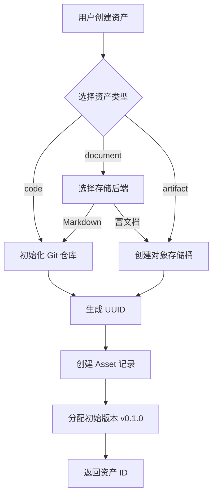
```mermaid
flowchart TD
    A[用户创建资产] --> B{选择资产类型}
    B -->|code| C[初始化 Git 仓库]
    B -->|document| D[选择存储后端]
    B -->|artifact| E[创建对象存储桶]
    D -->|Markdown| C
    D -->|富文档| E
    C --> F[生成 UUID]
    E --> F
    F --> G[创建 Asset 记录]
    G --> H[分配初始版本 v0.1.0]
    H --> I[返回资产 ID]
```

#### C.2 发布流程时序图

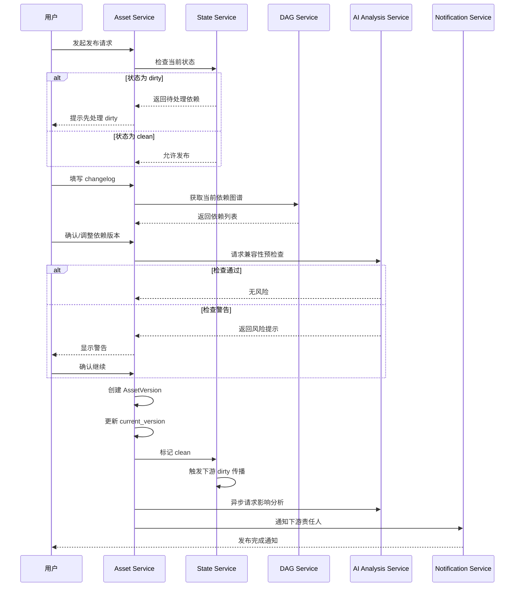
```mermaid
sequenceDiagram
    participant U as 用户
    participant A as Asset Service
    participant S as State Service
    participant D as DAG Service
    participant AI as AI Analysis Service
    participant N as Notification Service

    U->>A: 发起发布请求
    A->>S: 检查当前状态
    alt 状态为 dirty
        S-->>A: 返回待处理依赖
        A-->>U: 提示先处理 dirty
    else 状态为 clean
        S-->>A: 允许发布
    end
    U->>A: 填写 changelog
    A->>D: 获取当前依赖图谱
    D-->>A: 返回依赖列表
    U->>A: 确认/调整依赖版本
    A->>AI: 请求兼容性预检查
    alt 检查通过
        AI-->>A: 无风险
    else 检查警告
        AI-->>A: 返回风险提示
        A-->>U: 显示警告
        U->>A: 确认继续
    end
    A->>A: 创建 AssetVersion
    A->>A: 更新 current_version
    A->>S: 标记 clean
    S->>S: 触发下游 dirty 传播
    A->>AI: 异步请求影响分析
    A->>N: 通知下游责任人
    N-->>U: 发布完成通知
```

#### C.3 状态传播数据流

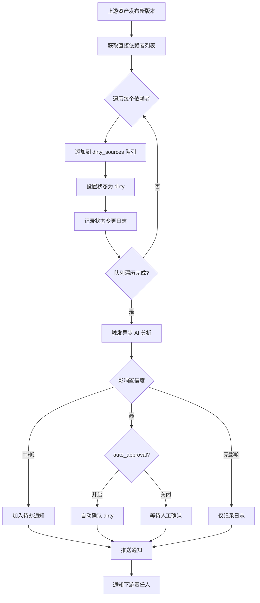
```mermaid
flowchart TD
    A[上游资产发布新版本] --> B[获取直接依赖者列表]
    B --> C{遍历每个依赖者}
    C --> D[添加到 dirty_sources 队列]
    D --> E[设置状态为 dirty]
    E --> F[记录状态变更日志]
    F --> G{队列遍历完成?}
    G -->|否| C
    G -->|是| H[触发异步 AI 分析]
    H --> I{影响置信度}
    I -->|高| J{auto_approval?}
    I -->|中/低| K[加入待办通知]
    I -->|无影响| L[仅记录日志]
    J -->|开启| M[自动确认 dirty]
    J -->|关闭| N[等待人工确认]
    K --> O[推送通知]
    M --> O
    N --> O
    L --> O
    O --> P[通知下游责任人]
```

#### C.4 Dirty 处理时序图

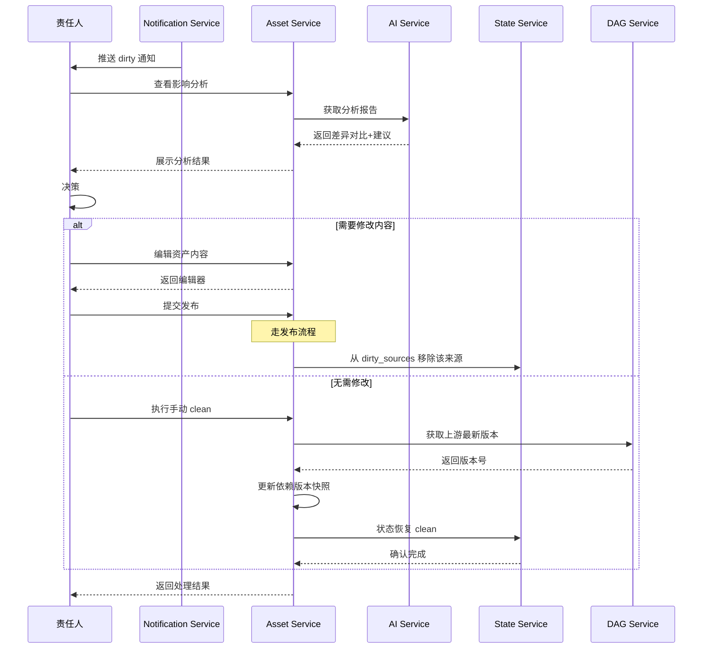
```mermaid
sequenceDiagram
    participant U as 责任人
    participant N as Notification Service
    participant A as Asset Service
    participant AI as AI Service
    participant S as State Service
    participant D as DAG Service

    N->>U: 推送 dirty 通知
    U->>A: 查看影响分析
    A->>AI: 获取分析报告
    AI-->>A: 返回差异对比+建议
    A-->>U: 展示分析结果
    U->>U: 决策
    alt 需要修改内容
        U->>A: 编辑资产内容
        A-->>U: 返回编辑器
        U->>A: 提交发布
        Note over A: 走发布流程
        A->>S: 从 dirty_sources 移除该来源
    else 无需修改
        U->>A: 执行手动 clean
        A->>D: 获取上游最新版本
        D-->>A: 返回版本号
        A->>A: 更新依赖版本快照
        A->>S: 状态恢复 clean
        S-->>A: 确认完成
    end
    A-->>U: 返回处理结果
```

#### C.5 AI 生成资产数据流

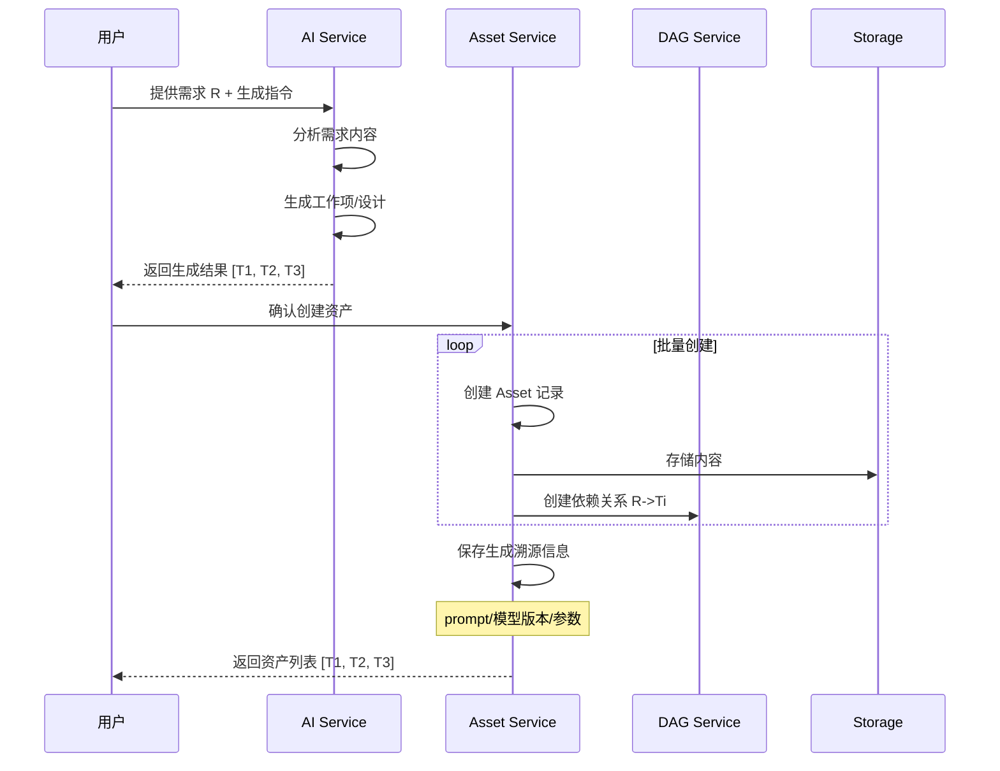
```mermaid
sequenceDiagram
    participant U as 用户
    participant AI as AI Service
    participant A as Asset Service
    participant D as DAG Service
    participant S as Storage

    U->>AI: 提供需求 R + 生成指令
    AI->>AI: 分析需求内容
    AI->>AI: 生成工作项/设计
    AI-->>U: 返回生成结果 [T1, T2, T3]
    U->>A: 确认创建资产
    loop 批量创建
        A->>A: 创建 Asset 记录
        A->>S: 存储内容
        A->>D: 创建依赖关系 R->Ti
    end
    A->>A: 保存生成溯源信息
    Note over A: prompt/模型版本/参数
    A-->>U: 返回资产列表 [T1, T2, T3]
```

#### C.6 依赖图谱查询数据流

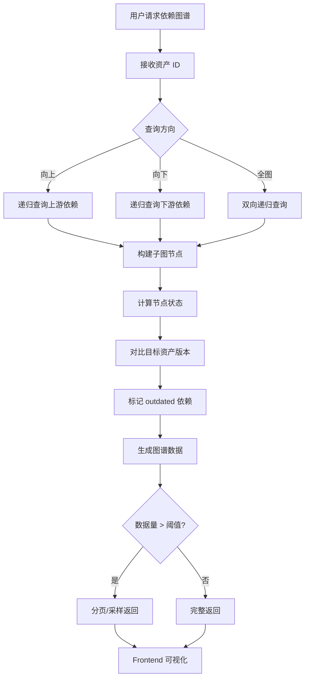
```mermaid
flowchart TD
    A[用户请求依赖图谱] --> B[接收资产 ID]
    B --> C{查询方向}
    C -->|向上| D[递归查询上游依赖]
    C -->|向下| E[递归查询下游依赖]
    C -->|全图| F[双向递归查询]
    D --> G[构建子图节点]
    E --> G
    F --> G
    G --> H[计算节点状态]
    H --> I[对比目标资产版本]
    I --> J[标记 outdated 依赖]
    J --> K[生成图谱数据]
    K --> L{数据量 > 阈值?}
    L -->|是| M[分页/采样返回]
    L -->|否| N[完整返回]
    M --> O[Frontend 可视化]
    N --> O
```

#### C.6.1 Agent DAG 上下文构建

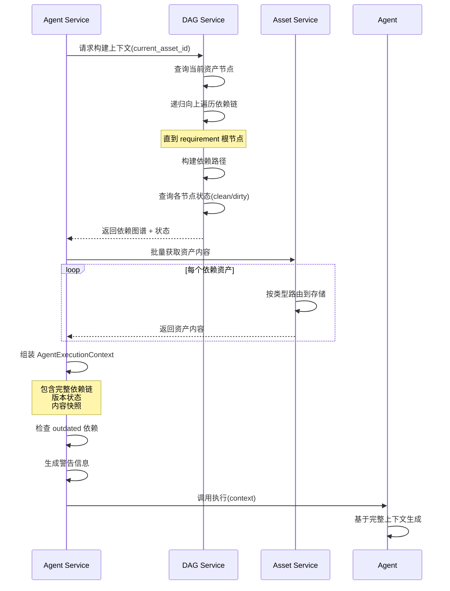
```mermaid
sequenceDiagram
    participant AG as Agent Service
    participant DG as DAG Service
    participant AS as Asset Service
    participant AI as Agent

    AG->>DG: 请求构建上下文(current_asset_id)
    DG->>DG: 查询当前资产节点
    DG->>DG: 递归向上遍历依赖链
    Note over DG: 直到 requirement 根节点
    DG->>DG: 构建依赖路径
    DG->>DG: 查询各节点状态(clean/dirty)
    DG-->>AG: 返回依赖图谱 + 状态
    AG->>AS: 批量获取资产内容
    loop 每个依赖资产
        AS->>AS: 按类型路由到存储
        AS-->>AG: 返回资产内容
    end
    AG->>AG: 组装 AgentExecutionContext
    Note over AG: 包含完整依赖链<br>版本状态<br>内容快照
    AG->>AG: 检查 outdated 依赖
    AG->>AG: 生成警告信息
    AG->>AI: 调用执行(context)
    AI->>AI: 基于完整上下文生成
```

#### C.7 存储层数据流

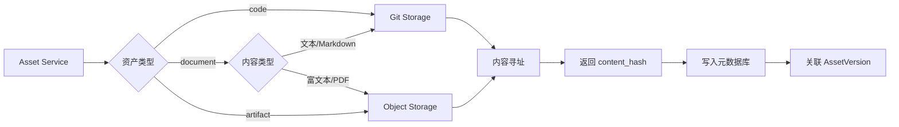
```mermaid
flowchart LR
    A[Asset Service] --> B{资产类型}
    B -->|code| C[Git Storage]
    B -->|document| D{内容类型}
    B -->|artifact| E[Object Storage]
    D -->|文本/Markdown| C
    D -->|富文本/PDF| E
    C --> F[内容寻址]
    E --> F
    F --> G[返回 content_hash]
    G --> H[写入元数据库]
    H --> I[关联 AssetVersion]
```

#### C.8 AI 分析服务内部数据流

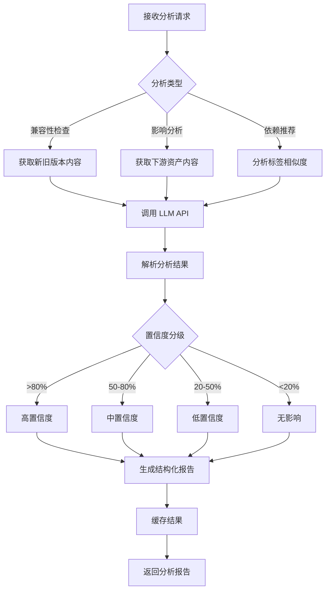
```mermaid
flowchart TD
    A[接收分析请求] --> B{分析类型}
    B -->|兼容性检查| C[获取新旧版本内容]
    B -->|影响分析| D[获取下游资产内容]
    B -->|依赖推荐| E[分析标签相似度]
    C --> F[调用 LLM API]
    D --> F
    E --> F
    F --> G[解析分析结果]
    G --> H{置信度分级}
    H -->|>80%| I[高置信度]
    H -->|50-80%| J[中置信度]
    H -->|20-50%| K[低置信度]
    H -->|<20%| L[无影响]
    I --> M[生成结构化报告]
    J --> M
    K --> M
    L --> M
    M --> N[缓存结果]
    N --> O[返回分析报告]
```

#### C.9 通知服务数据流

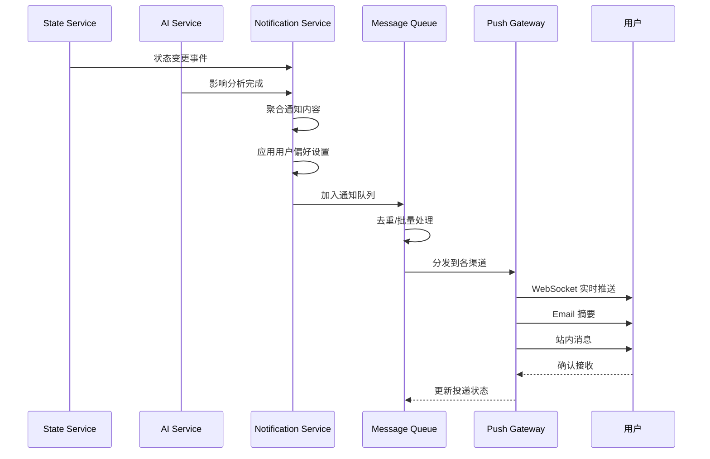
```mermaid
sequenceDiagram
    participant S as State Service
    participant AI as AI Service
    participant N as Notification Service
    participant Q as Message Queue
    participant P as Push Gateway
    participant U as 用户

    S->>N: 状态变更事件
    AI->>N: 影响分析完成
    N->>N: 聚合通知内容
    N->>N: 应用用户偏好设置
    N->>Q: 加入通知队列
    Q->>Q: 去重/批量处理
    Q->>P: 分发到各渠道
    P->>U: WebSocket 实时推送
    P->>U: Email 摘要
    P->>U: 站内消息
    U-->>P: 确认接收
    P-->>Q: 更新投递状态
```

#### C.10 完整资产生命周期状态机

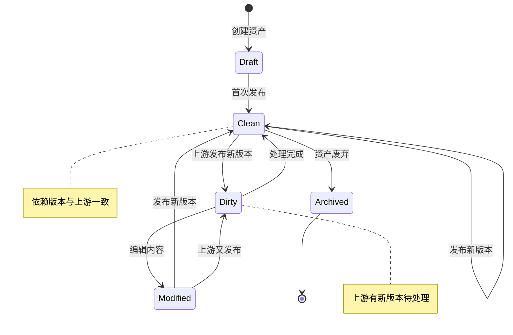
```mermaid
stateDiagram-v2
    [*] --> Draft: 创建资产
    Draft --> Clean: 首次发布

    Clean --> Dirty: 上游发布新版本
    Clean --> Clean: 发布新版本
    Clean --> Archived: 资产废弃

    Dirty --> Clean: 处理完成
    Dirty --> Modified: 编辑内容

    Modified --> Clean: 发布新版本
    Modified --> Dirty: 上游又发布

    Archived --> [*]

    note right of Clean
        依赖版本与上游一致
    end note

    note right of Dirty
        上游有新版本待处理
    end note
```

#### C.11 Agent 执行流程

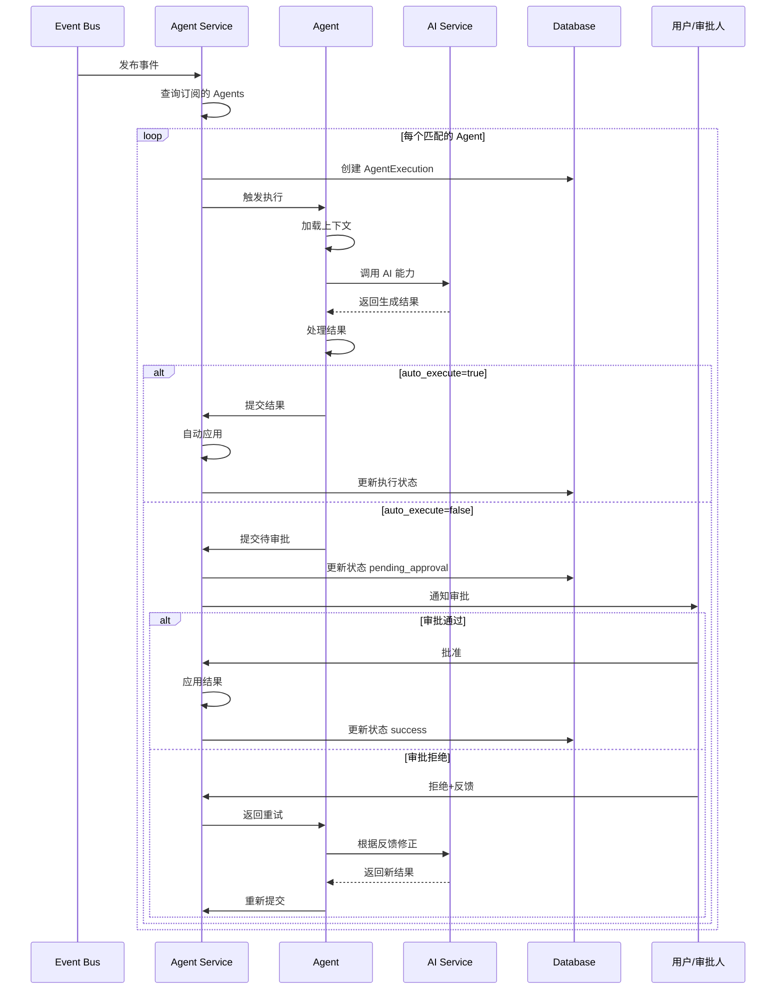
```mermaid
sequenceDiagram
    participant E as Event Bus
    participant AS as Agent Service
    participant A as Agent
    participant AI as AI Service
    participant DB as Database
    participant U as 用户/审批人

    E->>AS: 发布事件
    AS->>AS: 查询订阅的 Agents
    loop 每个匹配的 Agent
        AS->>DB: 创建 AgentExecution
        AS->>A: 触发执行
        A->>A: 加载上下文
        A->>AI: 调用 AI 能力
        AI-->>A: 返回生成结果
        A->>A: 处理结果
        alt auto_execute=true
            A->>AS: 提交结果
            AS->>AS: 自动应用
            AS->>DB: 更新执行状态
        else auto_execute=false
            A->>AS: 提交待审批
            AS->>DB: 更新状态 pending_approval
            AS->>U: 通知审批
            alt 审批通过
                U->>AS: 批准
                AS->>AS: 应用结果
                AS->>DB: 更新状态 success
            else 审批拒绝
                U->>AS: 拒绝+反馈
                AS->>A: 返回重试
                A->>AI: 根据反馈修正
                AI-->>A: 返回新结果
                A->>AS: 重新提交
            end
        end
    end
```

#### C.12 环节委托与流转

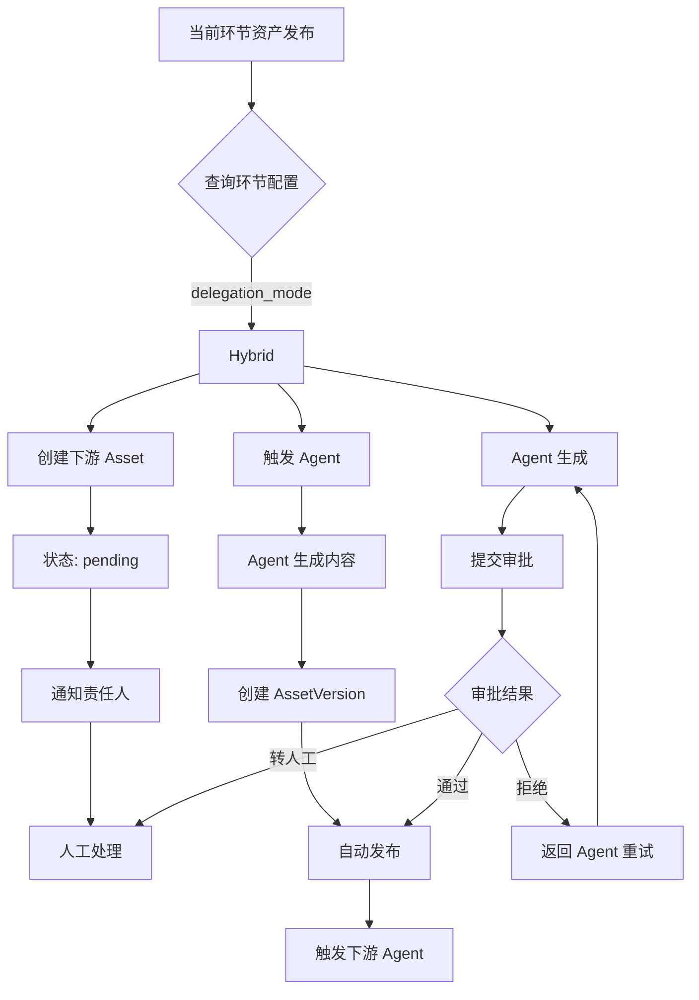
```mermaid
flowchart TD
    A[当前环节资产发布] --> B{查询环节配置}
    B -->|delegation_mode| C

    C[Manual] --> D[创建下游 Asset]
    D --> E[状态: pending]
    E --> F[通知责任人]
    F --> G[人工处理]

    C[Agent] --> H[触发 Agent]
    H --> I[Agent 生成内容]
    I --> J[创建 AssetVersion]
    J --> K[自动发布]
    K --> L[触发下游 Agent]

    C[Hybrid] --> M[Agent 生成]
    M --> N[提交审批]
    N --> O{审批结果}
    O -->|通过| K
    O -->|拒绝| P[返回 Agent 重试]
    P --> M
    O -->|转人工| G
```

#### C.13 事件总线架构

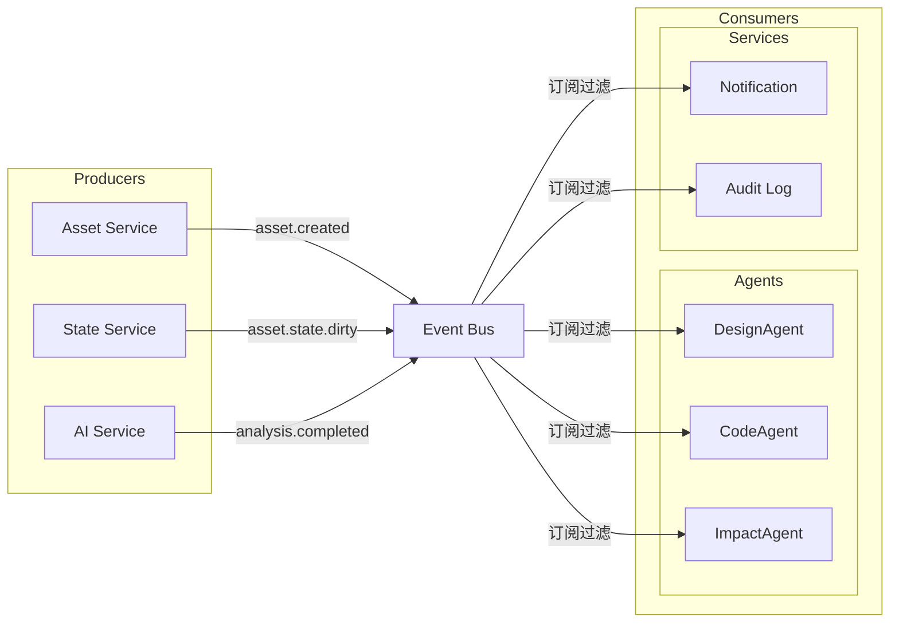
```mermaid
flowchart LR
    subgraph Producers
        P1[Asset Service]
        P2[State Service]
        P3[AI Service]
    end

    EB[Event Bus]

    subgraph Consumers
        subgraph Agents
            A1[DesignAgent]
            A2[CodeAgent]
            A3[ImpactAgent]
        end
        subgraph Services
            S1[Notification]
            S2[Audit Log]
        end
    end

    P1 -->|asset.created| EB
    P2 -->|asset.state.dirty| EB
    P3 -->|analysis.completed| EB

    EB -->|订阅过滤| A1
    EB -->|订阅过滤| A2
    EB -->|订阅过滤| A3
    EB -->|订阅过滤| S1
    EB -->|订阅过滤| S2
```

#### C.14 Agent 审批流程

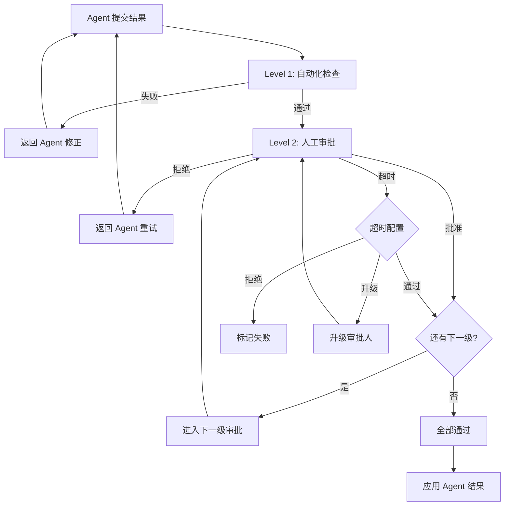
```mermaid
flowchart TD
    A[Agent 提交结果] --> B[Level 1: 自动化检查]
    B -->|失败| C[返回 Agent 修正]
    C --> A
    B -->|通过| D[Level 2: 人工审批]
    D -->|批准| E{还有下一级?}
    D -->|拒绝| F[返回 Agent 重试]
    F --> A
    D -->|超时| G{超时配置}
    G -->|通过| E
    G -->|拒绝| H[标记失败]
    G -->|升级| I[升级审批人]
    I --> D
    E -->|是| J[进入下一级审批]
    J --> D
    E -->|否| K[全部通过]
    K --> L[应用 Agent 结果]
```

#### C.15 发布前后 Agent 触发

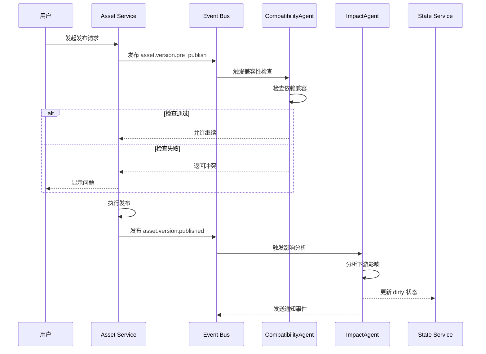
```mermaid
sequenceDiagram
    participant U as 用户
    participant A as Asset Service
    participant E as Event Bus
    participant C as CompatibilityAgent
    participant I as ImpactAgent
    participant S as State Service

    U->>A: 发起发布请求
    A->>E: 发布 asset.version.pre_publish
    E->>C: 触发兼容性检查
    C->>C: 检查依赖兼容
    alt 检查通过
        C-->>A: 允许继续
    else 检查失败
        C-->>A: 返回冲突
        A-->>U: 显示问题
    end
    A->>A: 执行发布
    A->>E: 发布 asset.version.published
    E->>I: 触发影响分析
    I->>I: 分析下游影响
    I-->>S: 更新 dirty 状态
    I-->>E: 发送通知事件
```

#### C.16 Agent Skill 机制（渐进式上下文披露）

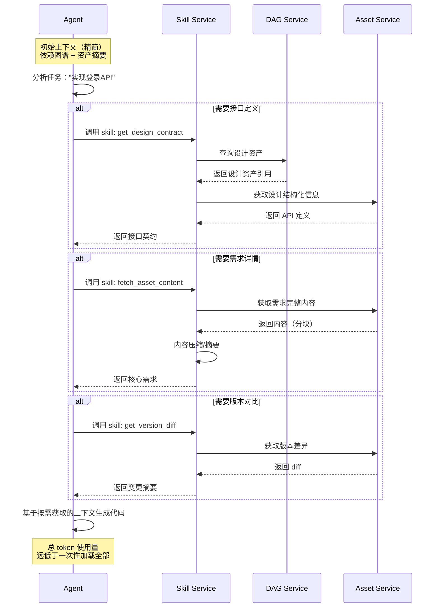
```mermaid
sequenceDiagram
    participant AG as Agent
    participant SK as Skill Service
    participant DG as DAG Service
    participant AS as Asset Service

    Note over AG: 初始上下文（精简）<br>依赖图谱 + 资产摘要

    AG->>AG: 分析任务："实现登录API"

    alt 需要接口定义
        AG->>SK: 调用 skill: get_design_contract
        SK->>DG: 查询设计资产
        DG-->>SK: 返回设计资产引用
        SK->>AS: 获取设计结构化信息
        AS-->>SK: 返回 API 定义
        SK-->>AG: 返回接口契约
    end

    alt 需要需求详情
        AG->>SK: 调用 skill: fetch_asset_content
        SK->>AS: 获取需求完整内容
        AS-->>SK: 返回内容（分块）
        SK->>SK: 内容压缩/摘要
        SK-->>AG: 返回核心需求
    end

    alt 需要版本对比
        AG->>SK: 调用 skill: get_version_diff
        SK->>AS: 获取版本差异
        AS-->>SK: 返回 diff
        SK-->>AG: 返回变更摘要
    end

    AG->>AG: 基于按需获取的上下文生成代码

    Note over AG: 总 token 使用量 <br>远低于一次性加载全部
```

#### C.17 Skill Service 架构

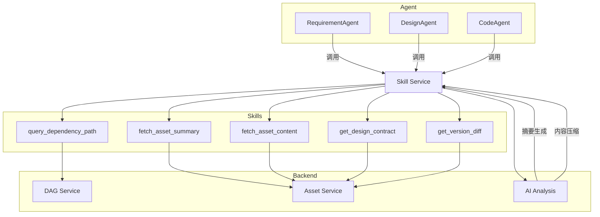
```mermaid
flowchart TD
    subgraph Agent
        A1[RequirementAgent]
        A2[DesignAgent]
        A3[CodeAgent]
    end

    SK[Skill Service]

    subgraph Skills
        S1[fetch_asset_summary]
        S2[fetch_asset_content]
        S3[get_design_contract]
        S4[query_dependency_path]
        S5[get_version_diff]
    end

    subgraph Backend
        DG[DAG Service]
        AS[Asset Service]
        AI[AI Analysis]
    end

    A1 -->|调用| SK
    A2 -->|调用| SK
    A3 -->|调用| SK

    SK --> S1
    SK --> S2
    SK --> S3
    SK --> S4
    SK --> S5

    S1 --> AS
    S2 --> AS
    S3 --> AS
    S4 --> DG
    S5 --> AS

    SK --> AI

    AI -->|摘要生成| SK
    AI -->|内容压缩| SK
```

### D. 开放平台设计

> **优先级**: P2 (V1.5-V2.0)
>
> 本附录描述 ANDOS 平台的开放能力，允许外部系统集成和第三方扩展。

#### D.1 Webhook 系统

**功能定位**
- 支持外部系统订阅平台事件
- 实现事件驱动的跨系统集成

**Webhook 配置**

```yaml
WebhookSubscription:
  id: uuid
  name: string                 # 订阅名称，如"同步到 Jira"
  url: string                  # 接收端点 URL
  events: [string]             # 订阅的事件类型列表
  secret: string               # HMAC-SHA256 签名密钥
  active: boolean              # 是否激活
  retry_policy:
    max_attempts: integer      # 最大重试次数，默认 3
    backoff_multiplier: number # 退避倍数，默认 2
    initial_delay_ms: integer  # 初始延迟，默认 1000
  created_by: user_id
  created_at: timestamp
```

**支持的事件类型**

| 事件 | 说明 |  payload 示例 |
|------|------|--------------|
| `asset.created` | 资产创建 | `{asset_id, type, name, project_id}` |
| `asset.updated` | 资产更新 | `{asset_id, changes: [...], updated_by}` |
| `asset.state.changed` | 状态变更 | `{asset_id, from: "clean", to: "dirty", trigger}` |
| `asset.version.published` | 版本发布 | `{asset_id, version, published_by}` |
| `dependency.created` | 依赖建立 | `{source_id, target_id, created_by}` |
| `analysis.completed` | 分析完成 | `{asset_id, analysis_type, confidence, summary}` |
| `agent.execution.completed` | Agent 执行完成 | `{execution_id, agent_id, status, result}` |

**安全机制**

```http
# Webhook 请求头
X-Andos-Event: asset.state.changed
X-Andos-Delivery: delv_xxx
X-Andos-Signature: sha256=xxxxxxxx...
X-Andos-Timestamp: 1741861600

# 签名验证（HMAC-SHA256）
signature = HMAC_SHA256(secret, timestamp + "." + body)
```

**Webhook 交付保障**

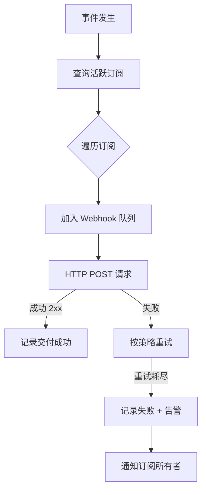
```mermaid
flowchart TD
    A[事件发生] --> B[查询活跃订阅]
    B --> C{遍历订阅}
    C --> D[加入 Webhook 队列]
    D --> E[HTTP POST 请求]
    E -->|成功 2xx| F[记录交付成功]
    E -->|失败| G[按策略重试]
    G -->|重试耗尽| H[记录失败 + 告警]
    H --> I[通知订阅所有者]
```

#### D.2 GraphQL API

**功能定位**
- 提供灵活的依赖图谱查询接口
- 支持复杂关系查询和聚合分析
- 作为 REST API 的补充，满足前端复杂查询需求

**Schema 设计（核心类型）**

```graphql
# 资产类型
enum AssetType {
  REQUIREMENT
  DESIGN
  TASK
  CODE
  TEST
  PIPELINE
}

enum AssetState {
  DRAFT
  CLEAN
  DIRTY
  MODIFIED
  ARCHIVED
}

type Asset {
  id: ID!
  name: String!
  slug: String!
  type: AssetType!
  state: AssetState!
  currentVersion: String
  project: Project!
  owners: [User!]!
  tags: [String!]!

  # 依赖关系
  upstream: [AssetEdge!]!      # 上游依赖（我依赖谁）
  downstream: [AssetEdge!]!    # 下游依赖（谁依赖我）
  dependencyGraph(depth: Int = 3): DependencyGraph!

  # 版本
  versions(limit: Int = 20, cursor: String): VersionConnection!

  # Dirty 来源
  dirtySources: [DirtySource!]!

  createdAt: DateTime!
  updatedAt: DateTime!
}

# 依赖边
type AssetEdge {
  id: ID!
  from: Asset!                  # 下游资产
  to: Asset!                    # 上游资产
  dependencyVersion: String     # 依赖的版本
  confirmedAt: DateTime
  confirmedBy: User
}

# 依赖图谱
type DependencyGraph {
  nodes: [Asset!]!
  edges: [AssetEdge!]!
  paths: [[ID!]!]!              # 所有依赖路径
  criticalPaths: [[ID!]!]!      # 关键路径
}

# Dirty 来源
type DirtySource {
  id: ID!
  upstreamAsset: Asset!
  upstreamVersion: String!
  upstreamPublishedAt: DateTime!
  impactLevel: ImpactLevel!
  status: DirtySourceStatus!
}

enum ImpactLevel {
  HIGH
  MEDIUM
  LOW
  NONE
}

enum DirtySourceStatus {
  PENDING
  ACKNOWLEDGED
  PROCESSING
  RESOLVED
}
```

**查询示例**

```graphql
# 查询资产的完整依赖图谱（向上追溯 5 层）
query GetAssetDependencyGraph($assetId: ID!) {
  asset(id: $assetId) {
    id
    name
    state
    dependencyGraph(depth: 5) {
      nodes {
        id
        name
        type
        state
        currentVersion
      }
      edges {
        id
        from { id name }
        to { id name }
        dependencyVersion
      }
      paths
    }
  }
}

# 查询项目中所有 dirty 状态资产
query GetProjectDirtyAssets($projectId: ID!) {
  project(id: $projectId) {
    assets(filter: { state: DIRTY }) {
      nodes {
        id
        name
        type
        dirtySources {
          upstreamAsset { id name }
          impactLevel
          upstreamPublishedAt
        }
      }
    }
  }
}

# 查询影响分析（哪些资产会受到某资产变更影响）
query GetImpactAnalysis($assetId: ID!, $version: String!) {
  impactAnalysis(assetId: $assetId, version: $version) {
    affectedAssets {
      asset { id name type }
      impactLevel
      distance: Int             # 距离（跳数）
      path: [Asset!]!           # 影响路径
    }
    totalAffected: Int
    highImpactCount: Int
    criticalPaths: [[ID!]!]
  }
}
```

**GraphQL 端点**

```
https://api.andos.dev/v1/graphql

# 认证方式与 REST API 一致
Authorization: Bearer <jwt_token>
```

#### D.3 Plugin SDK

**功能定位**
- V2.0 提供官方 Plugin SDK
- 允许第三方开发 Skill 扩展平台能力
- 支持自定义 Agent 和存储后端

**Plugin 架构**

```
┌─────────────────────────────────────────────────────────┐
│                    ANDOS Platform                        │
├─────────────────────────────────────────────────────────┤
│                                                          │
│   ┌──────────────────────────────────────────────┐     │
│   │            Plugin Runtime                     │     │
│   │  ┌─────────────┐ ┌─────────────┐             │     │
│   │  │   Skill     │ │   Agent     │             │     │
│   │  │  Plugin     │ │  Plugin     │             │     │
│   │  └─────────────┘ └─────────────┘             │     │
│   │  ┌─────────────┐ ┌─────────────┐             │     │
│   │  │  Storage    │ │   UI        │             │     │
│   │  │  Plugin     │ │ Extension   │             │     │
│   │  └─────────────┘ └─────────────┘             │     │
│   └──────────────────────────────────────────────┘     │
│                          │                             │
│   ┌──────────────────────────────────────────────┐     │
│   │         Plugin SDK (Node.js/Go)               │     │
│   │  - Skill API                                 │     │
│   │  - Agent Hooks                               │     │
│   │  - Storage Interface                         │     │
│   │  - Event Subscription                        │     │
│   └──────────────────────────────────────────────┘     │
│                                                          │
└─────────────────────────────────────────────────────────┘
```

**Plugin 类型**

| 类型 | 说明 | 示例 |
|------|------|------|
| **Skill Plugin** | 扩展 Skill 能力 | 自定义代码分析、文档生成 |
| **Agent Plugin** | 自定义 Agent 行为 | 领域特定生成器 |
| **Storage Plugin** | 自定义存储后端 | 企业内网 GitLab |
| **UI Plugin** | 前端扩展 | 自定义资产可视化 |
| **Notification Plugin** | 通知渠道扩展 | 企业微信、钉钉 |

**Skill Plugin 开发示例**

```typescript
// my-skill/index.ts
import { defineSkill, SkillContext } from '@andos/plugin-sdk';

export default defineSkill({
  name: 'custom-code-analysis',
  version: '1.0.0',
  description: '自定义代码分析器',

  // 声明所需权限
  permissions: ['asset:read', 'storage:read'],

  // 工具定义
  tools: {
    analyzeCode: {
      description: '分析代码质量',
      parameters: {
        assetId: { type: 'string', required: true },
        rules: { type: 'array', items: 'string' }
      },
      async handler(ctx: SkillContext, params) {
        // 获取资产内容
        const content = await ctx.assets.getContent(params.assetId);

        // 执行分析
        const result = await analyze(content, params.rules);

        // 返回结果
        return {
          score: result.score,
          issues: result.issues,
          suggestions: result.suggestions
        };
      }
    }
  },

  // 生命周期钩子
  hooks: {
    onInstall: async (ctx) => {
      // 安装时初始化
    },
    onEnable: async (ctx) => {
      // 启用时执行
    },
    onDisable: async (ctx) => {
      // 禁用时清理
    }
  }
});
```

**Plugin 生命周期**

```mermaid
stateDiagram-v2
    [*] --> Discovered: 扫描插件目录
    Discovered --> Installed: 用户安装
    Installed --> Enabled: 启用插件
    Enabled --> Disabled: 禁用
    Disabled --> Enabled: 重新启用
    Enabled --> Error: 运行时错误
    Error --> Enabled: 自动恢复
    Error --> [*]: 卸载
    Disabled --> [*]: 卸载
```

**Plugin 市场**

```yaml
# AndosHub Plugin 市场
PluginRegistry:
  source: https://hub.andos.dev/plugins

  plugins:
    - name: jira-integration
      version: 2.1.0
      author: Atlassian
      description: 与 Jira 双向同步资产
      downloads: 15000
      rating: 4.5

    - name: github-enhanced
      version: 1.3.2
      author: GitHub
      description: 增强 GitHub 集成能力
      downloads: 28000
      rating: 4.8

    - name: confluence-sync
      version: 1.0.5
      author: community
      description: 同步文档到 Confluence
      downloads: 3200
      rating: 4.2
```

**Plugin 安全模型**

```yaml
# 权限声明（manifest.yml）
permissions:
  # 资产访问
  - resource: asset
    actions: [read, write]
    scope: project    # project/org/global

  # 存储访问
  - resource: storage
    actions: [read]
    paths: ['/plugins/my-plugin/*']

  # 网络访问
  - resource: network
    allow: ['*.example.com', 'api.github.com']
    deny: ['*.internal.company.com']

  # 命令执行（沙箱内）
  - resource: exec
    commands: ['node', 'python']
    sandbox: required
```

**Plugin CLI**

```bash
# 安装插件
andos plugin install jira-integration
andos plugin install jira-integration@2.1.0

# 从本地安装
andos plugin install ./my-plugin

# 管理插件
andos plugin list
andos plugin enable jira-integration
andos plugin disable jira-integration
andos plugin uninstall jira-integration

# 开发模式
andos plugin dev ./my-plugin --watch
andos plugin publish ./my-plugin --registry=https://hub.andos.dev

# 配置插件
andos plugin config jira-integration --set apiKey=xxx
```

**里程碑**

| 阶段 | 开放能力 | 时间 |
|------|----------|------|
| V1.5 | Webhook Beta | +2w |
| V1.8 | GraphQL API Beta | +6w |
| V2.0 | Plugin SDK Release | +12w |
| V2.5 | Plugin Marketplace | +18w |
