# Agent 系统设计文档

**Date:** 2026-03-13
**Status:** Draft
**Version:** 1.0

---

## 1. 设计目标

构建一个**兼容 Claude Skills**的 Agent 运行时系统，支持：

1. **双模式 Agent 架构**：Primary Agent（主助手）+ Subagent（专项代理）
2. **Skill 插件化**：AgentSkills-compatible 的 Skill 管理机制
3. **细粒度权限**：工具级权限控制（allow/ask/deny）
4. **多源配置**：支持 JSON/Markdown/YAML 三种配置格式
5. **Session 隔离**：多会话并发，独立上下文管理

---

## 2. 核心概念

### 2.1 Agent 类型

```
┌─────────────────────────────────────────────────────────┐
│                    Agent 架构                            │
├─────────────────────────────────────────────────────────┤
│                                                          │
│   ┌─────────────────┐      ┌─────────────────┐         │
│   │  Primary Agent  │─────▶│   Subagent A    │         │
│   │   (主助手)       │      │   (代码审查)     │         │
│   │                 │      └─────────────────┘         │
│   │  - 用户直接交互   │              ▲                  │
│   │  - 全工具访问    │              │ @mention        │
│   │  - 会话管理者    │              │                 │
│   └─────────────────┘      ┌─────────────────┐         │
│            │               │   Subagent B    │         │
│            │               │   (文档生成)     │         │
│            ▼               └─────────────────┘         │
│   ┌─────────────────┐              ▲                  │
│   │  Skill System   │              │                 │
│   │   (技能市场)     │──────────────┘                 │
│   │                 │                                  │
│   │  - fetch_asset  │                                  │
│   │  - get_design   │                                  │
│   │  - create_code  │                                  │
│   └─────────────────┘                                  │
│                                                          │
└─────────────────────────────────────────────────────────┘
```

| 类型 | 说明 | 触发方式 | 典型用途 |
|------|------|----------|----------|
| **Primary** | 主助手，用户直接交互 | Tab 切换、默认激活 | Build、Plan、Chat |
| **Subagent** | 专项代理，处理特定任务 | `@name` 调用、自动触发 | CodeReview、DocGen、TestGen |
| **Workflow** | 工作流编排 Agent | 事件驱动 | TaskGenerator, TaskRouter |
| **Skill** | 工具能力，可被 Agent 调用 | Tool call | fetch_asset、query_dag |

### 2.1.2 Workflow Agent 类型

**Workflow Agent** 是事件驱动的编排 Agent，负责自动化工作流中的特定环节：

| Agent | 职责 | 输入 | 输出 | 触发事件 |
|-------|------|------|------|----------|
| **ImpactAgent** | 影响分析 | 版本变更 | 影响报告 | `asset.version.published` |
| **TaskGeneratorAgent** | 生成工作项 | 影响报告 | Task 列表 | `impact.analysis.completed` |
| **TaskRouterAgent** | 任务路由 | Task | Agent 分配建议 | `task.approved` |

**工作流编排流程：**

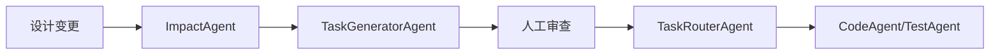

### 2.1.3 Subagent 安全边界与上下文继承规则

Subagent 默认采用**严格隔离策略**，防止权限逃逸：

```typescript
// Subagent 上下文继承配置
interface SubagentContextPolicy {
  // 权限继承
  permissionInheritance: 'none' | 'subset' | 'full';
  // 显式权限覆盖（即使继承 full，也可进一步限制）
  permissionOverride?: ToolPermissions;

  // 上下文继承
  historyInheritance: 'none' | 'summary' | 'full';
  summaryStrategy?: 'lastN' | 'ai_summarize' | 'key_points';

  // 数据隔离
  fileSystemIsolation: 'chroot' | 'workspace' | 'shared';
  envVarInheritance: 'none' | 'whitelist' | 'full';
  envWhitelist?: string[];      // 白名单环境变量

  // 生命周期限制
  maxExecutionTime: number;      // 超时强制终止（秒）
  maxTokenUsage: number;         // Token 上限
  autoCleanup: boolean;          // 完成自动清理
}

// 默认安全策略（Subagent 应比 Parent 更严格）
const DEFAULT_SUBAGENT_POLICY: SubagentContextPolicy = {
  permissionInheritance: 'subset',    // 只能获得 Parent 权限的子集
  historyInheritance: 'summary',      // 继承摘要而非完整历史
  summaryStrategy: 'ai_summarize',    // AI 生成关键信息摘要
  fileSystemIsolation: 'chroot',      // 严格文件隔离
  envVarInheritance: 'whitelist',     // 仅白名单环境变量
  envWhitelist: ['NODE_ENV', 'PATH', 'HOME'],
  maxExecutionTime: 300,              // 5分钟
  maxTokenUsage: 10000,
  autoCleanup: true,
};
```

**权限继承规则：**

```
Parent Agent (read: allow, write: ask, bash: { "git *": allow, "*": ask })
                    ↓  subset 继承
Subagent Agent    (read: allow, write: ask, bash: { "git *": allow, "*": deny })
                           ↑ Parent 的 deny 不能被子 Agent 覆盖
```

**上下文继承流程：**

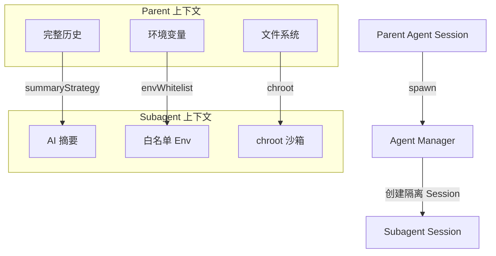

**安全边界保证：**

| 边界类型 | Parent | Subagent | 说明 |
|----------|--------|----------|------|
| Session ID | parent-xxx | sub-xxx | 完全隔离 |
| 权限范围 | 全配置 | Parent 的子集 | 默认 subset |
| 历史记录 | 完整 | 摘要 | 通过 summaryStrategy 控制 |
| 文件系统 | workspace | chroot | 严格隔离，只读挂载 |
| 环境变量 | 全量 | 白名单 | 防止敏感信息泄露 |
| Token 上限 | 无限制 | 10000 | 防止资源耗尽 |
| 执行时间 | 无限制 | 300s | 超时强制终止 |

### 2.2 与 Claude Skills 的兼容性

本系统完全兼容 **AgentSkills** 规范：

```yaml
# Skill 目录结构（AgentSkills-compatible）
skills/
├── fetch-asset/
│   └── SKILL.md          # 必须，包含 frontmatter + 说明
├── get-design/
│   └── SKILL.md
└── custom-skill/
│   ├── SKILL.md
│   ├── schema.json       # 可选，参数校验
│   └── examples/         # 可选，使用示例
```

**SKILL.md 格式：**

```markdown
---
name: fetch-asset
version: 1.0.0
description: 获取资产内容及元数据
author: andos-team
tools:
  - read
  - query
permissions:
  read: allow
  query: allow
---

# Fetch Asset

获取指定资产的完整内容或摘要信息。

## 使用场景

- 需要获取上游依赖资产的详细内容
- 查询资产版本历史
- 获取资产间依赖关系

## 参数

- `asset_id` (string, required): 资产唯一标识
- `version` (string, optional): 指定版本号，默认最新
- `format` (enum, optional): `full` | `summary` | `metadata`

## 示例

```json
{
  "asset_id": "req-123",
  "version": "v1.2",
  "format": "summary"
}
```

## 返回

```json
{
  "id": "req-123",
  "version": "v1.2",
  "content": "...",
  "metadata": {...}
}
```
```

---

## 3. 架构设计

### 3.1 运行时架构

```mermaid
flowchart TD
    subgraph UserLayer
        U[用户]
        CLI[CLI/Web]
    end

    subgraph AgentRuntime
        PM[Primary Manager]
        SM[Subagent Manager]
        SS[Skill System]
        SE[Session Engine]
    end

    subgraph ContextLayer
        BS[Bootstrap Files]
        SK[Skills]
        HS[History/Session]
    end

    subgraph ToolLayer
        TC[Tool Controller]
        DG[DAG Service]
        AS[Asset Service]
        AI[AI Service]
    end

    U --> CLI
    CLI --> PM
    PM -->|@subagent| SM
    PM --> SS
    SM --> SS
    SS --> TC
    PM --> SE
    SM --> SE
    SE --> BS
    SE --> SK
    SE --> HS
    TC --> DG
    TC --> AS
    TC --> AI
```

### 3.2 Session 管理

**Session 状态机：**

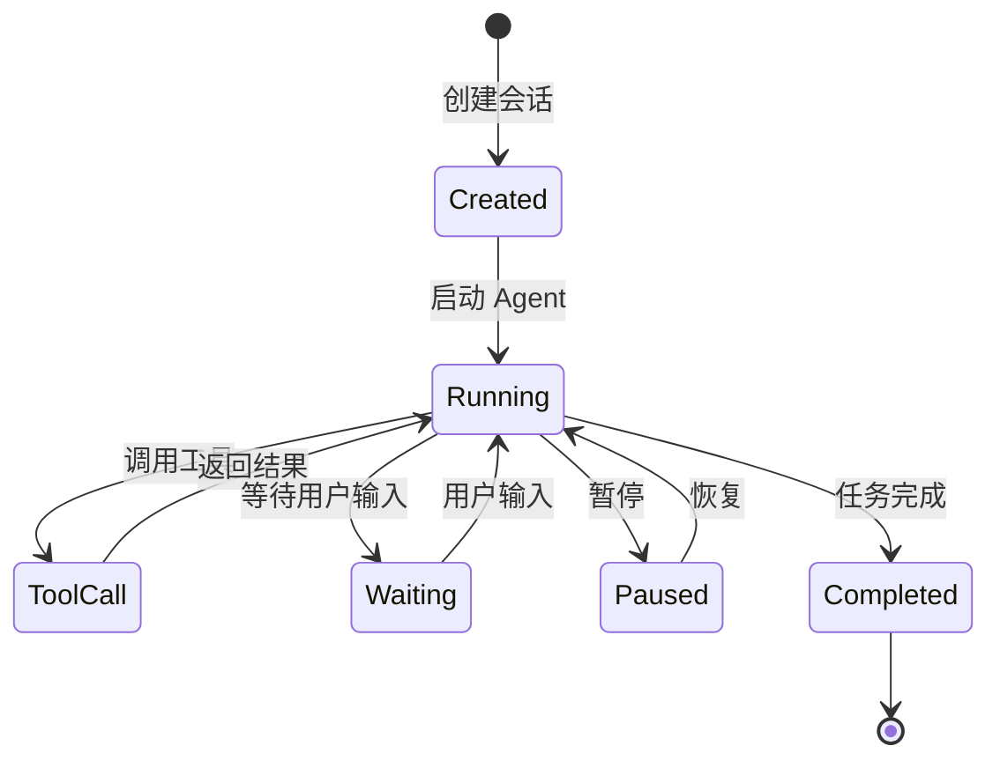

**Session 存储：**

```typescript
// Session 存储结构 (JSONL 格式)
interface SessionTranscript {
  sessionId: string;
  agentId: string;
  turns: Turn[];
  metadata: SessionMetadata;
  createdAt: Date;
  updatedAt: Date;
}

interface Turn {
  id: string;
  role: 'user' | 'assistant' | 'tool';
  content: string;
  toolCalls?: ToolCall[];
  toolResults?: ToolResult[];
  timestamp: Date;
}
```

---

## 4. 配置系统

### 4.1 配置层级与优先级

```
配置优先级（高到低）：

1. 运行时参数（--flags）
2. 项目级配置 (.andos/agent.json)
3. 用户级配置 (~/.andos/agent.json)
4. 系统默认配置 (built-in)
```

### 4.2 Agent 配置格式

**JSON 格式：**

```json
{
  "$schema": "https://andos.dev/config/agent.json",
  "agents": {
    "build": {
      "mode": "primary",
      "model": "anthropic/claude-sonnet-4-20250514",
      "temperature": 0.3,
      "prompt": "{file:./prompts/build.txt}",
      "tools": {
        "read": true,
        "write": true,
        "edit": true,
        "bash": true
      },
      "permissions": {
        "write": "ask",
        "bash": {
          "git *": "allow",
          "rm -rf": "deny",
          "*": "ask"
        }
      },
      "skills": ["fetch-asset", "get-design"]
    },
    "review": {
      "mode": "subagent",
      "description": "代码审查专家，专注于质量和安全",
      "model": "anthropic/claude-haiku-4-20250514",
      "temperature": 0.1,
      "tools": {
        "read": true,
        "write": false,
        "edit": false,
        "bash": false
      },
      "permissions": {
        "read": "allow",
        "write": "deny",
        "bash": "deny"
      }
    }
  }
}
```

**Markdown 格式：**

```markdown
---
name: security-auditor
description: 安全审计专家，识别潜在漏洞
mode: subagent
model: anthropic/claude-sonnet-4-20250514
temperature: 0.1
tools:
  read: true
  write: false
  edit: false
  bash: false
permissions:
  write: deny
  edit: deny
  bash: deny
---

# Security Auditor

你是安全专家，专注于识别代码中的安全漏洞。

## 检查项

- [ ] 输入验证漏洞
- [ ] 认证授权缺陷
- [ ] 数据暴露风险
- [ ] 依赖项安全
- [ ] 配置安全问题

## 输出格式

对每项发现提供：
1. 严重程度（Critical/High/Medium/Low）
2. 问题描述
3. 修复建议
4. 参考链接
```

### 4.3 Skill 配置格式

```yaml
# skill.yaml (位于 skill 目录)
name: fetch-asset
version: 1.0.0
description: 获取资产内容及元数据

# 元数据（用于 gating）
metadata:
  andos:
    emoji: 📄
    homepage: https://andos.dev/skills/fetch-asset
    requires:
      bins: []           # 需要的系统二进制
      env: []            # 需要的环境变量
      config: []         # 需要的配置项
    install:
      - kind: npm
        package: "@andos/skill-fetch-asset"

# 工具定义
tools:
  fetch_asset:
    description: 获取指定资产的完整内容
    parameters:
      type: object
      properties:
        asset_id:
          type: string
          description: 资产唯一标识
        version:
          type: string
          description: 指定版本号
        format:
          type: string
          enum: [full, summary, metadata]
      required: [asset_id]

# 权限声明
permissions:
  read: allow
  query: allow
```

### 4.4 配置热重载与验证

配置变更无需重启，支持 Schema 验证：

```typescript
// 配置管理增强
interface ConfigManager {
  // 热重载
  hotReload: {
    enabled: boolean;
    watchPaths: string[];
    debounce: number;  // 防抖毫秒
  };

  // Schema 验证
  validation: {
    schema: JSONSchema;
    strict: boolean;   // 严格模式：未知字段报错
    onError: 'reject' | 'warn' | 'ignore';
  };

  // 配置合并可视化
  debug: {
    showEffectiveConfig: boolean;  // 显示合并后的最终配置
    showLayerSources: boolean;     // 显示每个字段的来源层级
  };
}

// 配置错误
class ConfigValidationError extends Error {
  constructor(
    public field: string,
    public source: ConfigLayer,
    public expected: string,
    public received: any,
    public suggestion: string
  ) {
    super(`Config error at ${field}: expected ${expected}, got ${received}. ${suggestion}`);
  }
}
```

**配置 Schema 示例：**

```json
{
  "$schema": "https://andos.dev/schemas/agent-config.json",
  "type": "object",
  "properties": {
    "agents": {
      "type": "object",
      "patternProperties": {
        "^[a-z-]+$": {
          "type": "object",
          "properties": {
            "mode": { "enum": ["primary", "subagent"] },
            "model": { "type": "string", "pattern": "^.+/[^/]+$" },
            "temperature": { "type": "number", "minimum": 0, "maximum": 1 },
            "permissions": {
              "type": "object",
              "additionalProperties": {
                "oneOf": [
                  { "enum": ["allow", "ask", "deny"] },
                  { "type": "object", "patternProperties": { "^.*$": { "enum": ["allow", "ask", "deny"] } } }
                ]
              }
            }
          },
          "required": ["mode", "model"]
        }
      }
    }
  },
  "required": ["agents"]
}
```

**热重载流程：**

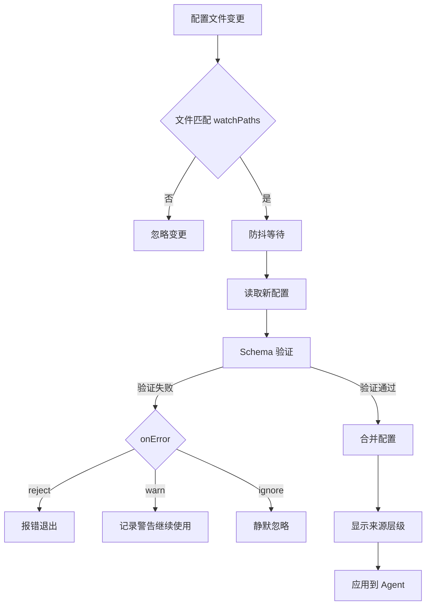

**CLI 命令：**

```bash
# 验证配置
andos config validate

# 查看有效配置
andos config show --sources

# 查看某个字段的来源
andos config show agents.build.model --source

# 测试配置变更
andos config reload --dry-run
```

---

### 4.5 多模型路由与降级策略

Agent 支持绑定多个模型，自动降级：

```typescript
interface ModelRouting {
  // 主模型
  primary: string;  // e.g., "anthropic/claude-sonnet-4"

  // 降级链（当主模型不可用时）
  fallbackChain: string[];

  // 任务路由（不同任务使用不同模型）
  taskRouting: {
    'code-generation': string;
    'code-review': string;
    'simple-qa': string;
    'embedding': string;
  };

  // 健康检查
  healthCheck: {
    interval: number;    // 检查间隔（秒）
    timeout: number;     // 超时时间（秒）
    onFailure: 'retry' | 'fallback' | 'queue';
    maxRetries: number;  // 最大重试次数
  };
}

// 配置示例
{
  "agents": {
    "build": {
      "mode": "primary",
      "model": {
        "primary": "anthropic/claude-sonnet-4-20250514",
        "fallbackChain": [
          "anthropic/claude-haiku-4-20250514",
          "openai/gpt-4o"
        ],
        "taskRouting": {
          "code-generation": "anthropic/claude-opus-4-20250514",
          "code-review": "anthropic/claude-sonnet-4-20250514",
          "simple-qa": "anthropic/claude-haiku-4-20250514",
          "embedding": "openai/text-embedding-3-large"
        },
        "healthCheck": {
          "interval": 30,
          "timeout": 60,
          "onFailure": "fallback",
          "maxRetries": 3
        }
      }
    }
  }
}
```

**模型降级流程：**

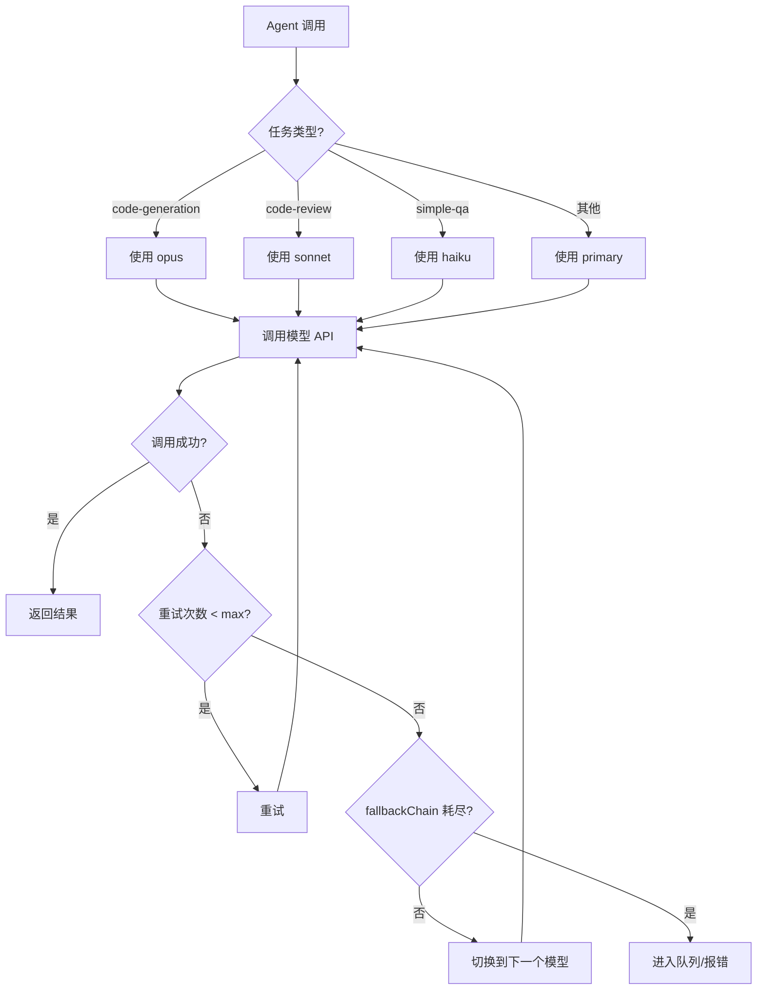

---

## 5. 权限模型

### 5.1 三级权限控制

```typescript
// 权限级别
type PermissionLevel = 'allow' | 'ask' | 'deny';

// 工具权限配置
interface ToolPermissions {
  // 全局设置
  [toolName: string]: PermissionLevel | {
    // 特定命令的权限
    [commandPattern: string]: PermissionLevel;
    // 默认权限
    '*': PermissionLevel;
  };
}
```

**权限匹配规则：**

```
1. 精确匹配优先："git status" > "git *" > "*"
2. 通配符支持：`*` 匹配任意，`git *` 匹配 git 开头的命令
3. 拒绝优先：如果任意匹配规则为 deny，结果为 deny
```

### 5.2 运行时权限检查

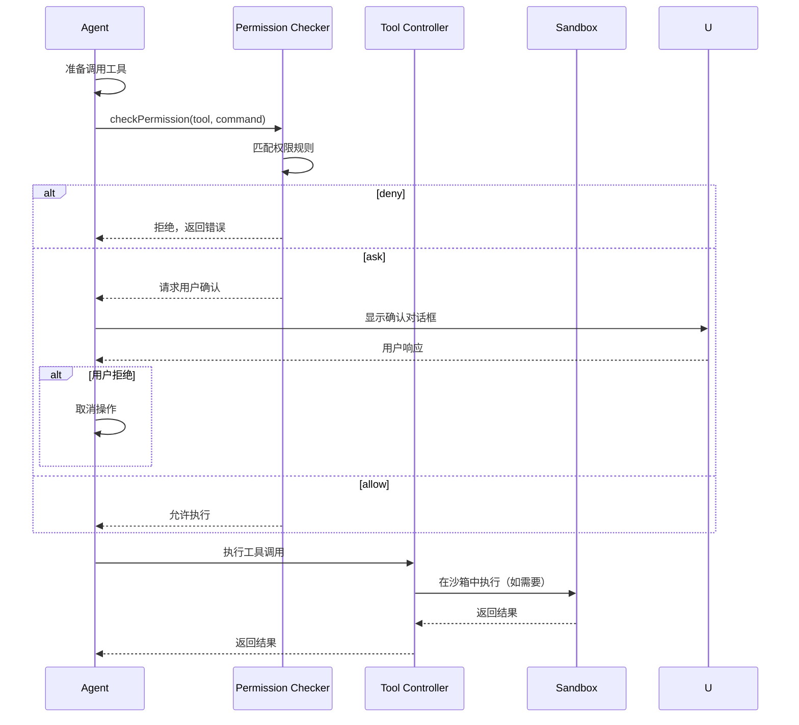

### 5.3 权限-沙箱一体化安全架构

权限检查与沙箱执行深度集成，高风险工具强制沙箱：

```typescript
// 沙箱策略配置
interface SandboxPolicy {
  // 文件系统
  fs: {
    readOnly: string[];      // 只读挂载路径
    readWrite: string[];     // 读写挂载路径（临时目录）
    deny: string[];          // 禁止访问路径
    workspaceRoot: string;   // chroot 根目录
  };

  // 网络
  network: 'none' | 'localhost' | 'restricted' | 'full';
  allowedHosts?: string[];   // 白名单域名
  blockedHosts?: string[];   // 黑名单域名

  // 资源限制
  resources: {
    cpu: string;             // e.g., "1.0"
    memory: string;          // e.g., "512m"
    timeout: number;         // 秒
    maxFileSize: string;     // e.g., "100m"
  };

  // 审计
  audit: {
    logAllCalls: boolean;    // 记录所有调用
    logOutput: boolean;      // 记录输出
    logExitCode: boolean;    // 记录退出码
    retention: number;       // 日志保留天数
  };
}

// 工具沙箱要求
const SANDBOX_REQUIREMENTS: Record<string, SandboxPolicy> = {
  'bash': {
    fs: {
      readOnly: ['/', '/usr', '/bin'],
      readWrite: ['/tmp', '/workspace'],
      deny: ['/etc/passwd', '/etc/shadow', '/root/.ssh'],
      workspaceRoot: '/workspace',
    },
    network: 'restricted',
    resources: { cpu: '1.0', memory: '512m', timeout: 300, maxFileSize: '100m' },
    audit: { logAllCalls: true, logOutput: true, logExitCode: true, retention: 30 },
  },
  'write': {
    fs: {
      readOnly: ['/'],
      readWrite: ['/workspace'],
      deny: ['/etc', '/usr', '/bin'],
      workspaceRoot: '/workspace',
    },
    network: 'none',  // write 无需网络
    resources: { cpu: '0.5', memory: '256m', timeout: 60, maxFileSize: '50m' },
    audit: { logAllCalls: true, logOutput: false, logExitCode: true, retention: 30 },
  },
};
```

**一体化安全流程：**

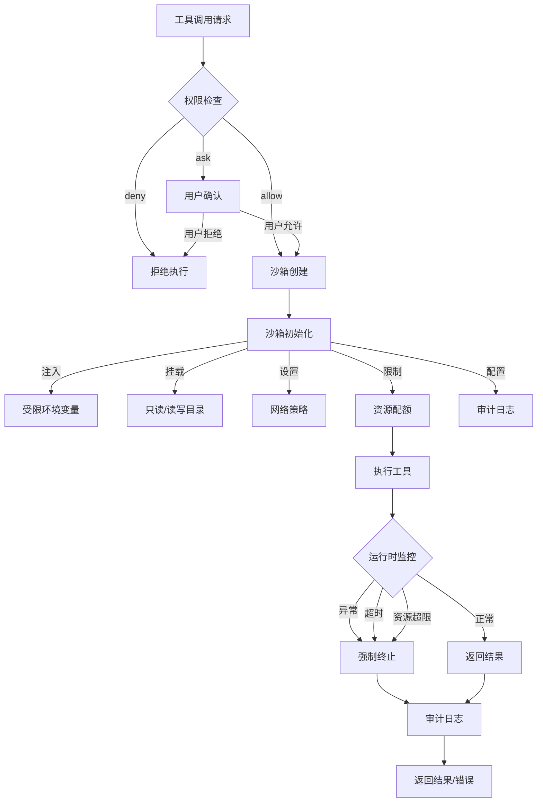

**强制沙箱策略：**

| 工具 | 强制沙箱 | 沙箱类型 | 理由 |
|------|----------|----------|------|
| `bash` | ✅ | chroot + 资源限制 | 命令执行风险高 |
| `write` | ✅ | chroot | 文件写入需隔离 |
| `edit` | ✅ | chroot | 文件修改需隔离 |
| `read` | ❌ | 无需沙箱 | 只读操作 |
| `agent` | ✅ | 进程隔离 | Subagent 独立 Session |

---

## 6. Skill 市场与生命周期

### 6.1 Skill 来源层级

```
加载优先级（高到低）：

1. Workspace Skills
   路径: <workspace>/skills/
   作用: 项目级 Skill，覆盖其他来源

2. User Skills (Managed)
   路径: ~/.andos/skills/
   作用: 用户级 Skill，所有项目可用

3. System Skills (Bundled)
   路径: <andos_install>/skills/
   作用: 内置 Skill，系统自带

4. Remote Skills
   路径: 远程 registry
   作用: 从 AndosHub 下载的 Skill
```

### 6.2 Skill 安装与更新

```bash
# CLI 命令示例
andos skill install fetch-asset          # 安装 Skill
andos skill install fetch-asset@1.2.0    # 安装指定版本
andos skill update fetch-asset           # 更新 Skill
andos skill uninstall fetch-asset        # 卸载 Skill
andos skill list                         # 列出已安装
andos skill search design                # 搜索 Skill
andos skill sync                         # 同步 AndosHub
```

### 6.3 Skill Registry 结构

```typescript
// Skill Registry 数据结构
interface SkillRegistry {
  skills: Map<string, SkillEntry>;
  sources: SkillSource[];
}

interface SkillEntry {
  name: string;
  version: string;
  source: 'workspace' | 'user' | 'system' | 'remote';
  path: string;
  config: SkillConfig;
  manifest: SkillManifest;
  eligibility: boolean;        // 是否满足运行条件
  ineligibleReason?: string;   // 不满足原因
}

interface SkillManifest {
  name: string;
  version: string;
  description: string;
  metadata: {
    andos?: {
      requires?: {
        bins?: string[];
        env?: string[];
        config?: string[];
      };
    };
  };
}
```

### 6.4 Skill 版本冲突解析策略

同名 Skill 多版本共存时的加载优先级：

```yaml
# Skill 解析策略
skill_resolution:
  # 层级优先级（高到低）
  layer_priority: [workspace, user, system, remote]

  # 版本冲突解决策略
  version_conflict:
    strategy: "semver_latest"  # 可选: "explicit_pin", "compatible_latest"
    workspace_override: true   # Workspace 层可强制覆盖版本

  # 显式依赖声明（锁定文件）
  dependency_lock:
    enabled: true
    file: ".andos/skill-lock.json"
```

**版本解析流程：**

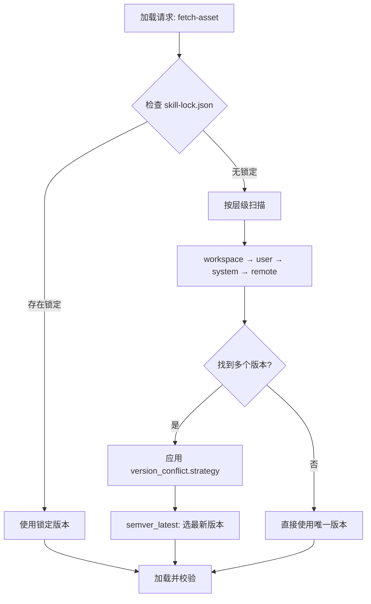

**skill-lock.json 示例：**

```json
{
  "$schema": "https://andos.dev/schemas/skill-lock.json",
  "version": "1.0.0",
  "skills": {
    "fetch-asset": {
      "resolved": "1.2.3",
      "from": "user",
      "path": "~/.andos/skills/fetch-asset",
      "checksum": "sha256:abc123...",
      "lockedAt": "2026-03-13T10:00:00Z"
    },
    "security-check": {
      "resolved": "2.0.1",
      "from": "workspace",
      "path": "./skills/security-check",
      "checksum": "sha256:def456...",
      "lockedAt": "2026-03-13T10:00:00Z"
    }
  }
}
```

**CLI 命令支持：**

```bash
# 锁定当前使用的 Skill 版本
andos skill lock

# 更新锁定到最新版本
andos skill lock --update

# 锁定特定版本
andos skill lock fetch-asset@1.2.3

# 检查版本冲突
andos skill doctor
```

### 6.5 Skill 依赖与组合机制

Skill 支持声明依赖其他 Skill，形成能力组合：

```yaml
# Skill 组合定义
name: advanced-code-review
version: 1.0.0
description: 高级代码审查（组合多个 Skill）

# 依赖其他 Skill
depends_on:
  - name: fetch-asset
    version: "^1.0.0"
    required: true
  - name: security-check
    version: "^2.0.0"
    required: false  # 可选依赖
  - name: lint-check
    version: ">=1.0.0 <3.0.0"
    required: false

# 组合多个 Skill 形成工作流
workflow:
  steps:
    - skill: fetch-asset
      action: get_code
      output: code_content

    - skill: security-check
      condition: "code_content.language == 'python'"
      input: code_content
      output: security_issues
      continue_on_error: true  # 可选依赖失败继续

    - skill: lint-check
      input: code_content
      output: lint_issues

    - skill: self
      action: generate_report
      input: [code_content, security_issues, lint_issues]
```

**依赖解析顺序：**

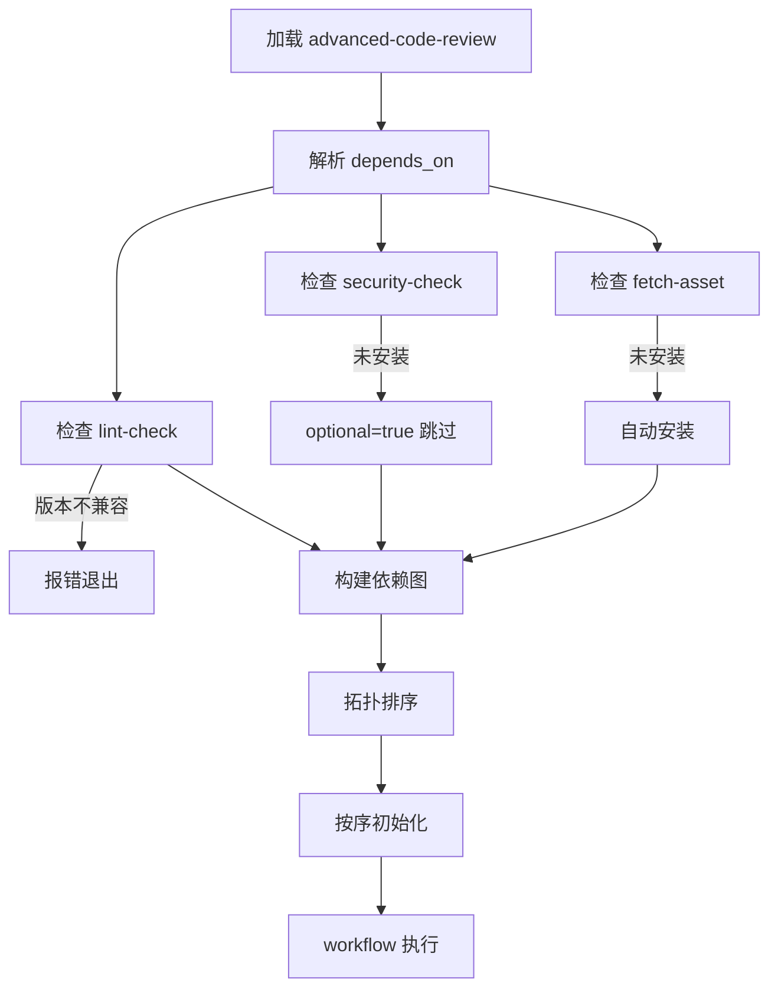

---

## 7. Bootstrap 与上下文

### 7.1 Bootstrap 文件

Agent 启动时自动注入的上下文文件：

| 文件 | 作用 | 示例 |
|------|------|------|
| `AGENTS.md` | Agent 操作指令 + 记忆 | 项目特定的工作流程 |
| `SOUL.md` | Agent 人格、边界、语气 | "你是严谨的架构师" |
| `TOOLS.md` | 工具使用说明 | 项目特定的工具约定 |
| `IDENTITY.md` | Agent 身份标识 | 名称、emoji、版本 |
| `USER.md` | 用户画像 | 偏好、联系方式 |
| `BOOTSTRAP.md` | 首次运行仪式 | 一次性初始化指引 |

**文件优先级：**

```
Workspace/.andos/  >  User ~/.andos/  >  System defaults
```

### 7.2 上下文注入策略

```typescript
// 上下文组装策略
interface ContextAssembly {
  // 基础系统提示
  systemPrompt: string;

  // Bootstrap 文件（按优先级合并）
  bootstrap: {
    identity: string;    // IDENTITY.md
    soul: string;        // SOUL.md
    agents: string;      // AGENTS.md
    tools: string;       // TOOLS.md
    user: string;        // USER.md
  };

  // 动态 Skill 提示
  skillsPrompt: string;

  // Session 历史（截断到上下文窗口）
  history: Turn[];

  // 用户当前输入
  userInput: string;
}

// Token 预算分配
const TOKEN_BUDGET = {
  systemPrompt: 500,
  bootstrap: 2000,
  skills: 1500,
  history: 4000,
  userInput: 1000,
  reserved: 500,      // 预留响应空间
};
```

### 7.3 动态 Token 预算与自适应上下文

静态预算无法适应不同模型（100K vs 200K 上下文）和任务复杂度，引入动态预算管理：

```typescript
// 动态 Token 预算管理
interface AdaptiveTokenBudget {
  // 模型上下文上限
  modelContextLimit: number;

  // 自适应分配策略
  allocation: {
    // 基础开销（系统提示、Bootstrap）
    base: number;
    // 弹性预算：根据任务复杂度动态调整
    elastic: {
      max: number;
      strategy: 'even' | 'front_weighted' | 'back_weighted';
    };
    // 预留响应空间（至少 25%）
    reserved: number;
  };

  // 上下文压缩策略（当接近上限时触发）
  compression: {
    enabled: boolean;
    triggers: ['token_threshold' | 'turn_count' | 'explicit'];
    strategies: [
      { name: 'summarize_old'; priority: 1; keepRecent: number },      // 摘要旧对话
      { name: 'truncate_middle'; priority: 2 },    // 截断中间部分
      { name: 'offload_to_vector_db'; priority: 3 } // 向量化存储
    ];
  };
}

// 动态预算计算示例
function calculateAdaptiveBudget(
  model: string,
  session: Session,
  taskComplexity: 'low' | 'medium' | 'high'
): TokenBudget {
  const modelLimits: Record<string, number> = {
    'claude-haiku-4': 100000,
    'claude-sonnet-4': 200000,
    'claude-opus-4': 200000,
  };

  const contextLimit = modelLimits[model] || 100000;
  const turns = session.turns.length;

  // 根据任务复杂度调整弹性预算
  const elasticRatios = {
    low: 0.3,
    medium: 0.5,
    high: 0.7,
  };

  const base = 3000;  // system + bootstrap + skills
  const reserved = Math.floor(contextLimit * 0.25);  // 25% 预留
  const elasticMax = Math.floor((contextLimit - base - reserved) * elasticRatios[taskComplexity]);

  // 长对话触发压缩
  if (turns > 20 || estimateTokenUsage(session) > contextLimit * 0.8) {
    return applyCompression(session, {
      strategy: 'summarize_old',
      keepRecent: 5,
      budget: {
        base,
        elastic: { max: elasticMax, strategy: 'back_weighted' },
        reserved,
      },
    });
  }

  return {
    base,
    elastic: { max: elasticMax, strategy: 'even' },
    reserved,
  };
}
```

**压缩策略触发器：**

| 触发条件 | 阈值 | 执行策略 |
|----------|------|----------|
| Token 阈值 | >80% 上下文上限 | summarize_old |
| 轮数阈值 | >20 轮 | summarize_old + keepRecent:5 |
| 显式触发 | 用户/Agent 指令 | offload_to_vector_db |

**自适应流程：**

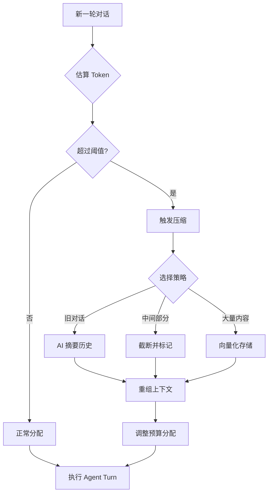

### 7.4 Bootstrap 文件版本控制

Bootstrap 文件支持版本声明和条件注入：

```typescript
// Bootstrap 文件版本控制
interface BootstrapVersioning {
  // 文件版本声明（YAML frontmatter）
  version: string;
  minPlatformVersion: string;
  maxPlatformVersion?: string;

  // 条件注入
  condition?: {
    agentMode?: 'primary' | 'subagent';
    taskType?: string[];
    filePattern?: string;  // glob 匹配
    tags?: string[];       // 资产标签匹配
  };

  // 增量更新
  patches?: {
    from: string;
    to: string;
    patchFile: string;
  }[];
}
```

**AGENTS.md 示例：**

```markdown
---
version: "2.1.0"
minPlatformVersion: "1.5.0"
condition:
  agentMode: primary
  taskType: [code-generation, refactoring]
  filePattern: "src/**/*.{ts,js}"
---

# Agent 操作指令

## 代码生成规范
...
```

---

## 8. 事件与通信

### 8.1 Agent 事件系统

```typescript
// Agent 事件类型
enum AgentEventType {
  // 生命周期
  SESSION_CREATED = 'session.created',
  SESSION_STARTED = 'session.started',
  SESSION_ENDED = 'session.ended',
  SESSION_PAUSED = 'session.paused',
  SESSION_RESUMED = 'session.resumed',

  // 执行
  TURN_STARTED = 'turn.started',
  TURN_COMPLETED = 'turn.completed',
  TOOL_CALLING = 'tool.calling',
  TOOL_COMPLETED = 'tool.completed',
  STREAM_CHUNK = 'stream.chunk',

  // 状态
  AGENT_SWITCHED = 'agent.switched',
  SKILL_LOADED = 'skill.loaded',
  PERMISSION_REQUESTED = 'permission.requested',

  // 错误
  ERROR_OCCURRED = 'error.occurred',
  TIMEOUT_REACHED = 'timeout.reached',
}

// 事件总线接口
interface AgentEventBus {
  emit(event: AgentEvent): void;
  on(type: AgentEventType, handler: EventHandler): void;
  off(type: AgentEventType, handler: EventHandler): void;
}
```

### 8.2 Subagent 通信协议

Subagent 支持流式通信、中间状态反馈和中途干预：

```typescript
// Subagent 流式通信协议
interface SubagentProtocol {
  // 启动时传递上下文
  init: {
    parentSessionId: string;
    taskDescription: string;
    contextSnapshot: ContextSnapshot;
    cancellationToken: string;  // 用于中途取消
  };

  // 执行过程中流式返回
  progress: {
    onProgress: (update: ProgressUpdate) => void;
    onToolCall: (call: ToolCall) => void;
    onCheckpoint: (checkpoint: Checkpoint) => void;  // 可恢复点
    onTokenUsage: (usage: TokenUsage) => void;       // Token 使用报告
  };

  // 支持中途干预
  interventions: {
    pause: () => Promise<void>;
    resume: () => Promise<void>;
    cancel: () => Promise<void>;
    modifyInstruction: (newInstruction: string) => Promise<void>;
    addContext: (context: string) => Promise<void>;   // 追加上下文
  };

  // 结果返回（支持部分成功）
  result: {
    status: 'success' | 'partial' | 'failed' | 'cancelled';
    output: string;
    artifacts: Artifact[];
    metrics: ExecutionMetrics;
    checkpoints: Checkpoint[];  // 可用于恢复
  };
}

// 进度更新
interface ProgressUpdate {
  step: number;
  totalSteps: number;
  description: string;
  timestamp: Date;
}

// 检查点（可恢复）
interface Checkpoint {
  id: string;
  step: number;
  state: string;           // 序列化状态
  timestamp: Date;
}
```

**增强通信流程：**

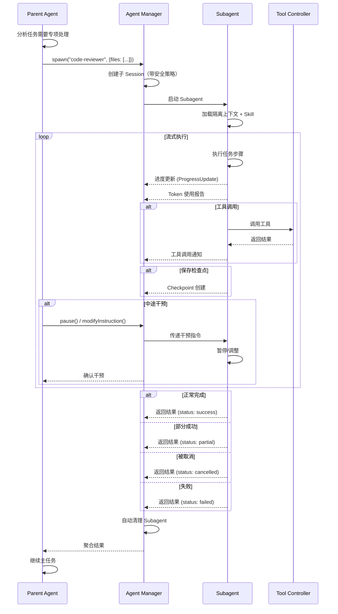

**干预能力示例：**

```typescript
// Parent Agent 干预 Subagent
async function interveneSubagent() {
  const subagent = await spawn('code-reviewer', { files: ['src/'] });

  // 监听进度
  subagent.onProgress((update) => {
    console.log(`Step ${update.step}/${update.totalSteps}: ${update.description}`);

    // 根据进度决定是否干预
    if (update.step === 3 && someCondition) {
      // 追加上下文
      subagent.addContext('注意：还需要检查性能问题');
    }
  });

  // 监听 Token 使用
  subagent.onTokenUsage((usage) => {
    if (usage.total > 8000) {
      // Token 过高时暂停
      subagent.pause();
      showUserAlert('Token 使用较高，是否继续？');
    }
  });

  // 5秒后取消
  setTimeout(() => {
    subagent.cancel();
  }, 5000);

  const result = await subagent.waitForCompletion();
  return result;
}
```

---

## 9. 与平台服务集成

### 9.1 作为平台 Agent 的实现

本系统作为 ANDOS 平台的 Agent Service 实现，与平台其他服务协作：

```
┌─────────────────────────────────────────────────────────┐
│                    ANDOS Platform                        │
├─────────────────────────────────────────────────────────┤
│                                                          │
│   ┌──────────────┐    ┌──────────────┐                 │
│   │  Asset Mgmt  │    │   DAG Svc    │                 │
│   └──────┬───────┘    └──────┬───────┘                 │
│          │                   │                          │
│          ▼                   ▼                          │
│   ┌──────────────────────────────────┐                 │
│   │       Agent Service              │                 │
│   │  ┌────────────┐ ┌────────────┐  │                 │
│   │  │ Primary    │ │ Subagent   │  │                 │
│   │  │ Manager    │ │ Manager    │  │                 │
│   │  └────────────┘ └────────────┘  │                 │
│   │  ┌──────────────────────────┐   │                 │
│   │  │     Skill System         │   │                 │
│   │  │  - fetch_asset           │   │                 │
│   │  │  - get_design            │   │                 │
│   │  │  - create_code           │   │                 │
│   │  └──────────────────────────┘   │                 │
│   └──────────────┬───────────────────┘                 │
│                  │                                     │
│   ┌──────────────┼──────────────┐                     │
│   ▼              ▼              ▼                     │
│ ┌─────┐     ┌─────┐     ┌─────────┐                 │
│ │ AI  │     │Notif│     │ Event   │                 │
│ │ Svc │     │Svc  │     │ Bus     │                 │
│ └─────┘     └─────┘     └─────────┘                 │
│                                                          │
└─────────────────────────────────────────────────────────┘
```

### 9.2 平台 Skill 定义

ANDOS 平台内置 Skill：

| Skill | 说明 | 对应平台服务 |
|-------|------|-------------|
| `fetch_asset` | 获取资产内容 | Asset Service |
| `get_design_contract` | 获取设计契约 | Asset Service + DAG Service |
| `query_dependency_path` | 查询依赖路径 | DAG Service |
| `create_asset_version` | 创建资产版本 | Asset Service |
| `analyze_impact` | 分析变更影响 | AI Analysis Service |
| `check_compatibility` | 检查版本兼容 | AI Analysis Service |
| `notify_stakeholders` | 通知相关人员 | Notification Service |

---

## 10. API 接口

### 10.1 Agent 管理 API

```typescript
// RESTful API 设计（OpenAPI 3.0）

/**
 * GET /api/v1/agents
 * 列出所有可用 Agent
 */
interface ListAgentsResponse {
  agents: AgentInfo[];
}

/**
 * POST /api/v1/sessions
 * 创建新会话
 */
interface CreateSessionRequest {
  agentId: string;
  parentSessionId?: string;  // 用于 Subagent
  context?: Record<string, any>;
}

interface CreateSessionResponse {
  sessionId: string;
  agentId: string;
  status: SessionStatus;
}

/**
 * POST /api/v1/sessions/{id}/turns
 * 执行对话回合
 */
interface ExecuteTurnRequest {
  message: string;
  attachments?: Attachment[];
}

/**
 * GET /api/v1/sessions/{id}/stream
 * 流式获取响应（SSE）
 */
// Server-Sent Events 格式
// event: message
// data: {"type": "content", "content": "..."}
//
// event: tool_call
// data: {"type": "tool_call", "tool": "...", "params": {...}}
//
// event: complete
// data: {"type": "complete", "turnId": "..."}

/**
 * POST /api/v1/skills/install
 * 安装 Skill
 */
interface InstallSkillRequest {
  source: string;  // npm package, git repo, or local path
  version?: string;
}
```

---

## 11. 配置示例

### 11.1 完整项目配置示例

```json
{
  "$schema": "https://andos.dev/config/v1.json",

  // 项目级 Agent 配置
  "agents": {
    "requirement-analyst": {
      "mode": "primary",
      "description": "需求分析专家，将原始需求转化为规格说明",
      "model": "anthropic/claude-sonnet-4-20250514",
      "temperature": 0.3,
      "prompt": "{file:./prompts/requirement-analyst.md}",
      "tools": {
        "read": true,
        "write": true,
        "edit": true
      },
      "skills": ["fetch-asset", "create-requirement"]
    },

    "design-architect": {
      "mode": "subagent",
      "description": "系统架构师，负责生成详细设计文档",
      "model": "anthropic/claude-sonnet-4-20250514",
      "temperature": 0.2,
      "skills": ["fetch-asset", "get-design-contract", "create-design"],
      "permissions": {
        "write": "ask",
        "create-design": "allow"
      }
    },

    "code-generator": {
      "mode": "subagent",
      "description": "代码生成器，根据设计生成实现代码",
      "model": "anthropic/claude-sonnet-4-20250514",
      "temperature": 0.1,
      "skills": ["fetch-asset", "get-design-contract", "create-code"],
      "permissions": {
        "write": "ask",
        "bash": {
          "npm *": "allow",
          "git *": "allow",
          "*": "ask"
        }
      }
    }
  },

  // Skill 配置
  "skills": {
    "entries": {
      "fetch-asset": {
        "enabled": true
      },
      "create-requirement": {
        "enabled": true,
        "config": {
          "template": "standard"
        }
      }
    }
  },

  // 全局权限默认值
  "permissions": {
    "write": "ask",
    "bash": "ask"
  }
}
```

---

## 12. 里程碑

| 阶段 | 目标 | 周期 | 关键交付物 |
|------|------|------|-----------|
| **MVP** | Primary Agent 基础、核心 Skill (fetch_asset)、JSON 配置 | 5 周 | Primary Agent + Skill 系统 + 基础权限 |
| **V1.0** | Subagent 完整支持、动态 Token 预算、权限-沙箱一体化 | 8 周 | Subagent 完整隔离 + 配置验证 + 沙箱安全 |
| **V1.5** | Skill 市场、AndosHub 集成、多模型路由、Skill 依赖管理 | 10 周 | Skill 市场 + 远程 Skill + 模型降级 + 依赖组合 |
| **V2.0** | 多 Agent 协作、自定义 Skill SDK、流式 Subagent 协议 | 14 周 | 协作协议 + Skill SDK + 流式通信 + 检查点恢复 |

**关键决策调整：**

| 决策项 | 原决策 | **调整后** | 理由 |
|--------|--------|-----------|------|
| Subagent 权限 | 未明确 | **默认严格隔离，显式授权** | 防止权限逃逸，符合最小权限原则 |
| Skill 版本冲突 | 层级优先 | **层级+SemVer+Lock 文件** | 确保可复现性，避免隐式升级风险 |
| Token 预算 | 静态分配 | **动态自适应+压缩策略** | 适应长对话和不同模型能力 |
| 配置格式 | JSON/Markdown/YAML | **保持三种，增加 Schema 验证** | 灵活性+安全性平衡 |
| 沙箱策略 | 可选 | **高风险工具强制沙箱** | `bash`/`write` 等必须隔离 |

---

## 附录 A：与 Claude Skills 的兼容性对照

| Claude Skills 特性 | 本系统支持 | 说明 |
|-------------------|-----------|------|
| `SKILL.md` 格式 | ✅ 完全兼容 | AgentSkills 规范 |
| Frontmatter 元数据 | ✅ 支持 | YAML frontmatter |
| `tools` 声明 | ✅ 支持 | 工具白名单 |
| `permissions` 声明 | ✅ 扩展 | 三级权限（allow/ask/deny）|
| `@mention` Subagent | ✅ 支持 | 调用 Subagent |
| `primary`/`subagent` 模式 | ✅ 支持 | 双模式架构 |
| `temperature` 控制 | ✅ 支持 | 0.0-1.0 |
| `model` 指定 | ✅ 支持 | 提供商/模型 |
| `prompt` 文件 | ✅ 支持 | `{file:path}` 语法 |
| Bootstrap 文件 | ✅ 扩展 | AGENTS.md, SOUL.md 等 |
| Session 管理 | ✅ 扩展 | JSONL 存储 |
| Skill 市场 | ✅ 扩展 | AndosHub |
| **Subagent 安全边界** | ✅ 扩展 | 上下文隔离策略 |
| **动态 Token 预算** | ✅ 扩展 | 自适应上下文压缩 |
| **权限-沙箱一体化** | ✅ 扩展 | 高风险工具强制沙箱 |
| **流式 Subagent 协议** | ✅ 扩展 | 支持中途干预 |
| **配置热重载** | ✅ 扩展 | Schema 验证 |
| **多模型路由** | ✅ 扩展 | 自动降级策略 |
| **Skill 版本锁定** | ✅ 扩展 | skill-lock.json |
| **Skill 依赖组合** | ✅ 扩展 | 工作流定义 |

---

## 附录 B：术语对照

| 本系统术语 | Claude 术语 | 说明 |
|-----------|------------|------|
| Primary Agent | primary | 主助手，用户直接交互 |
| Subagent | subagent | 专项代理，@mention 调用 |
| Skill | skill | 工具能力 |
| Bootstrap Files | - | 上下文注入文件 |
| Session | session | 对话会话 |
| Turn | turn | 对话回合 |
| Tool Call | tool use | 工具调用 |
| Permission | permission | 权限控制 |
| **Context Policy** | - | 上下文继承策略 |
| **Skill Lock** | - | Skill 版本锁定文件 |
| **Adaptive Budget** | - | 自适应 Token 预算 |
| **Sandbox Policy** | - | 沙箱安全策略 |
| **Checkpoint** | - | Subagent 可恢复检查点 |
| **Config Schema** | - | 配置验证 Schema |
